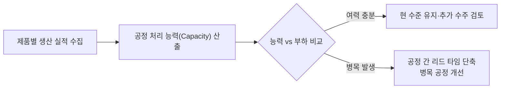

# 4교시 (2026-06-11)

> 회의 ID 170 · lecture · 전사 671건 · 실길이 약 40분
> (복원: development.log 저장본에서 8,688자 풍부판 복구)

## 한줄 요약
발표자: SPEAKER00 주제: 제품 분석을 통한 효율성 극대화 및 가치 공학(Value Engineering) 적용 핵심 메시지: 제품 개발 시 단순히 기술적 사양뿐만 아니라 수요, 공정, 자원 흐름을 분석하여 실현 가능한 생산 체계를 구축해야 함.

# 4교시

## 강연 개요

제품 분석을 통한 가치 창출 및 공정 효율화에 대한 강의. 선별적 접근에서부터 점진적 확대, 가치 엔지니어링 기법 활용, 조직 내 기존 관념 타파의 중요성을 중심으로 진행. 이후 QFD·FTA·FMEA 등 품질 분석 도구와 자동차 산업 리콜 사례를 통한 사전 예방의 중요성으로 확장. 이어서 관리계획서·표시 공정도 용어 비교와 여력(부하) 분석 방법론까지 다룸. 이후 원가 절감·자본 회전율, 양품 수율·종합 효율, 원가 구조 분석, QCD 관리 방향으로 이어지며, COPQ(불량 비용) 분석 실무 사례와 태양광을 통한 에너지 원가 절감 사례로 마무리.

## 주요 내용

### 제품 분석의 기본 원칙

* 전체 제품을 동시에 분석하지 말고 주요 제품 중심으로 접근

* 선별된 제품부터 점진적으로 범위 확대하는 전략 수립

* 단순하고 실용적인 방법론 필요

### 제품 구성 및 가치 분석

* 수요의 정확한 파악이 매우 중요

* 제품이 거쳐야 할 공정들이 과연 필요한지 검토 필수

* 보조자재(부품, 코팅 등)의 표준화 가능성 검토

* 공용 표준화를 최대한 확대하여 복잡도 감소

### 제품 선정 기준 및 분석 프로세스

* **선정 우선순위**: 공정을 가장 많이 거치는 제품 → 라우팅(경로)이 가장 복잡한 제품 순으로 분석 대상 선정

* **경로 분석 기반 접근**: 경로 분석 결과를 활용해 분석 대상 제품 선정 후 체계적으로 분석 진행

* **기능별 요소 분석**: 각 기능별로 구성 요소를 세밀하게 분석

* **공용화/전용화 판단**: 요소별로 공용화 또는 전용화 여부 결정

* **최소 해결책 도출**: 분석 결과를 바탕으로 최소한의 방법으로 문제 해결책 수립

* **핵심 목표**: 실현 가능한 셋업(Setup)을 찾는 것이 가장 중요

### 사전 예방과 시행착오 방지

* 분석 없이 무작정 진행하면 실현 과정에서 엄청난 시행착오 발생

* 문제를 사전에 미연에 방지하는 접근이 효율적

* 공용화 효과는 기대 이상으로 크게 나타남

### 실무 사례: 초기 개발 단계의 시행착오

* 핸드폰·태블릿류 제품의 디자인/타이밍 초기 단계에서 약 **2년 반** 소요

* 수많은 시행착오를 겪으며 노하우 축적

* 초기에는 납기 준수가 어려운 상황 발생

* 오랜 시간의 반복 경험을 통해 조건 확립 및 연결 완성

#### 핸드폰 제품 개발·양산 사이클

* 핸드폰은 보통 **4~5개월마다** 신모델 출시

* 출시 발표 시점 = 이미 설계 완료 + 양산팀이 생산 중인 상태

* 발표 → 곧바로 양산팀이 설계를 인수해 생산에 돌입하는 구조

* 이런 복합적 프로세스를 이해하면 **엄청난 노하우** 창출 가능

* (참고) 자사 제품(동판 등)은 구조가 상대적으로 단순 → 더 높은 수준의 품질 관리 실현 가능성

### 가치 엔지니어링(Value Engineering)

* 여러 공정 거침에 따른 비용 대비 가치 분석

* 제품 품질을 유지하면서 공정 단순화 방안 모색

* 쉽고 효율적으로 생산할 수 있는 체계 구축이 목표

### R&D와 설계의 역할

* R&D 설계 인력이 가치 분석에서 중추적 역할 수행

* 기술적 우월성과 실제 생산 가능성의 균형 필요

* R&D 진행 시 타임라인 관리 병행 중요

* **설계는 무조건 실행하는 것이 아님** → 실험·검증 과정을 거쳐, 보유 조건 내에서 실현 가능한 방안을 분석해 적용

### 품질 분석 도구: QFD · FTA · FMEA

| 도구   | 풀네임                                           | 특징                          | 활용 대상            |
| ---- | --------------------------------------------- | --------------------------- | ---------------- |
| QFD  | Quality Function Deployment (품질 기능 전개)        | 생산과 직접 연관, 실무 경력 10년 이상에 적합 | 생산 현장 관리자        |
| FTA  | Fault Tree Analysis (결함 수목 분석)                | 상대적으로 진입 장벽 낮음              | 품질/설계 담당자        |
| FMEA | Failure Mode & Effects Analysis (고장 형태 영향 분석) | 사전 예방의 핵심 도구, 자동차 업계 필수     | 전 산업 — 특히 자동차·항공 |

* 세 도구 모두 생산 효율화 및 품질 분석의 핵심 방법론

* **FMEA**: 잠재 고장 형태를 사전에 발굴해 대책 수립 → 리콜·소송 예방에 직결

### 관리계획서 vs 표시 공정도 — 용어 비교

* **관리계획서(Control Plan)**: 미국식 용어, IATF·APQP 기반 자동차 업계에서 통용

* **표시 공정도**: 국내 현장에서 일반적으로 통용되는 용어 (일본식 영향)

* **핵심**: 두 용어는 동일한 개념 — 명칭만 다를 뿐, 내용과 기능은 같음

* FMEA 분석 결과를 바탕으로 각 공정의 관리 방법을 기술하는 문서로 활용

* CTP(Critical to Process) 등 공정 핵심 특성을 도출한 뒤 관리계획서/표시 공정도 작성

* **상위품부터 잘 만들어야** 이하 품목의 표준도 제대로 만들 수 있음

| 구분     | 관리계획서 (Control Plan) | 표시 공정도      |
| ------ | -------------------- | ----------- |
| 용어 출처  | 미국식 (IATF/APQP)      | 국내 현장 일반 용어 |
| 내용·기능  | 동일                   | 동일          |
| 주요 사용처 | 자동차·수출 업계            | 국내 제조 현장    |

### 여력(부하) 분석

* **목적**: 우리의 공정 능력(Capacity)이 실제로 어느 정도인지, 부하(Load)가 어느 수준인지 파악

* **흐름**: 공정이 라인 → 라인 → 라인을 타고 이어지는 구조 → 공정 간 대기(Lead Time) 발생

* **핵심 과제**: 공정 간 리드 타임을 어떻게 줄일 것인가

* **분석 방법**: 생산 실적(실제 부하량) 대비 공정 처리 능력(Capacity) 비교

* A 제품·B 제품 각각의 능력을 개별 분석 후 비교

* 여력(여유 능력)이 어느 정도 남아 있는지 수치로 확인하는 작업

* 분석 없이 운영하면 능력 초과 여부를 알 수 없어 납기·품질 리스크 증가

### 원가 절감과 자본 회전율

* **원가 낭비 제거**가 모든 회사의 가장 큰 숙제

* 원가 절감의 핵심 수단 = **리드 타임 단축**

#### 자본 회전율과 이자의 관계

* 회사는 대출로 자재를 구매 → 생산 → 납품 → 대금 수령 → 은행 상환의 순환 구조

* 리드 타임이 길수록 **이자 부담 증가** → 리드 타임 단축 = 이자 절감 = 원가 절감

* 빨리 쓰고 빨리 갚는 것 = **자본 회전율 향상**의 본질

> "리드 타임 단축밖에 없어요. 빨리 쓰고 빨리 갚아야 돼요 — 그게 바로 자본의 회전율이잖아요."

### 양품 수율 및 종합 효율 관리

* **양품 수율**: 생산 효율을 대표하는 핵심 지표

* **종합 효율표**: 생산량·가동률·품질 등을 종합적으로 분석하는 표

  * 생산량 측면 + 불량 수율 측면을 함께 관리

  * 주어진 시간 내 최대 생산량 확보가 목표

* **로스(Loss) 활동**: 생산 손실 요인을 발굴·제거하는 활동 → 생산 부문의 가장 중요한 과제

### 원가 구조 분석

재료비 비중이 압도적으로 높고(약 70% 이상), 이를 어떻게 관리하느냐가 원가 경쟁력의 핵심.

| 원가 항목 | 주요 내용              | 핵심 관리 포인트                |
| ----- | ------------------ | ------------------------ |
| 재료비   | 전체 원가의 약 70% 이상 차지 | 수입 불량 최소화가 최우선 과제        |
| 가공비   | 인건비 + 가동률 + 임률     | 임률은 줄이기 어려움 → 가동률 향상이 핵심 |
| 관리비   | 고정비 성격             | 효율적 운영으로 비율 관리           |

* **재료비에서 수입 불량**이 가장 큰 손실 원인 → 수입 검사 및 공정 품질 강화 필요

* **임률(인건비 단가)**: 임의로 낮출 수 없는 요소 → 효율(가동률) 향상으로 대응

* 가공비 구조는 **고정비와 변동비**로 분리해 관리

#### 고정비 vs 변동비 세부 구조

* **변동비**: 생산량 증가 시 비율적으로 증가 → 생산량이 늘면 단위당 원가(원단위)는 오히려 감소

* **고정비**: 생산량과 무관하게 일정 수준 유지 (건물·설비 감가상각 등)

* **통제 불가 비용 존재**: 영업부 관련 비용 등 생산 부문에서 직접 관리하기 어려운 항목 포함

* **핵심 질문**: 우리가 줄일 수 있고 균형을 맞출 수 있는 항목이 무엇인지 식별하는 것이 출발점

### COPQ(Cost of Poor Quality) — 불량 비용 분석

* **정의**: 불량·결함으로 인해 발생하는 모든 비용을 계량화한 지표

* **분석 방법**: 회계 계정 항목 전체를 COPQ 해당 여부로 분류 → 개선 우선순위 도출

#### 실제 분석 사례

* 과거 원가혁신 추진 당시, 1년치 회계 계정 항목을 전수 분류해 COPQ 분석 실시

* 회계 담당 부서와 협업하여 항목별 귀속 분류 수행

| 분석 대상               | 결과              | 의미                 |
| ------------------- | --------------- | ------------------ |
| 특정 기업 (2016~17년 분석) | 매출 대비 약 **25%** | 매출의 4분의 1이 불량 비용   |
| 국내 제조업 평균           | 약 **30%**       | 공식 발표 기준, 업계 통용 수치 |

* 매출의 25~30%가 COPQ로 잡힌다는 것은 **엄청난 개선 여지**가 존재함을 의미

* 이 분류 결과를 개선 과제 우선순위 수립에 활용

> "COPQ 분석해 보니까 거의 25% 나오더라고요. 그러니까 엄청난 거죠."

### QCD 관리 방향

* **QCD = Quality(품질) · Cost(원가) · Delivery(납기)**

* 제조업의 궁극적 관리 방향이자 가장 중요한 경영 지표

* 위에서 다룬 여력 분석, 리드 타임 단축, 원가 절감, 양품 수율 관리 등은 모두 QCD 달성을 위한 활동

* 다양한 산업군별로 QCD 달성 수준을 분류·비교하여 자사 위치 파악 가능

### 산업별 품질 관리 실무 사례

#### 자동차 산업 — FMEA와 리콜

* 자동차는 FMEA가 개발 프로세스에 기본으로 내장됨

* FMEA 미비 → 근본적 대책 없음 → **리콜** 발생

* 리콜 소송 시 **수백억 원** 규모 손실 발생 가능

* 특히 **미국 시장**: 소비자 보호법이 강력, 시공간 제한 없이 소송 가능

* 이 때문에 자동차 업계는 FMEA를 매우 철저하게 운영

* 사전 예방(FMEA 철저 시행)이 사후 수습(리콜·소송)보다 압도적으로 유리

#### 정부 규제 동향

* 행정안전부 등 정부 차원에서도 품질·안전 관련 요건 강화 추세

* 제도적 요구 사항으로 FMEA 등 품질 도구 적용이 확산되는 흐름

### 에너지 원가 절감 — 태양광 활용 사례

* 최근 공장 탄소 절감·에너지 비용 절감 수단으로 **태양광 설치** 확산 추세

* 자사 공장에도 태양광 설치 완료, 전기 생산 중

#### 태양광 경제성 구조

| 구분              | 내용                     |
| --------------- | ---------------------- |
| 전기 구매 단가        | 약 40~50원/kWh           |
| 태양광 발전 전기 판매 단가 | 구매가보다 **훨씬 높음**        |
| 수익 구조           | 자가 소비 절감 + 잉여 전력 판매 수익 |

* 내가 쓰는 전기료보다 태양광으로 생산해 판매하는 전기 단가가 더 높아 **수익 발생**

* 탄소 배출 감축 크레딧 등 추가 인센티브도 존재

#### 지도 기업 실사례 (대구 소재)

* 강사가 컨설팅 지도한 대구 소재 공장(규모 약 천 평)

* 단층 공장 지붕 전면에 태양광 패널 설치

* 태양광만으로 **공장 전기 전량 자급 가능** 수준 달성

> "그 공장 지붕에 태양광을 가득 채웠는데, 실제 전기로 자급되는 것이 가능하대요."

### 조직 내 저항 요소

* 제조 기술자들의 고정관념 극복이 매우 어려움

* 기존 방식에 대한 강한 신념 존재

* 새로운 표준화 과정에서 이론과 현실의 간극 발생

* 강도 테스트(인장 강도 등) 같은 표준 검증 과정의 복잡성

### 의사결정 기준

* 이론적 타당성보다 시간 내 실현 가능성 검토 필수

* 최종적으로 회사의 이익을 우선적으로 고려

## 핵심 인사이트

* "제품 구성의 목적은 어떻게 하면 효율적으로 생산할 수 있는 체계를 구축할 것인가에 있음"

* "R&D 설계 인력이 고급 기술에만 갇혀 있으면 실질적 개선이 어려움"

* "기술자들의 고정관념 타파는 매우 어렵지만, 회사의 이익이 먼저 결정되어야 함"

* "실현 가능한 셋업을 찾는 것이 제일 중요 — 분석 없이 진행하면 실현 과정에서 엄청난 시행착오를 겪게 됨"

* "초기 개발에서 2년 반의 시행착오를 거쳐 노하우가 축적됨 — 이 과정을 단축하는 것이 분석의 가치"

* "핸드폰은 발표 시점에 이미 생산 중 — 그만큼 복합적 프로세스를 이해하면 엄청난 노하우를 만들어낼 수 있음"

* "FMEA를 철저히 하지 않으면 자동차 리콜로 수백억이 날아간다 — 사전 예방이 사후 수습보다 훨씬 유리"

* "설계는 무조건 실행하는 것이 아니다 — 보유 조건 안에서 실현 가능한 방안을 실험·분석해 적용해야 함"

* "관리계획서와 표시 공정도는 용어만 다를 뿐 같은 개념 — 상위품을 제대로 만들어야 하위 표준도 잘 만들 수 있음"

* "공정 능력(Capacity) 대비 실제 부하를 수치로 비교해야 리드 타임 단축과 병목 해소가 가능"

* "리드 타임 단축 = 이자 절감 = 원가 절감 — 자본 회전율이 제조업 원가 경쟁력의 핵심"

* "재료비가 70% 이상인 구조에서 수입 불량 관리가 곧 원가 관리 — 가동률 향상이 가공비 절감의 유일한 수단"

* "QCD가 모든 것의 방향 — 품질·원가·납기를 동시에 관리하는 체계가 제조업 경쟁력의 본질"

* "COPQ 분석해 보니까 매출의 25%가 불량 비용 — 국내 평균이 30%, 그만큼 개선 여지가 엄청나다"

* "고정비는 생산량과 무관하게 유지 — 우리가 줄일 수 있는 항목이 무엇인지 먼저 식별해야 한다"

* "태양광 발전 전기 판매 단가가 구매 단가보다 높다 — 설치만 잘 하면 전기 비용이 수익으로 전환됨"

## Q&A 정리

*(해당 내용 없음)*

## Takeaway

* 제품 분석은 선별에서 점진적 확대로 진행

* **분석 대상 선정 기준**: 공정이 많고 라우팅이 복잡한 제품부터 시작

* 공정 효율화와 단순화가 핵심 과제

* 가치 엔지니어링으로 품질과 비용의 최적화 달성

* **사전 분석이 시행착오를 줄이는 핵심** — 실현 가능한 셋업을 먼저 찾아야 함

* 조직 내 저항 요소(고정관념) 극복이 성공의 열쇠

* 기술 우월성보다 실현 가능성과 회사 이익을 우선 검토

* **QFD·FTA·FMEA** 등 품질 분석 도구를 적극 활용해 잠재 고장을 사전에 차단

* 자동차 리콜 사례처럼, FMEA 미비는 수백억 손실로 직결 — **사전 예방 투자가 절대적으로 유리**

* 설계 단계부터 실험·검증을 병행해 현실 조건에 맞는 방안을 도출할 것

* **관리계획서(Control Plan) = 표시 공정도** — 용어 출처(미국식 vs 국내식)만 다를 뿐 동일 문서, 현장 맥락에 맞는 용어 사용

* **여력 분석 필수**: 생산 실적 대비 공정 능력을 수치로 비교해야 리드 타임 단축·병목 해소 가능

* **리드 타임 단축 = 이자 절감**: 자재 구매 → 생산 → 납품 → 회수의 사이클을 빠르게 돌릴수록 자본 회전율 향상

* **원가 구조 관리**: 재료비(70% 이상)는 수입 불량 최소화로, 가공비는 가동률 향상으로 절감

* **QCD(Quality·Cost·Delivery)** 가 제조업 경쟁력의 궁극적 방향 — 모든 분석과 개선 활동은 QCD 달성에 수렴

* **COPQ 분석 적극 활용**: 회계 계정 항목을 불량 비용으로 분류하면 개선 우선순위가 명확해짐 — 국내 평균 30%, 이 숫자를 낮추는 것이 원가 혁신의 핵심

* **고정비 항목 식별이 우선**: 원가 절감 시작점은 내가 통제할 수 있는 항목과 없는 항목을 명확히 구분하는 것

* **태양광 등 에너지 절감 투자 검토**: 전기 단가 구조상 자가 발전·판매 수익 모두 가능 — 단층 공장이라면 지붕 전체 태양광으로 전기 자급도 현실적