# 또박또박 - 기능 설명서

> AI 기반 실시간 회의 전사(STT) 및 자동 요약 서비스

---

## 1. 홈 / 로그인

앱에 접속하면 간결한 랜딩 페이지가 표시됩니다. 로그인 버튼을 클릭하면 이메일/비밀번호로 인증할 수 있습니다.

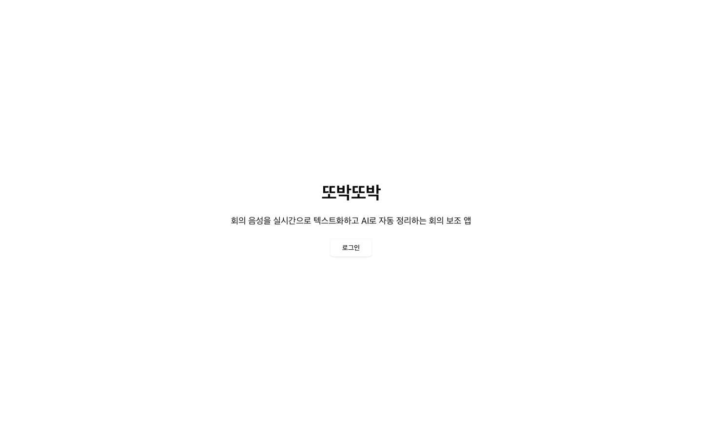

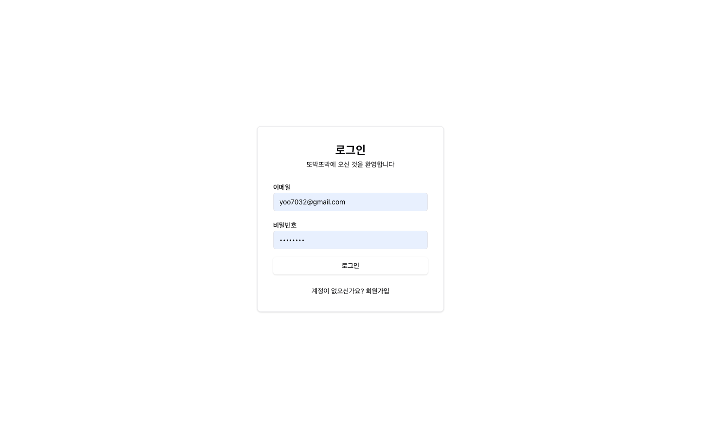

- 이메일/비밀번호 기반 인증 (Devise JWT)
- 회원가입 후 즉시 사용 가능

---

## 2. 대시보드

로그인 후 첫 화면입니다. 전체 회의 현황(전체, 녹음중, 완료, 대기중)을 한눈에 확인하고, 최근 회의 목록에서 바로 이동할 수 있습니다.

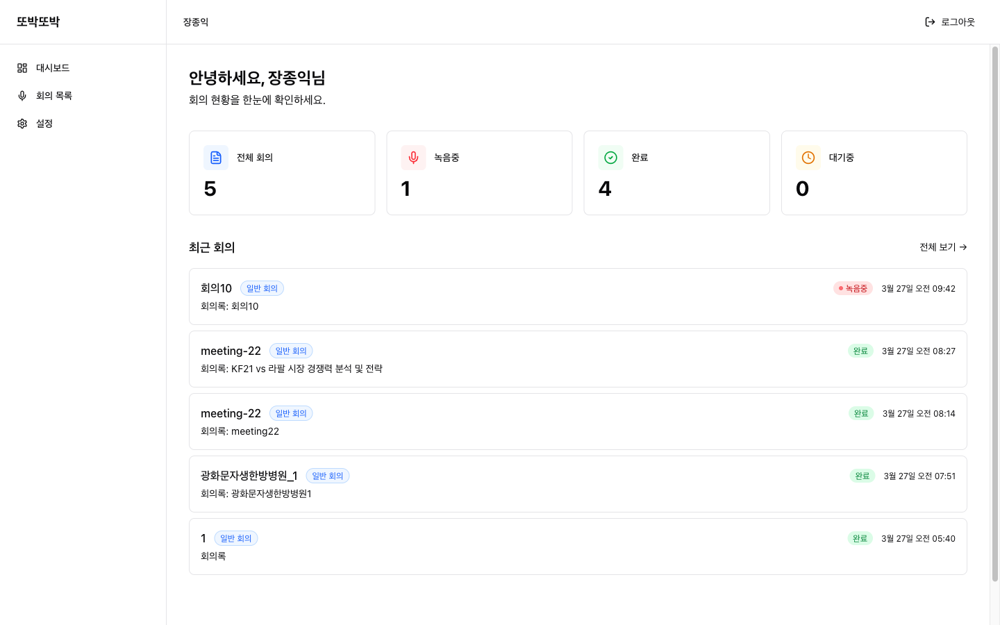

- 회의 상태별 통계 카드 (전체 / 녹음중 / 완료 / 대기중)
- 최근 회의 목록 — 클릭 시 상세 페이지로 이동
- 회의 유형 배지 표시 (일반 회의, 팀 회의, 스탠드업 등)

---

## 3. 회의 목록

모든 회의를 관리하는 페이지입니다. 새 회의를 만들거나, 기존 녹음 파일을 업로드하여 회의록을 생성할 수 있습니다.

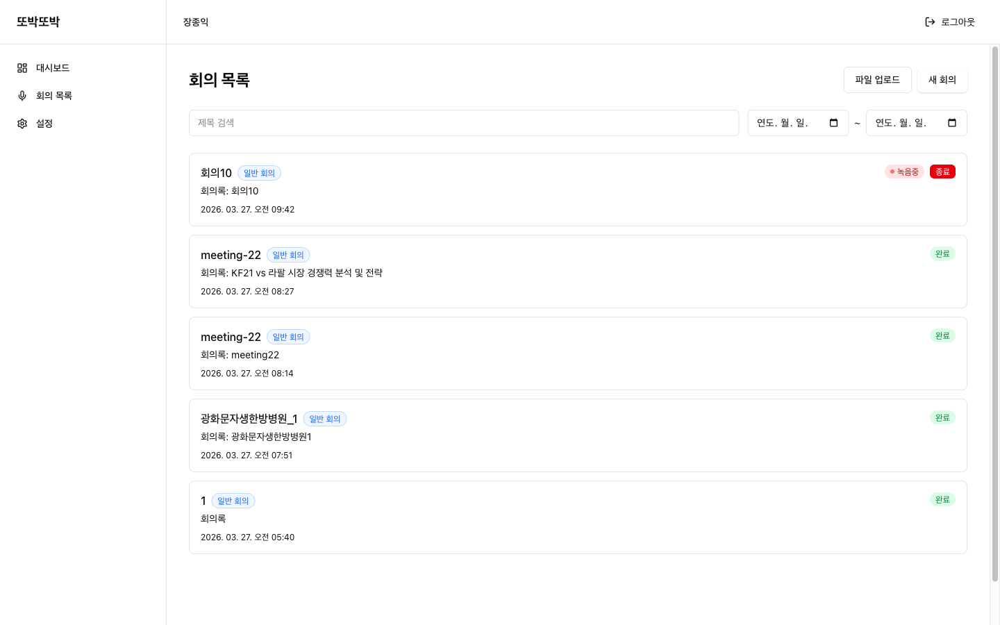

- **새 회의** — 제목과 회의 유형을 지정하여 새 회의 생성
- **파일 업로드** — mp3, wav, m4a 등 오디오 파일을 업로드하면 STT + AI 요약 자동 처리
- **제목 검색** — 키워드로 회의 검색
- **날짜 필터** — 기간별 회의 조회
- 진행중인 회의는 "종료" 버튼으로 바로 마감 가능

---

## 4. 회의 상세 (완료된 회의)

완료된 회의의 전체 내용을 확인하는 페이지입니다. 왼쪽에 전체 기록, 오른쪽에 AI 회의록이 표시됩니다.

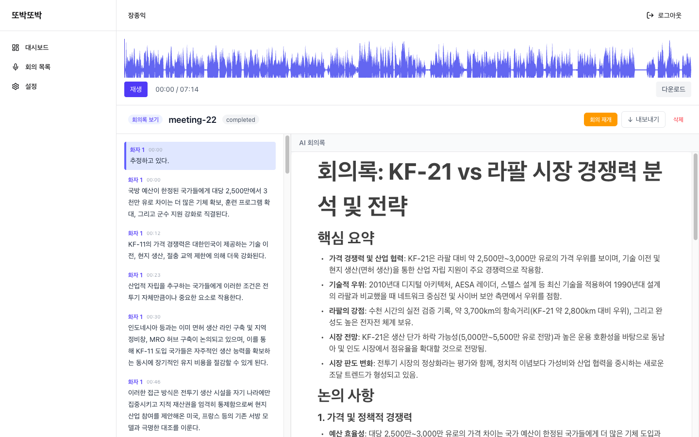

### 오디오 플레이어
- 상단의 파형(waveform) 시각화로 녹음 전체를 한눈에 확인
- 재생/일시정지, 타임라인 클릭으로 원하는 시점 이동
- 오디오 파일 다운로드 지원

### 전체 기록 (왼쪽 패널)
- 화자별 라벨과 타임스탬프가 표시된 전체 기록
- 기록 클릭 시 오디오 플레이어가 해당 시점으로 이동
- 화자별 색상 구분

### AI 회의록 (오른쪽 패널)
- AI가 자동 생성한 구조화된 회의록
- **핵심 요약** — 주요 논의 사항 불릿 포인트
- **논의 사항** — 주제별 상세 정리
- **결정사항** — 회의에서 확정된 내용
- **Action Items** — 할 일 목록

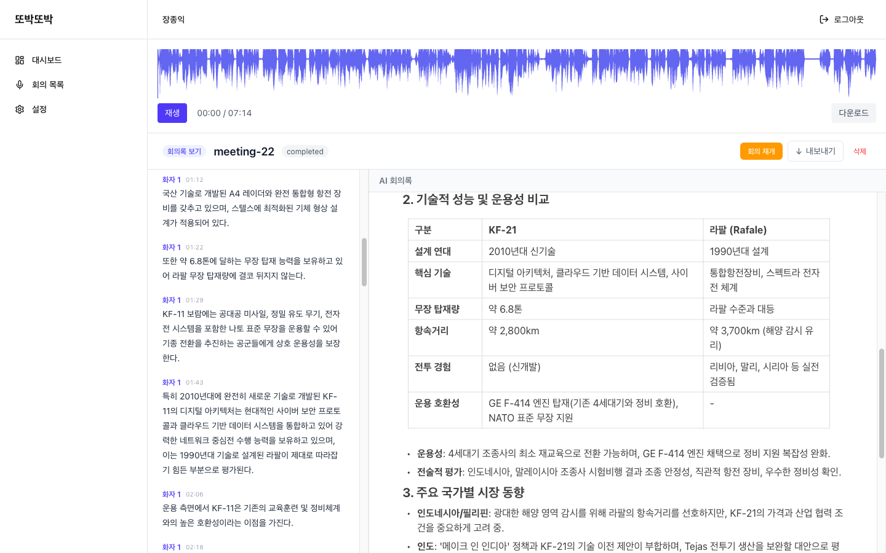

- AI가 자동으로 비교 테이블을 생성하여 시각적으로 정리
- BlockNote 기반 에디터로 내용을 직접 수정 가능
- **회의 재개** 버튼으로 이어서 녹음 가능
- **내보내기** 버튼으로 Markdown 파일 저장

---

## 5. 회의 진행 (라이브)

실시간으로 회의를 녹음하고, 기록과 AI 회의록이 동시에 생성되는 핵심 화면입니다.

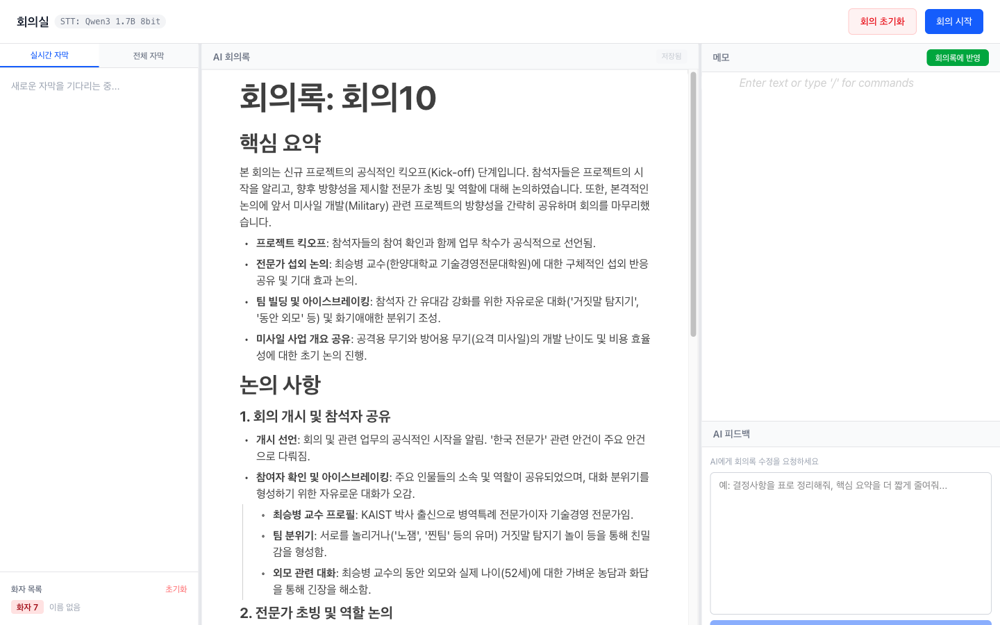

화면은 3개 패널로 구성됩니다:

### 라이브 기록 (왼쪽)
- **라이브 기록 탭** — 현재 말하고 있는 내용이 실시간으로 표시
- **전체 기록 탭** — 회의 시작부터의 모든 기록 열람
- **화자 목록** — 인식된 화자 목록, 이름 수정 가능, 초기화 버튼

### AI 회의록 (가운데)
- 설정된 주기(15초~5분)마다 자동으로 AI 회의록 갱신
- BlockNote 에디터로 실시간 수정 가능
- 핵심 요약, 논의 사항, 결정사항, Action Items 자동 구조화

### 메모 + AI 피드백 (오른쪽)
- **메모** — 회의 중 자유롭게 메모 작성 (BlockNote 에디터)
- **회의록에 반영** 버튼으로 메모 내용을 AI 회의록에 통합
- **AI 피드백** — "결정사항을 표로 정리해줘", "핵심 요약을 더 짧게 줄여줘" 등 자연어로 AI에게 회의록 수정 요청

### 상단 컨트롤
- 현재 사용 중인 STT 엔진 표시 (예: `Qwen3 1.7B 8bit`)
- **회의 시작/중지** — 녹음 시작 및 일시 정지
- **회의 초기화** — 기록과 화자 DB 초기화

---

## 6. 설정

앱의 모든 설정을 관리하는 페이지입니다.

### STT 모델 선택

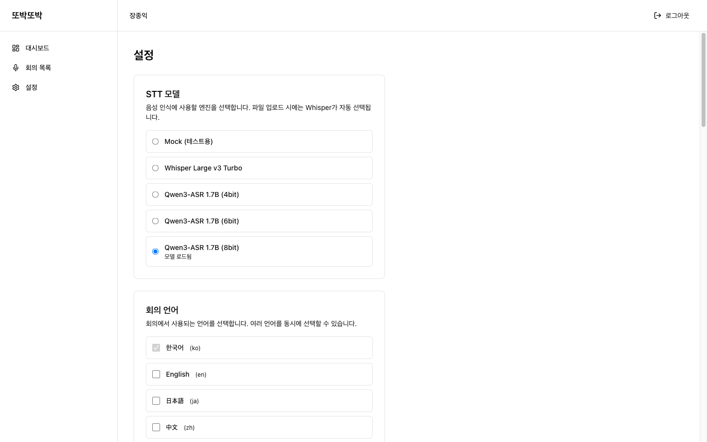

음성 인식 엔진을 선택합니다. 현재 로드된 모델에 "모델 로드됨" 상태가 표시됩니다.

| 엔진 | 설명 |
|------|------|
| Mock (테스트용) | 개발/테스트 시 더미 텍스트 반환 |
| Whisper Large v3 Turbo | whisper.cpp 기반, Metal/ANE 가속 |
| Qwen3-ASR 1.7B (4/6/8bit) | mlx-audio 기반, Apple Silicon 최적화 |

### 회의 언어

9개 언어 중 복수 선택 가능. 한국어가 기본 선택되어 있으며, 선택한 언어의 음성만 인식됩니다.

### AI 요약 모델

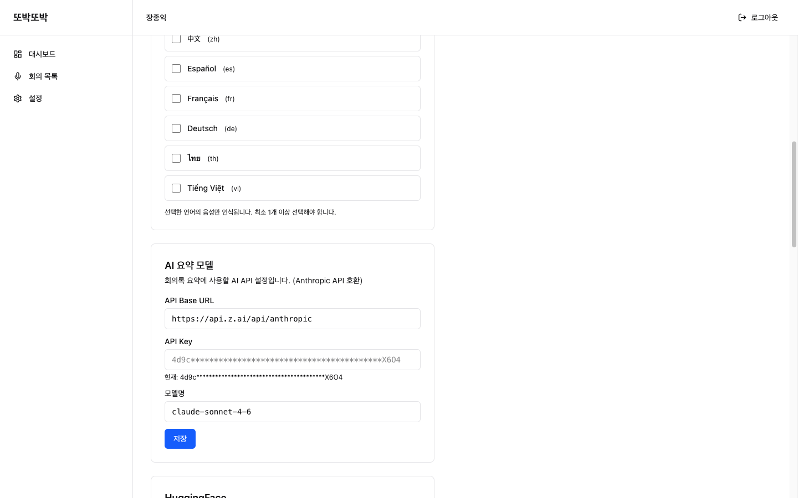

Anthropic API 호환 엔드포인트를 설정합니다:
- **API Base URL** — API 서버 주소
- **API Key** — 인증 토큰 (마스킹 처리)
- **모델명** — 사용할 LLM 모델 (예: claude-sonnet-4-6)

### HuggingFace 설정
화자 분리(pyannote) 모델 다운로드에 필요한 HF 토큰을 설정합니다.

### AI 회의록 적용 주기

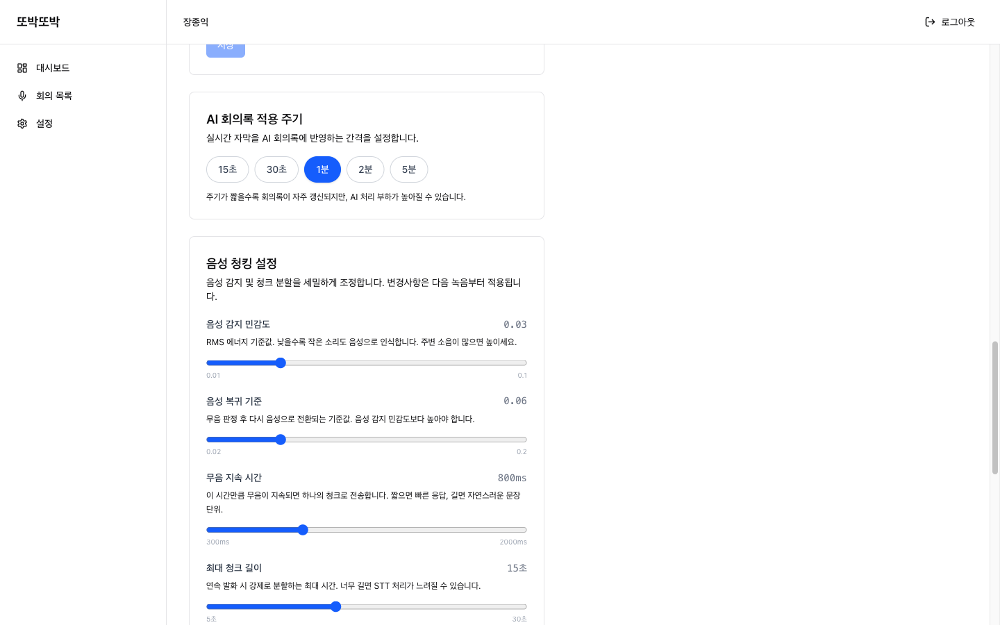

라이브 기록을 AI 회의록에 반영하는 간격을 15초 ~ 5분 사이에서 선택합니다. 주기가 짧을수록 회의록이 자주 갱신되지만, AI 처리 부하가 높아질 수 있습니다.

### 음성 청킹 설정

음성 감지와 청크 분할을 세밀하게 조정합니다:

| 항목 | 기본값 | 설명 |
|------|--------|------|
| 음성 감지 민감도 | 0.03 | 낮을수록 작은 소리도 감지 |
| 음성 복귀 기준 | 0.06 | 무음→음성 전환 히스테리시스 |
| 무음 지속 시간 | 800ms | 무음 유지 시 청크 전송 |
| 최대 청크 길이 | 15초 | 연속 발화 강제 분할 |
| 최소 청크 길이 | 3초 | 짧은 소음 필터링 |
| 프리롤 | 300ms | 음성 시작 전 여유 시간 |
| 청크 간 겹침 | 200ms | 경계 음절 손실 방지 |

### 화자 분리 설정

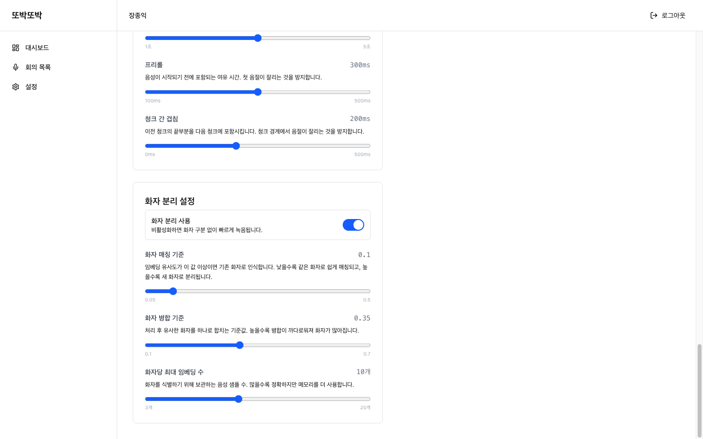

- **화자 분리 사용** 토글 — 비활성화하면 화자 구분 없이 빠르게 녹음
- **화자 매칭 기준** (0.1) — 임베딩 유사도 매칭 임계값
- **화자 병합 기준** (0.35) — 유사한 화자 사후 병합 임계값
- **화자당 최대 임베딩 수** (10개) — 화자 식별용 음성 샘플 보관 수

---

## 기술 흐름 요약

```
마이크 녹음 (브라우저)
    ↓ WebSocket (PCM 16kHz)
Rails ActionCable
    ↓ HTTP
Python Sidecar
    ├── STT (Qwen3-ASR / Whisper) → 텍스트 변환
    ├── 화자 분리 (pyannote) → 화자 라벨 부여
    └── AI 요약 (LLM) → 구조화된 회의록 생성
    ↓ WebSocket 브로드캐스트
프론트엔드 실시간 UI 갱신
```
