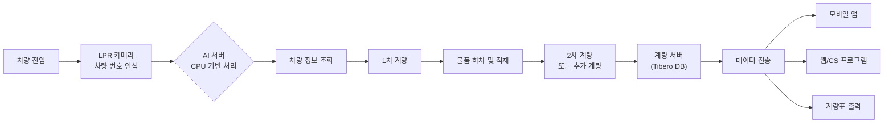

# dev-team 개선 아이디어: Window 내 pane 병렬화

## 현재 구조
- tmux window 단위로 domain별 병렬 (backend-dev, frontend-dev)
- window 내에서는 Task를 순차 실행

## 아이디어: window 내 리더 + 팀원 구조

```
backend-dev (window)
├── pane 0: backend-leader (도메인 리더)
├── pane 1: claude (독립 Task A)
└── pane 2: claude (독립 Task B)
```

도메인 리더 역할:
1. 의존성 분석 후 선행 Task 직접 실행
2. fork 지점에서 `tmux split-window`로 pane 생성, 병렬 실행
3. pane 완료 대기 후 다음 단계 진행

## 예시: WP-01 frontend

```
TSK-01-04 (리더가 직접 실행)
    ↓ 완료 후 fork
TSK-01-05 (pane 1) + TSK-01-06 (pane 2) ← 병렬
```

## 주의점
- 같은 worktree에서 여러 claude가 동시에 파일 수정 시 충돌 위험
- pane마다 별도 worktree를 만들면 해결되지만 관리 복잡도 증가
- 같은 domain Task끼리는 공유 파일이 많아서 (routes.rb, schema.rb 등) 실제 병렬화 이득이 적을 수 있음
- claude 프로세스 수 증가로 리소스 사용량 증가


## 회의록 작성
### 작업완료
- 팀목록 메뉴 삭제, 화면 삭제   
- 대시보드의 의미에 맞게 수정                                                                                                                                                                  
- 새 회의 만들기의 창 색깔이 어둡다. 밝은 색으로 변경                                              ghldmlf                                                                                          

- 기존 AI 회의록의 내용 변경은 최소화 하면서 라이브 기록을 적용하는 방식인지 확인하고 진행
- AI 회의록 자체도 Notion과 같이 수정이 가능하도록 변경
- 회의록에 대한 피드백을 AI에게 전달하면 AI가 회의록을 수정하는 방식, 메모는 높이의 60%, 피드백은 메모 밑에 입력창 추가
- 회의진행 페이지의 각 폭 크기 설정은 라이브/전체 기록 20%, AI회의록 50%, 메모 20%,
- 화자리스트는 라이브 기록 밑으로 가는 것이 좋겠다.

- 설정창에 요약을 위한 AI 설정도 설정(API주소, API Key, 모델명 등)에 있는 것이 좋겠다. 지금 .env 파일에 있는 설정을 셋팅해줘.
- 설정창에 필요한 Hugging Face 설정도 있는 것이 좋겠다. 지금 .env 파일에 있는 설정을 셋팅해줘.

- 내보내기 지금 제대로 안됨, 링크복사 버튼 필요 없음 삭제
- 회의 리스트에서 선택해서 meetings 페이지로 들어가면 왼쪽은 전체 기록(너비 30% 설정)이 나오고, 중간에 입력창이 있는데 필요 없음, 오른쪽은 요약이 나오는데 요약이 너무 작다. 요약 크기 70%(스크롤바 추가)
- AI 피드백은 회의록을 수정하는 프롬프트라고 생각하자. AI 로 전송 기능(버튼도 필요, 엔터키도 전송, 쉬프트엔터키는 줄바꿈) 추가, 다만 AI로 전송할 경우 타이머는 멈추고 진행
- 실제 녹음 파일을 재생하고 기록이 선택되면서 해당 시간으로 이동할 수 있으면 좋겠다. 그리고 오디오 파일도 저장하는 기능이 있으면 좋겠다.
- 회의재개 시 이전에 진행했던 회의록이 자동으로 로드되고 이어서 진행 가능하도록 변경
- 오디오 파일로 회의록 작성하는 기능 추가, 이때는 정교하게 문장을 잘 잘라야 한다. 이렇게 만들어진 텍스트를 AI 회의록으로 작성 하는 기능 개발
- 설정에서 회의 언어 선택 기능 (주요 언어 선택 기능 추가, 한국어가 최우선으로 나오도록), 2~3개 선택 가능하게 체크 박스로 하면 좋겠다.
- 설정에 화자 분할 옵션을 추가 (화자 분할 하는것이 오래 걸려서)
- mermaid 를 사용한 다이어그램을 추가
- 키를 바꾸자
    ANTHROPIC_AUTH_TOKEN="your_token_here"
    ANTHROPIC_BASE_URL="https://api.z.ai/api/anthropic"
- 대시보드에서 전체 회의, 녹음중, 완료, 대기중 각각을 선택하면 회의 목록에서 해당 상태의 회의만 볼 수 있도록 변경
- 기존 회의록의 내용에 새로운 내용을 추가하도록 해야 함. 기존 내용이 절대 누락 되면 안됨
- 회의목록 조회 조건에 회의 진행상태를 추가하자.
- 회의 유형별 프롬프트 관리
- 그래프형태로 표현하면 더 좋은 내용들은 알아서 그래프형태(mermaid)로 회의록을 시각화 하는 기능 추가
- Gemini 모델 확인
- 전체 STT 생성 : 현재 까지의 오디오로 전체 기록을 다시 생성하는 기능
- 회의록 재생성 : 전체 기록을 바탕으로 회의록을 다시 생성하는 기능, 실시간 보다 정교해야 함
- loop back audio capture 기능(현재 macOS)
- 회의록을 카테고리별로 폴더 분류, 폴더 생성, 이동 기능 추가 (회의록 자체를 폴더 아래 파일과 같은 개념으로 생각)
- 회의카드에 요약 내용 보여주기
- 메모는 그냥 그대로 저장하자. AI가 요약한 내용과 별도로 사용자가 작성한 내용이다. 합치지 말자
- 레이아웃 변경
  - 회의실 화면에서도 사이드바가 보이도록 변경
  - 사이드바는 햄버거 아이콘으로 열고 닫기 가능하게 변경
- 메모를 보였다가 안보였다가 토클로 하자 (회의 미리보기 / 회의실 옆 문서 버튼)
- 목록에 요약 정보 추가
- 회의록 내보내기(pdf, word 출력) - 에러 처리중
- 서버의 포트를 13323, 13324, 13325 로 바꾸자
- 회의록에 파일, 링크 업로드 기능(회의 안건 파일, 참고 파일, 회의록에 첨부할 파일 등 구분 필요)

---
### 진행

### 작업대기

- 또박또박 컨셉에 맞는 아이콘을 추가하자. 제미나이에서 그려

- 회의록과 전체 기록에서 필요로 한 내용을 검색하는 기능 추가
  - 회의록과 전체 기록에서 특정 내용을 검색하는 기능
  - 검색 결과에서 해당 내용으로 이동하는 기능
- 안건파일에 대해 회의록을 미리 생성하는 기능
  - 회의 시작전 안건파일을 업로드하면 AI가 안건파일을 분석해서 회의록을 미리 생성하는 기능
  - OCR 기능으로 이미지 파일도 분석 가능해야 함
- 미팅 stt -> 요약 -> 회의록 생성 -> cps 생성 -> prd 생성 -> 화면 설게(샘플 화면 구현) -> 승인 -> 개발

- https://huggingface.co/CohereLabs/cohere-transcribe-03-2026 - 시간이 더 지나야함, 아직 쓸만한 양자화 모델이 안나왔어

base_url = "http://10.90.3.61:9500/v1",
api_key="9f1c3b2e4a6d7c8f5b1e9a2d3c7e8b4a1c2d5e7f",  
model="Qwen3.5-27B",

---

## Tauri 배포 빌드 — Ruby PATH 충돌 문제 (2026-03-31)

### 현상
Tauri로 빌드한 macOS 앱(.app)을 Finder에서 실행하면, 초기 설정 단계에서 `bundle install`이 실패한다.

```
uninitialized constant Gem::Resolver::APISet::GemParser (NameError)
from /System/Library/Frameworks/Ruby.framework/Versions/2.6/usr/lib/ruby/2.6.0/rubygems/core_ext/kernel_require.rb:54
from /Users/jji/.rbenv/versions/4.0.2/bin/bundle:27:in '<main>'
```

### 원인
macOS에 Ruby가 2개 존재한다.

| 구분 | 경로 | 버전 |
|------|------|------|
| 시스템 Ruby | `/usr/bin/ruby` | 2.6 |
| rbenv Ruby | `~/.rbenv/versions/4.0.2/bin/ruby` | 4.0.2 |

앱이 `discover_tools()`로 `~/.rbenv/versions/4.0.2/bin/bundle`을 정확히 찾지만, `bundle` 파일 내부의 shebang이 `#!/usr/bin/env ruby`로 되어 있다. Finder에서 실행된 앱은 쉘 환경(rbenv init)이 로드되지 않아 `/usr/bin/env ruby`가 시스템 Ruby 2.6으로 해석된다.

결과: **Ruby 2.6이 Ruby 4.0용 bundler 4.0.8을 로드** → 호환되지 않는 API 호출 → 에러

### 근본 원인: macOS GUI 앱의 환경변수 구조

1. **Finder 실행 = launchd 환경**: Finder(또는 Spotlight/Dock)에서 앱을 실행하면 `launchd`가 프로세스를 생성한다. launchd는 최소한의 PATH만 제공:
   ```
   /usr/bin:/bin:/usr/sbin:/sbin
   ```
   쉘 설정 파일(`.zshrc`, `.zprofile`)은 절대 로드되지 않음.

2. **rbenv 의존성**: rbenv은 `eval "$(rbenv init -)"` 를 쉘 초기화에서 실행해야 동작. GUI 앱에서는 이 초기화가 없음.

3. **shebang 실행 흐름**:
   - `Command::new("/path/to/bundle").env("PATH", custom_path).spawn()` 호출
   - 커널이 bundle 파일의 shebang `#!/usr/bin/env ruby` 발견
   - `execve("/usr/bin/env", ["ruby", "/path/to/bundle"], envp)` 로 변환
   - **envp에는 `.env("PATH", ...)`로 설정한 값이 포함됨** → `/usr/bin/env`는 custom PATH를 사용
   - 따라서 **PATH 순서만 올바르면 shebang도 정상 동작**

4. **그런데 왜 안 됐나**: 기존 `resolve_shell_path()`에서 `contains()` 체크로 인해, 쉘에서 가져온 PATH에 rbenv 경로가 이미 포함되어 있으면 순서를 재배치하지 않았음. rbenv 경로가 `/usr/bin` 뒤에 위치해도 앞으로 이동시키지 못함.

5. **또 다른 함정**: `Command::new("bundle")` (이름만 지정)으로 호출하면, Rust는 **부모 프로세스의 원래 PATH**에서 실행파일을 찾음. `.env("PATH", ...)`는 자식 프로세스에만 적용. 따라서 절대 경로 사용 필수.

### 해결 방안

**방법 1: `fix-path-env` 크레이트 사용 (Tauri 공식 해결책)**
- Tauri 팀이 이 문제를 위해 만든 크레이트: https://github.com/tauri-apps/fix-path-env-rs
- 앱 시작 시 로그인 쉘의 환경변수를 **프로세스 레벨**에 설정
- `main()` 진입 시 `fix_path_env::fix()` 호출 → 이후 모든 `Command::new()`가 올바른 PATH 사용
- Oh My Zsh 자동 업데이트 차단, ANSI 이스케이프 코드 제거 등 엣지 케이스 처리 포함
- 이것만으로 프로세스 PATH가 정상화되므로 shebang 문제도 해결

**방법 2: PATH 순서 강제 수정 (방법 1과 병행)**
- `resolve_shell_path()`에서 rbenv 경로를 항상 맨 앞에 강제 배치 (중복 제거 후 삽입)
- `#!/usr/bin/env ruby`가 자연스럽게 rbenv Ruby를 찾게 됨

**방법 3: shebang 우회 (방법 1과 병행)**
- `bundle install` → `ruby /path/to/bundle install` 형태로 실행
- shebang 자체를 무시하고 올바른 Ruby 인터프리터로 직접 실행

**최종 적용: 방법 1 + 2 + 3 모두 적용 (다중 방어)**
- `fix-path-env`로 프로세스 PATH를 근본적으로 수정 (1차 방어)
- PATH 순서 강제 수정으로 rbenv을 항상 우선 (2차 방어)
- Ruby 도구는 `ruby <tool>` 형태로 실행 (3차 방어)

### 관련 파일
- `frontend/src-tauri/src/main.rs` — 앱 진입점, `fix_path_env::fix()` 호출
- `frontend/src-tauri/src/lib.rs` — 서비스 생명주기 관리, PATH 해결, 도구 탐색
- `frontend/src-tauri/Cargo.toml` — 의존성 (`fix-path-env` 추가)
- `frontend/src/pages/SetupPage.tsx` — 초기 설정 UI


---

# 회의록: 부산 공장 계량대 고도화 및 안전보건 시스템 구축

## 1. 핵심 요약

* 부산 공장 계량대 시스템 고도화(To-Be)를 위해 LPR(차량 번호 인식), 모바일 앱, 웹 대시보드 등 도입 검토

* 기존 포항 계량대 시스템과 차별화된 AI 기반 차량 인식(Dynavis) 및 무인 자동화 프로세스 적용 예정

* 10월 오픈을 목표로 5개월간 진행하며, 4월 중순 착수 후 설계 완료 후 개발 착수 계획

* 안전보건 시스템(EHS) 구축 프로젝트도 병행 진행(200페이지 이상, 120개 항목 개선 필요)

* 현업 요구사항 확정 및 기획/설계 자료 수급을 위한 현업 미팅 주도 필요

## 2. 논의 사항

### 2.1. 계량대 현황 및 개선 필요성 (As-Is)

* **현재 운영 중인 계량 대수**: 부산 1대 (포항은 6대 운영 중)

* **계량 대상 물품**: 보산물, 부자재, 제품 외 폐기물, 반품, 반출, 반입 물품 등

* **계량 횟수 및 프로세스**:

  * 일반적으로 1차/2차 계량 진행

  * 품목 다양성 및 작업 특성상 1회 입고 시 3~4회 계량 발생

  * 부분 하차 후 재계량(중량 감소에 따른) 복잡한 프로세스 존재

* **출력물**: 계량표 출력 필수 (현장 기사 요청 및 업체 전달용)

  * 종이 출력 선호 경향으로 유지 필요

### 2.2. 신규 시스템 구성 및 기술 스택 (To-Be)

* **하드웨어 변경사항**:

  * LPR(차량 번호판 인식) 카메라 추가

  * AI 서버(CPU 기반)를 통한 차량 번호 인식

  * 차단기 1소 추가, 전광판 및 인터폰 유지

* **소프트웨어 개발 범위**:

  * **계량 웹(Weighing Web)**: Spring Boot 기반 백엔드, React 기반 프론트엔드

  * **계량 앱(Weighing App)**: 기사용 모바일 앱 (계량 조회 및 데이터 확인)

  * **CS 프로그램**: 관리자용 통합 패치 및 실적 관리

* **인프라**:

  * DB: Tibero

  * 차량 인식 엔진: Dynavis (사내 개솜)



### 2.3. 데이터 연동 및 서버 범위

* **계량 서버 관리 주체**:

  * LPR, 차단기, 인디케이터 등 하드웨어 제어 및 데이터 연동은 개발 범위에 포함

  * 단, 계량 서버(물리 서버) 자체의 하드웨어 관리는 별도 논의 필요

* **데이터 제공**:

  * 모바일 및 웹에서 계량 데이터, 실적 등을 실시간 조회 가능하도록 API 제공

### 2.4. 안전보건 시스템(EHS) 구축

* **규모**: 총 200페이지 이상, 120여 개 고도화 항목 존재

* **특이사항**:

  * 게시판 형태의 화면이 다수를 차지

  * 백엔드/프론트 소스 코드 없음 (DB 및 화면 캡쳐 존재)

  * 역설계(Reverse Engineering)를 통한 분석 및 설계 필수

* **연동 시스템**: ERP, MMS(공정 관리), 노면 관리 시스템 등 3곳과 인터페이스

* **진행 상황**: 법무팀 저작권 검토 완료 후 구축 예정

## 3. 결정사항

| 항목            | 내용                            | 비고                   |
| ------------- | ----------------------------- | -------------------- |
| 개발 언어 및 프레임워크 | Spring Boot, React, Tibero DB | 기존 문서 참조             |
| 차량 번호 인식 방식   | Dynavis (사내 AI 솔루션) 적용        | CPU 서버 기반 운영         |
| 계량표 출력        | 기존과 동일하게 종이 출력 지원             | 현장 요청 반영             |
| 프로젝트 기간       | 약 5개월 (10월 오픈 목표)             | 4월 중순 착수             |
| 소스 코드 제공      | 계량대 시스템(부분 적용), EHS(미보유)      | 계량대는 바이러스로 인해 일부만 존재 |

## 4. Action Items

| 구분            | 내용                              | 담당자 | 기한        | 비고                |
| ------------- | ------------------------------- | --- | --------- | ----------------- |
| 기획 및 설계 자료 요청 | 모바일 화면 설계, 프로세스 정의서, 프로그램 리스트 등 | 현업  | 4월 중순     | 4월 둘째/셋째 주 미팅 예정  |
| 현업 미팅 주도      | 프로세스(다중 계량 처리 등) 및 요구사항 확정      | 개발팀 | 4월 둘째 주 전 | 문서 바탕으로 논의        |
| 자료 전달         | 수행 계획서, 프로그램 매뉴얼, 소스코드(가용 범위)   | 협력사 | -         | 메일로 전달            |
| 인력 지원 요청      | 설계 및 분석 역량을 가진 개발자/설계자 지원       | 협력사 | -         | EHS 및 계량대 프로젝트 병행 |
| 재견적           | 수정된 일정 및 범위에 따른 견적서 재발행         | 협력사 | 회신 요청 시   | 메일 회신 필요          |
| 현장 담사         | 부산 계량대 현장 확인, 사진 촬영, 프로세스 파악    | 개발팀 | -         | 금일 오후 진행          |

## 5. 기타 논의

* **포항 계량대**: 현재 운영 중이나 추가적인 고도화 계획은 없음.

* **소스 코드 관리**: 계량대 기존 소스(C#)는 바이러스 피해로 이전 버전을 기반으로 부분 수정만 가능했던 상황임을 공유.

* **저작권 검토**: 안전보건 시스템 구축 시 기존 시스템 복제에 따른 저작권 이슈는 법무팀 검토 후 문제 없음을 확인.
