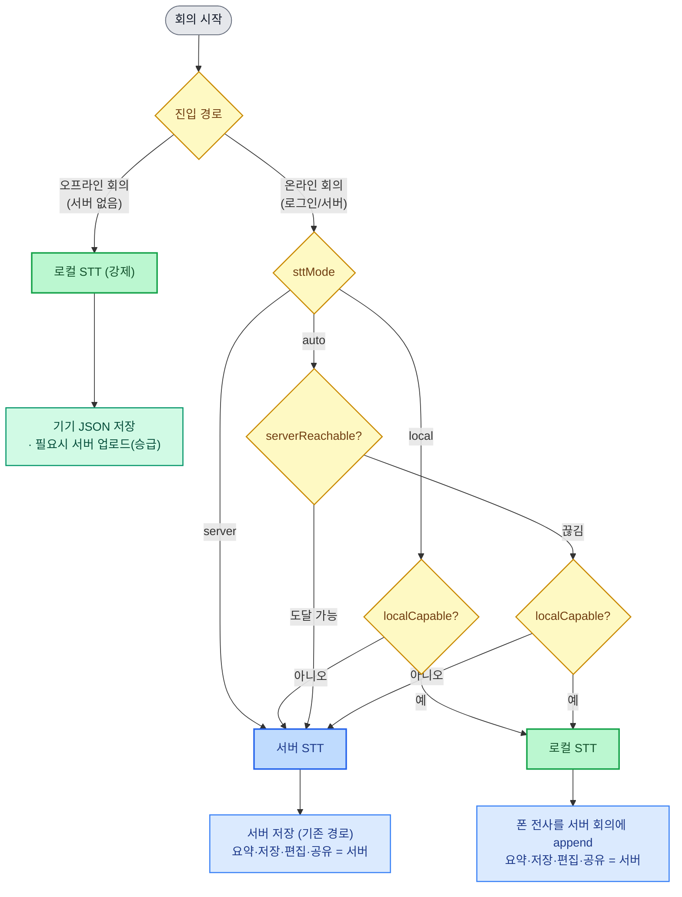

# STT & 온/오프라인 전략

> 상위 전략 문서. 또박또박에서 음성 전사(STT)를 **어디서 수행**하고, 회의를 **어떻게 진입·저장·공유**하는지의 정책을 정리한다. 구현 세부(컴포넌트/엔드포인트)는 별도 design/plan 문서로 분기한다.
>
> 관련 문서: `2026-06-01-ondevice-stt-local-mode-design.md`(로컬모드 설계), `2026-06-01-ondevice-stt-auto-decisions.md`(자동결정 A1~A25).

## 0. 핵심 원칙 — 두 축의 직교 분리

STT는 서로 **독립적인 두 축**으로 나눈다. 이 분리가 전체 전략의 뼈대다.

- **축 A — STT 위치**: `서버 STT` ↔ `로컬/온디바이스 STT`. 로컬 엔진은 플랫폼별 — 모바일 = Cohere int8 FFI, 데스크톱 = 온-머신 sidecar(Whisper/pyannote).
- **축 B — 연결/진입**: `완전 오프라인`(서버 0) ↔ `로그인/서버 연결`

> **원칙: 두 축은 직교한다.** STT 위치는 "전사를 어디서 계산하는가"의 선택지일 뿐이며, 회의 UI·저장 위치·공유 가능성과 **분리**된다. 따라서 어떤 조합이든 **동일한 회의 UI**를 쓰고, 전사 결과는 그 회의의 진실원천에 정상 저장된다.

`LiveRecord`(전사 본문 렌더)가 `transcriptStore` 기반이라 — STT 위치가 서버든 폰이든 **같은 UI에 같은 모양으로** 렌더된다. 이것이 직교 분리를 실제로 가능케 하는 seam이다.

## 1. STT 위치 전략 — 연결 상태가 1차 결정

**정책(사용자 의도):**

- **오프라인 진입 → 로컬 STT 강제.** 서버가 없으므로 선택지 자체가 없다. `/local-meetings`(오프라인 회의)는 `sttMode`를 거치지 않고 항상 온디바이스로 동작한다.
- **온라인(서버 연결) → 사용자가 STT 위치를 선택.** `server`(서버 sidecar) 또는 `local`(온디바이스). 어느 쪽이든 회의는 서버에 저장된다(§4).
- (옵션) `auto` = 온라인 기본 서버, 서버가 끊기면 로컬로 자동 폴백.

이 정책을 구현하는 순수 함수가 `resolveSttMode({ manualMode, serverReachable, localCapable })`다. 사용자 토글 `sttMode`(SttSettingsPanel) = `server | local | auto`. **오프라인 회의는 이 함수를 타지 않고 구성상 로컬**이다.

| manualMode | 조건 | 실행 모드 | 사유 |
|---|---|---|---|
| `local` | localCapable | **local** | manual |
| `local` | !localCapable | server | local-incapable (폴백) |
| `server` | — | server | manual |
| `auto` | !serverReachable & localCapable | **local** | auto-offline |
| `auto` | 그 외 | server | auto-online |

- `localCapable` = Android && 모델 present && 언어 ∈ Cohere8 && 단일 화자.
- **핵심: `auto`는 서버 도달 가능하면 항상 서버.** 온라인 상태에서 온디바이스를 강제하려면 사용자가 `manual='local'`을 명시해야 한다. ("로그인 돼도 로컬 STT" = `sttMode='local'`.)
- 폴백은 항상 안전 방향: local 불가 → server, auto 오프라인 → local.

### 1.1 STT 결정 흐름도

> 색: 🟡 결정 노드 · 🟢 로컬 STT/로컬 저장 · 🔵 서버 STT/서버 저장.

- `localCapable` = 로컬 STT 실행 가능(모바일: 모델 present·언어 Cohere8·단일화자 / 데스크톱: sidecar 가용).
- **엣지**: `auto`가 서버 끊김으로 로컬 폴백했는데 그 회의가 서버 회의였다면, 전사는 로컬 버퍼에 쌓고 재연결 시 서버로 동기(또는 오프라인 회의로 강등). 본 다이어그램은 정상 경로 중심.
- **데스크톱**: Rails+sidecar가 `127.0.0.1`(온-머신)이라 위 "서버 STT" 분기가 **로컬에서·인터넷 없이** 수행된다. 즉 데스크톱은 "서버 STT" 경로가 곧 로컬 STT다(별도 Cohere FFI 불필요). §2·§5 참고.

## 2. 온/오프라인 전략 (상태 매트릭스)

| 상태 | 진입 | STT 위치 | 진실원천(저장) | 기능 |
|---|---|---|---|---|
| **완전 오프라인** (서버 한 번도 안 봄) | `/local-meetings` (게이트 밖) | 온디바이스 강제 | 기기 `localStore` | 축소 — 녹음·전사·로컬저장만. AI요약/공유/검색은 업로드 후 |
| **로그인 + 서버 STT** | 일반 회의 | 서버 sidecar | 서버 | 전체 — 전사·AI·공유·화자분리·다국어 |
| **로그인 + 로컬 STT** *(목표)* | 일반 회의 (`sttMode=local`) | 온디바이스 | **서버** (그 회의에 append) | **STT만 폰.** 요약·저장·편집·공유·전체기록은 전부 서버(기존과 동일). 폰 전사를 서버 회의에 append |
| **데스크톱 로컬모드** (맥 앱) | 127.0.0.1 Rails+sidecar | **로컬**(온-머신 sidecar) | 로컬 sidecar/SQLite | **로컬 STT + 오프라인(인터넷 불필요).** 엔진 = sidecar(Whisper/pyannote). 모바일 Cohere FFI와 별개 |

진입 전략:
- **탈출구 노출**: 서버주소 화면(SetupGate)·로그인 화면(LoginPage) 양쪽에 "서버 없이 오프라인으로 시작 →" (Android만). 서버를 한 번도 안 본 사용자도 완전 오프라인 진입 가능.
- **오프라인 = 축소 기능 명시**: AI/공유/검색은 서버 의존. 오프라인 UI는 이를 "업로드 후 사용"으로 정직하게 안내한다.

## 3. 모델 획득 전략

- **물리 제약**: 2.7GB 모델은 무에서 생성 불가 → **최초 1회 온라인 필요**, 이후 영구 오프라인.
- **획득 경로**:
  1. 회의 서버 정적 제공 — `/api/v1/cohere-onnx/<file>` (Caddy `file_server` / prod Nginx `location`). 실사용 기본 경로.
  2. adb 스테이징 — `/data/local/tmp/cohere-onnx` (`ensure_cohere_model`). 개발/사전적재.
  3. APK 번들 — **불가**(2.7GB, Play 제한).
- **획득 순서**(ModelManager): adb 스테이징 우선 → 없으면 서버 다운로드(진행률 %). 서버 미연결이면 "서버 연결 필요" 정직 안내.
- **관리**: ModelManager(상태·용량·다운로드·삭제)를 설정 + 오프라인 경로 양쪽에 노출.

## 4. 회의 저장·승급 전략

- **진실원천**: 오프라인 = 기기(`localStore`), 로그인 = 서버. 한 회의는 하나의 진실원천만 갖는다.
- **오프라인 저장 형식**: 오프라인 STT 결과는 기기에 **fs JSON**으로 저장된다(`localStore` — 세그먼트/메타는 JSON, 오디오는 별도 바이너리). 서버 없이도 완결된 회의 기록이 기기에 남는다.
- **오프라인 → 서버 승급**: 오프라인에서 만든 회의는 **필요시(사용자 선택)** 온라인에 업로드할 수 있다. `syncQueue` 단방향 프로모트(opt-in)로 로컬 회의를 **새 서버 회의**로 올려 공유·검색·요약을 활성화한다.
- **로그인 + 로컬 STT**: **STT(전사 계산)만 폰에서 수행**하고, 요약·저장·편집·공유 등 **나머지는 모두 서버(기존 경로 그대로)**. 온디바이스 전사 결과는 **현재 서버 회의(meetingId)에 transcript append**(POST → 서버 broadcast)로 보내 서버가 진실원천이 된다. **별도 로컬 회의를 만들지 않는다.** (현재 결함: 별도 로컬회의 포크 → §6 갭 G2.)
  - 즉 서버 STT 경로와 유일한 차이는 "전사를 sidecar 대신 폰이 한다"뿐. 그 외 데이터 경로(AI 트리거·전체기록·편집·공유)는 서버 STT와 동일하다.

## 5. UI 전략

- **단일 회의 셸**: `MobileRecordControls`(헤더/녹음) + `MobileTabLayout`(탭) + `LiveStatusBar`(상태). 서버·오프라인이 같은 컴포넌트를 쓴다.
- **오프라인 = 기록 탭만**: AI요약/메모 탭은 서버 의존 → 숨김. 전사 본문(`LiveRecord`)은 store 기반이라 그대로 렌더.
- **상태바 표기**: STT 위치 + 사유(`manual`/`auto-offline`/`auto-online`/`local-incapable`)를 노출해 "지금 어디서 전사 중인지" 가시화.
- **오프라인 회의 관리**: 오프라인 회의 목록(`LocalMeetingsSection`)의 **각 회의마다 업로드·삭제 메뉴**를 노출한다.
  - **업로드** = 서버 승급(`syncQueue` 프로모트 → 새 서버 회의). 업로드 후 상태 표기(예: "업로드됨").
  - **삭제** = 기기에서 제거(`localStore` 항목 + 오디오 삭제). 되돌릴 수 없으므로 확인 후 삭제(네이티브 dialog 회피, 인라인 확인 — ModelManager 패턴과 동일).

## 6. 현재 vs 목표 (갭)

**완료(커밋·에뮬 실증)**: 모델 다운로드/관리(ModelManager), 로그인/서버설정 탈출구, `useLiveRecording`의 `activeSttMode==='local'` 라우팅 메커니즘.

| 갭 | 내용 | 비고 |
|---|---|---|
| **G1** | 오프라인 라이브 UI가 커스텀 최소 화면 → 서버 모바일 셸로 통일(기록 탭) | 작음. 컴포넌트 재사용 |
| **G2** | 로그인 + 로컬 STT가 별도 로컬회의를 포크하고 서버 회의록엔 전사 미저장 → **현재 서버회의 append**로 수정(신규 `POST /meetings/:id/transcripts` + broadcast) | 백엔드+프런트 |
| **G3** | 오프라인 회의 목록에 회의별 **업로드(승급)·삭제(기기제거) 메뉴 없음** → 추가 | 프런트 (+`localStore` 삭제, syncQueue 승급은 기존) |

## 7. 경계 / 비목표 (YAGNI)

- 온디바이스 **화자분리·다국어·태국어** = 서버 전용. 온디바이스는 단일언어·단일화자.
- **양방향 동기**, 오프라인 실시간 공유 = 비목표(단방향 승급만).
- **공개 CDN 모델 호스팅** = 비목표(라이선스/인프라 — Cohere 상업 라이선스 배포 전 법무 확인).
- 데스크톱 로컬 STT·오프라인 = **sidecar(온-머신)로 이미 충족**. 데스크톱에 모바일 Cohere FFI 엔진을 별도 이식하는 것은 비목표.
