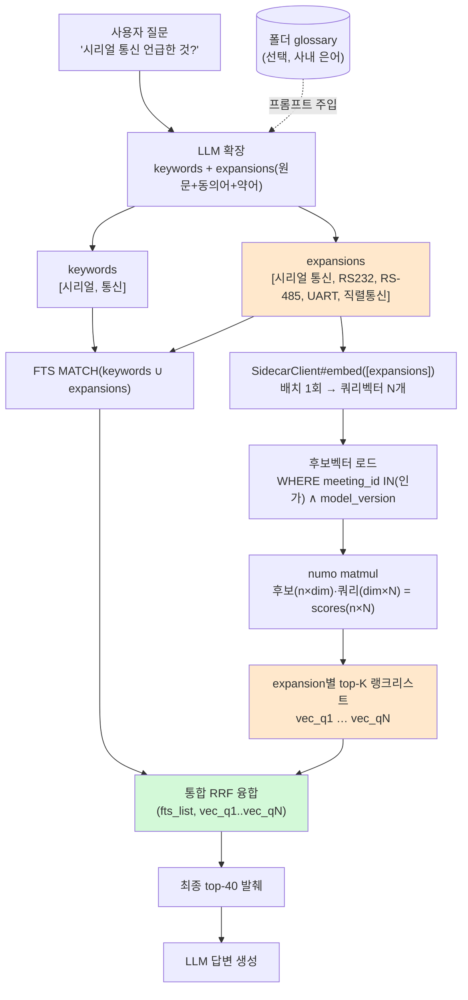
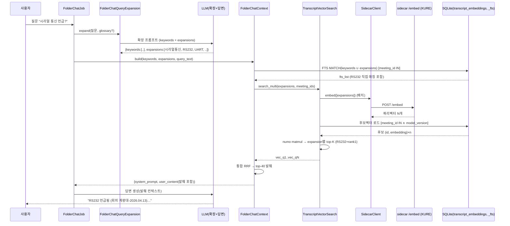

# 폴더/프로젝트 챗 — 쿼리 확장(Query Expansion) 설계

- 날짜: 2026-06-20
- 관련: `2026-06-19-folder-chat-embedding-design.md`(의미검색 본체), `project_folder_chat_embedding_impl`
- 상태: 설계 승인 (구현 대기)
- 브랜치: `feat/folder-chat-embedding` 위에 이어서(미머지) 또는 그 위 새 브랜치

## 0. 확정 결정 (2026-06-20)

- **확장 LLM = AI 챗 모델** — `user.effective_chat_llm_config`(현 `FolderChatKeywords`와 동일, 보통 haiku급 저렴 모델). 별도 모델·설정 없음. 추가 LLM 호출 0(기존 키워드 호출에 확장 흡수).
- **발췌 상한 `TOP_K` = 40 → 60** (`FolderChatContext`). 확장으로 후보 다양성↑ → 발췌 폭도 소폭 확대.
- 확장어 사전 불필요(LLM 즉석 생성). 사내 은어는 폴더 glossary 보강(선택).

### 0.1 구현 착수 확정 (2026-06-20, 브레인스토밍 재확인)

- **`FolderChatKeywords` 삭제** — 신 `FolderChatQueryExpansion`이 키워드 추출 + 폴백 토큰화까지 흡수. 클래스·스펙 제거(참조처 = job + spec 뿐, 확인됨). build 산출물 사본은 무시.
- **glossary = 파라미터만 배선** — `FolderChatQueryExpansion.expand(question, user:, glossary: nil)` 인자로 받아 프롬프트 주입 가능하게만. **DB 변경 0**(Folder.glossary 컬럼 미추가), job은 glossary 미전달. 추후 확장 여지만 남김.
- **회귀 테스트 = 대조(contrast) 검증** — "단일쿼리 '시리얼 통신' → RS232 발췌 미포함" vs "expansions=['시리얼 통신','RS232'] → 포함"을 한 테스트에서 동시 단언. 단순 포함만이 아니라 *확장이 없으면 놓치고 있으면 잡는다*를 증명. fixture는 stub `embed`가 쿼리별 다른 벡터 반환(시리얼통신 벡터=RS232행과 멂, RS232 벡터=RS232행과 가까움).
- **하위호환** — `FolderChatContext.build(..., expansions: [], query_text:)`: expansions 비면 벡터검색이 `[query_text]`로 폴백 → 기존 hybrid 스펙(expansions 미전달) 무회귀.
- **FTS 확장 처리** — `MATCH(keywords ∪ expansions)`에서 다중어 expansion은 토큰 분해 후 각 토큰을 `"tok"*` prefix로 OR 결합(phrase-prefix 모호성 회피). "RS232"는 단일토큰이라 직접 매칭.

### 0.2 검증 한계 (착수 시점 명시)

- 스펙은 LLM·sidecar 모두 stub → green = RRF/플러밍 정확성 증명일 뿐, **실제 계량대 수정 증명 아님**.
- sidecar가 구코드라 `/embed` 404 + `embeddings:backfill` 미실행(전 task `project_folder_chat_embedding_impl`에서 이월) → **벡터-확장 절반은 운영에서 죽어 있음**(sidecar 재시작 + 백필 전까지). 단 **FTS-확장 절반**(`"RS232"*` 직접매칭)은 sidecar 없이도 작동 — 단, 실 LLM이 "RS232"를 실제로 뱉어야 함(stub라 미검증).
- 완료 선언 = "구현 완료, 스펙 green; 실 계량대 수정은 sidecar 재시작 + 백필 + 수동 E2E 후 확인 가능".

## 1. 문제 (실측)

계량대(project 15)에서 "시리얼 통신 언급한 것 찾아줘" → RS232를 못 찾음.

| 쿼리 | RS232 전사(#16694, m77 "RS232는 다 통하는 거 아니야?") 결과 |
|------|------|
| `"시리얼 통신"` | **top-40 밖** (raw cosine 0.4355, 대화체 잡담 밑에 묻힘 ~rank 1000+) |
| `"RS232"` | **rank 1 (cosine 0.765)** |

원인: 범용 임베딩(KURE)이 한국어 개념어 "시리얼 통신" ↔ 약어 "RS232"를 의미적으로 약하게만 연결(0.43). KURE는 한국어 단문 baseline 유사도가 ~0.5~0.6이라 약한 매칭이 묻힘. FTS도 미스("RS232"엔 "시리얼"·"통신" 단어 없음). → 두 경로 다 RS232를 LLM 발췌에 못 올림.

**핵심 통찰**: top-40 한계는 **재정렬로 못 넘는다**(리랭커 무용 — 애초에 안 들어온 걸 못 살림). 하지만 **새 쿼리를 추가하면 넘는다** — 각 쿼리가 자기 top-40을 가지므로. "RS232"라는 별도 검색이 RS232를 rank1로 끌어온다.

## 2. 해결책 개요

질문을 **LLM이 동의어·약어·다른 표현으로 펼쳐**(expansions) 여러 검색을 던지고, 모든 결과를 RRF로 융합한다. 확장어는 **사전 불필요 — LLM이 질문 시점에 즉석 생성**(RS232 같은 일반 기술어는 학습지식으로 펼침). 선택적으로 폴더 glossary를 프롬프트에 주입해 사내 은어 보강.

## 3. 현재 흐름 (확장 전)

```
FolderChatJob
 └─ FolderChatKeywords.extract(질문)      ── LLM 1회 ─→ keywords=["시리얼","통신"]
 └─ FolderChatContext.build(keywords, query_text=질문)
     ├─ FTS:   MATCH(keywords)                        → fts_list   (RS232 없음)
     ├─ Vector: TranscriptVectorSearch.search(질문)    → vec_list   (RS232 없음, 묻힘)
     └─ RRF(fts_list, vec_list) → top-40 발췌 → LLM 답변
```

## 4. 변경 흐름 (확장 후)

```
FolderChatJob
 └─ FolderChatQueryExpansion.expand(질문[, glossary])  ── LLM 1회(기존 keyword 호출에 흡수) ─→
        { keywords:   ["시리얼","통신"],                        # FTS용 (기존)
          expansions: ["시리얼 통신","RS232","RS-485","UART","직렬 통신"] }  # 원문 포함, 3~5개
 └─ FolderChatContext.build(keywords, expansions, query_text=질문)
     ├─ FTS:    MATCH(keywords ∪ expansions)            → fts_list     ("RS232"* 가 RS232 직접 매칭)
     ├─ Vector: TranscriptVectorSearch.search_multi(expansions)
     │            ├─ SidecarClient#embed([e1..eN])  ── 배치 1회 ─→ 쿼리벡터 N개
     │            ├─ 후보벡터 1회 로드(WHERE meeting_id IN ∧ model_version)
     │            ├─ scores = 후보행렬(n×dim) · 쿼리행렬(dim×N) = (n×N)   # numo matmul 1회
     │            └─ 각 expansion 열별 top-K → expansion별 랭크리스트 [vec_q1..vec_qN]
     └─ 통합 RRF(fts_list, vec_q1, …, vec_qN) → 최종 top-40 발췌 → LLM 답변
```

**RS232가 들어오는 경로**: `expansions`의 "RS232" 서브쿼리(`vec_qi`)에서 RS232 전사가 rank1 → 통합 RRF에서 높은 점수 → 최종 top-40 → 발췌 → LLM이 "RS232 언급됨(계량대-2026.04.13)" 답변. (동시에 FTS도 "RS232"* 로 직접 매칭하여 이중 보강.)

## 5. 순서도 (Flowchart)



순서도(ASCII 요약):
```
질문 ─┬─────────────────────────────────────────────┐
      ▼                                             │
 [LLM 확장] → keywords + expansions(원문+약어 3~5)    │
      ├─ keywords∪expansions → FTS MATCH ───────────┤
      └─ expansions → embed(배치) → 후보cosine(matmul)│
                       → expansion별 랭크 N개 ────────┤
                                                     ▼
                            [통합 RRF(FTS + 벡터 N개)]
                                     ▼
                          최종 top-40 발췌 → LLM 답변
```

## 6. 시퀀스 다이어그램



## 7. 구현 통합 지점 (현 코드)

| 컴포넌트 | 변경 |
|---------|------|
| `FolderChatKeywords` → (확장) `FolderChatQueryExpansion` | LLM 응답을 `{keywords, expansions}` JSON으로 받게 프롬프트·파서 변경. **모델 = `user.effective_chat_llm_config`(AI 챗 모델, 저렴)** — 기존 keyword 호출과 동일, **추가 LLM 호출 0**. 실패 시 expansions=[원문]만(graceful). `MAX_EXPANSIONS=5`. |
| `LlmPrompts` | 확장 프롬프트 추가: "질문의 핵심 의미를 검색용 동의어·약어·다른 표현 3~5개로(원문 포함). 기술 용어는 표준 약어 포함(예: 시리얼 통신→RS232,UART). JSON 배열." (+glossary 주입 선택) |
| `FolderChatContext` | `build(..., expansions:)` 인자 추가. FTS MATCH를 `keywords ∪ expansions`로. 벡터는 `search_multi(expansions)`. 통합 RRF를 FTS+벡터 N개 리스트로 확장. **`TOP_K` 40→60.** |
| `TranscriptVectorSearch` | `search_multi(queries:, meeting_ids:, limit:)` 추가: `embed(queries)` 배치 → 후보 1회 로드 → `mat.dot(Qmat)`(n×N) → 열별 top-K → expansion별 리스트 반환. 기존 `search`는 `search_multi([q]).first`로 위임. |
| `SidecarClient#embed` | 변경 없음(이미 배치 `texts` 받음). |

## 8. 융합(RRF) 상세

통합 RRF — 모든 랭크 리스트(FTS 1개 + expansion별 벡터 N개)를 하나로:
```
score(t) = Σ_over_lists  1 / (RRF_K + rank_in_list(t) + 1)     # RRF_K=60, rank 0-base
```
- 여러 리스트에서 등장하면 점수 합산(다중 신호 강화).
- RS232: "RS232" 벡터리스트 rank0 → 1/61 + FTS리스트 매칭분 → 상위.
- 원문("시리얼 통신") 벡터리스트도 포함되므로 일반 의미검색 품질 회귀 없음.

## 9. 비용 / 성능

- LLM: **0 추가**(키워드 호출에 확장 흡수).
- 임베딩: 1배치(N텍스트) — 기존 1텍스트 대비 무시할 차이.
- 후보 로드: 동일(1회). cosine: `(n×dim)·(dim×N)` matmul 1회 — 현 규모(스코프 수천)서 수~수십 ms.
- 순지연 증가: 거의 없음.

## 10. 함정 / 한계

- **확장 노이즈**: 너무 많으면 엉뚱한 결과 유입 → `MAX_EXPANSIONS=5` + RRF가 원문 우세 유지.
- **LLM 미지의 사내 은어**(예: 내부 장비명 "B1-IMAGE"): LLM 확장 불가 → glossary 보강 또는 FTS 정확매칭이 안전망.
- **확장 비결정성**: LLM이라 run마다 약간 다름(검색 결과 미세 변동, 품질엔 무해).
- **여전히 retrieval 단계**: 확장어가 실제 데이터 표현과 닿아야 함. "RS232"는 데이터에 그대로 있어 적중. 데이터에 약어조차 없으면(개념만 다른 말로 존재) 확장도 한계 → 그땐 원문 의미검색 의존.

## 11. 테스트 (TDD 예정)

- `FolderChatQueryExpansion`: LLM stub → `{keywords, expansions}` 파싱, 원문 항상 포함, 실패 시 [원문] fallback, MAX 제한.
- `TranscriptVectorSearch#search_multi`: fixture 벡터로 expansion별 top-K + 융합, 빈 입력.
- **회귀(계량대 케이스)**: expansions=["시리얼 통신","RS232"] → RS232 전사가 최종 결과에 포함됨(현재는 미포함).
- 인가: search_multi도 `meeting_id IN` 필터 유지(스코프 밖 미노출).
- FolderChatContext 통합 RRF 순서 + 벡터 실패 시 FTS-only fallback 유지.

## 12. 단계

- Phase 1: `FolderChatQueryExpansion`(+프롬프트) — LLM 확장.
- Phase 2: `TranscriptVectorSearch#search_multi` + numo 다중쿼리 matmul.
- Phase 3: `FolderChatContext` 통합 RRF + FTS 확장 키워드.
- Phase 4: 계량대 회귀 테스트 + glossary 보강(선택).

---

## 부록 A. 구현 코드 (확정 — 서브에이전트는 이 코드를 그대로 전사)

> 모든 코드는 `backend/` 하위. 서브에이전트는 ① 이 코드를 정확히 작성, ② §A.7 테스트 케이스로 spec 작성(TDD: red→green), ③ 해당 spec 실행해 green 확인 후 반환. 시그니처/반환형은 한 글자도 바꾸지 말 것(특히 §A.3 contract).

### A.1 `app/services/folder_chat_query_expansion.rb` (신규)

```ruby
# 자연어 질문 → {keywords:, expansions:}. 단일 경량 LLM 호출로 FTS 키워드 + 검색 확장어를 동시에 뽑는다.
# 확장어(원문 동의어·약어·다른 표현)는 의미검색 recall을 높인다. 실패/파싱불가 시 graceful 폴백.
# ⚠️ 추가 LLM 호출 0 — 기존 키워드 호출 자리를 그대로 대체(FolderChatKeywords 후신).
class FolderChatQueryExpansion
  MAX_KEYWORDS   = 5
  MAX_EXPANSIONS = 5

  Result = Struct.new(:keywords, :expansions, keyword_init: true)

  def self.expand(question, user:, glossary: nil)
    new(question, user, glossary).expand
  end

  def initialize(question, user, glossary = nil)
    @question = question.to_s.strip
    @user     = user
    @glossary = glossary.to_s.strip
  end

  def expand
    return Result.new(keywords: [], expansions: []) if @question.blank?

    config = @user.effective_chat_llm_config
    return fallback if config.blank?

    raw = LlmService.new(llm_config: config).answer_question(prompt, @question)
    parse(raw) || fallback
  rescue StandardError => e
    Rails.logger.warn "[FolderChatQueryExpansion] #{e.message} — 폴백"
    fallback
  end

  private

  def prompt
    p = LlmPrompts::FOLDER_CHAT_EXPANSION_PROMPT
    p += "\n\n[사내 용어 참고]\n#{@glossary}" if @glossary.present?
    p
  end

  def parse(raw)
    json = raw.to_s[/\{.*\}/m] # 코드펜스·잡설 안의 첫 JSON 객체
    return nil unless json

    obj = JSON.parse(json)
    return nil unless obj.is_a?(Hash)

    Result.new(
      keywords:   clean(obj["keywords"], MAX_KEYWORDS).presence || tokenized,
      expansions: with_original(clean(obj["expansions"], MAX_EXPANSIONS))
    )
  rescue JSON::ParserError
    nil
  end

  def clean(arr, max)
    Array(arr).map { |w| w.to_s.strip }.reject(&:blank?).first(max)
  end

  # 원문 표현은 항상 expansions 맨 앞에 포함(의미검색 품질 회귀 방지).
  def with_original(arr)
    ([ @question ] + arr).map { |w| w.to_s.strip }.reject(&:blank?).uniq.first(MAX_EXPANSIONS)
  end

  def tokenized
    @question.split(/\s+/).reject(&:blank?).first(MAX_KEYWORDS)
  end

  def fallback
    Result.new(keywords: tokenized, expansions: [ @question ])
  end
end
```

### A.2 `app/services/llm_prompts.rb` (상수 추가 — 기존 `FOLDER_CHAT_KEYWORD_PROMPT` 자리 근처에 추가; 키워드 상수는 §A.6에서 제거)

```ruby
  # 폴더/프로젝트 챗 쿼리 확장: 한 번의 호출로 FTS 키워드 + 의미검색 확장어를 함께 뽑는다.
  FOLDER_CHAT_EXPANSION_PROMPT = <<~PROMPT.freeze
    너는 한국어 회의 검색 도우미다. 사용자 질문을 검색용으로 확장한다.
    아래 두 가지를 JSON 객체 하나로만 출력한다:
    - "keywords": 전문(full-text) 검색용 핵심 키워드. 명사·고유명사·핵심 동사 어근 위주, 조사·어미·불용어 제거. 각 키워드는 공백 없는 단어 1개. 5개 이하.
    - "expansions": 질문의 핵심 의미를 나타내는 동의어·약어·다른 표현 3~5개. 원문 표현을 반드시 포함한다. 기술 용어는 표준 약어/풀네임을 함께 넣어라(예: "시리얼 통신" → "RS232","UART","직렬 통신"). 각 항목은 검색 쿼리로 쓸 짧은 구.
    규칙:
    - 출력은 JSON 객체만. 설명·코드펜스 금지.
    - 예: {"keywords":["시리얼","통신"],"expansions":["시리얼 통신","RS232","UART","직렬 통신"]}
  PROMPT
```

### A.3 `app/services/transcript_vector_search.rb` (전체 교체)

**Contract(불변)**: `search_multi(queries:, meeting_ids:, limit:)` → `Array<Array<{transcript_id:, score:}>>` — 입력 쿼리 N개당 리스트 N개, 각 리스트는 score 내림차순 top-K. `search`는 `search_multi([q]).first || []`로 위임.

```ruby
require "numo/narray"

# 의미검색(브루트포스 exact cosine). VectorIndex 추상화 — 추후 pgvector 교체 지점.
# 벡터는 저장 시 L2 정규화돼 있으므로 dot product = cosine.
# ⚠️ meeting_ids·model_version 필터가 인가 경계 — 빼면 privilege escalation.
class TranscriptVectorSearch
  # 단일 쿼리: search_multi([q]).first 위임.
  def self.search(query_text:, meeting_ids:, limit: 40)
    search_multi(queries: [ query_text ], meeting_ids: meeting_ids, limit: limit).first || []
  end

  # 다중 쿼리(쿼리 확장): 쿼리별 [{transcript_id:, score:}] 리스트의 배열.
  # 후보벡터 1회 로드 + numo matmul(n×N) 1회로 N개 쿼리를 동시 평가.
  def self.search_multi(queries:, meeting_ids:, limit: 40)
    new(queries, meeting_ids, limit).search_multi
  end

  def initialize(queries, meeting_ids, limit)
    @queries     = Array(queries).map(&:to_s).reject(&:blank?)
    @meeting_ids = Array(meeting_ids)
    @limit       = limit
  end

  def search_multi
    return [] if @queries.empty? || @meeting_ids.empty?

    qvecs = Array(SidecarClient.new.embed(@queries)).reject(&:blank?)
    return [] if qvecs.empty?

    rows = TranscriptEmbedding
             .where(meeting_id: @meeting_ids, model_version: TranscriptEmbedding::MODEL_VERSION)
             .pluck(:transcript_id, :embedding)
    return Array.new(qvecs.size) { [] } if rows.empty?

    dim = qvecs.first.size
    mat = Numo::SFloat.zeros(rows.size, dim)
    rows.each_with_index { |(_, blob), i| mat[i, true] = Numo::SFloat.cast(blob.unpack("e*")) }

    qmat = Numo::SFloat.zeros(dim, qvecs.size)        # (dim × N)
    qvecs.each_with_index { |qv, j| qmat[true, j] = Numo::SFloat.cast(qv) }

    scores = mat.dot(qmat)                            # (n × N) cosine
    qvecs.each_index.map do |j|
      col   = scores[true, j]                         # (n,)
      order = col.sort_index.to_a.reverse             # 내림차순 인덱스
      order.first(@limit).map { |i| { transcript_id: rows[i][0], score: col[i].to_f } }
    end
  end
end
```

### A.4 `app/services/folder_chat_context.rb` (수정)

변경점:
1. `TOP_K = 40` → `TOP_K = 60`.
2. `self.build` 시그니처에 `expansions: []` 추가, 내부 `new(...)`에 전달.
3. `initialize`에 `expansions = []` 인자 추가 → `@expansions = Array(expansions).map(&:to_s).reject(&:blank?)`. `@keywords`도 `.map(&:to_s)` 추가.
4. FTS: `fts_terms`(키워드 ∪ 확장어 토큰분해) 신설, `fts_query`·`fts_ranked_ids` 가드가 이를 사용.
5. 벡터: 기존 `vector_ranked_ids` 제거 → `vector_queries`(확장어 우선, 비면 `[query_text]` 폴백) + `vector_ranked_lists`(search_multi 호출, id 리스트 배열) 신설.
6. `excerpts_block`이 `rrf_merge(fts_ids, *vec_lists)`로 통합 융합.

```ruby
  def self.build(scope_type:, scope_id:, user:, keywords:, expansions: [], query_text: nil)
    new(scope_type, scope_id, user, keywords, expansions, query_text).build
  end

  def initialize(scope_type, scope_id, user, keywords, expansions = [], query_text = nil)
    @scope_type = scope_type
    @scope_id   = scope_id
    @user       = user
    @keywords   = Array(keywords).map(&:to_s).reject(&:blank?)
    @expansions = Array(expansions).map(&:to_s).reject(&:blank?)
    @query_text = query_text.to_s
  end
```

```ruby
  # FTS 검색어: 키워드 ∪ 확장어(토큰 분해). 다중어 확장은 토큰별 prefix OR(phrase-prefix 모호성 회피).
  def fts_terms
    @fts_terms ||= (@keywords + @expansions.flat_map { |e| e.split(/\s+/) })
                     .map(&:strip).reject(&:blank?).uniq
  end

  def fts_query
    fts_terms.map { |w| "\"#{w.gsub('"', '')}\"*" }.join(" OR ")
  end
```

`fts_ranked_ids` 첫 줄 가드: `return [] if meeting_ids.empty? || fts_terms.empty?` (기존 `@keywords.empty?` 대체).

```ruby
  # 벡터 검색 쿼리: 확장어 우선, 없으면 원문(query_text)으로 폴백(하위호환).
  def vector_queries
    (@expansions.presence || [ @query_text ]).map(&:to_s).reject(&:blank?)
  end

  # 벡터 랭크 리스트들: 쿼리(확장어)별 [transcript_id,...]. sidecar 실패 시 [] (FTS-only fallback).
  def vector_ranked_lists
    return [] if meeting_ids.empty? || vector_queries.empty?

    TranscriptVectorSearch.search_multi(queries: vector_queries, meeting_ids: meeting_ids, limit: TOP_K)
                          .map { |list| list.map { |h| h[:transcript_id] } }
  rescue => e
    Rails.logger.warn("[FolderChatContext] 벡터검색 실패 → FTS-only: #{e.message}")
    []
  end
```

```ruby
  def excerpts_block
    return @excerpts_block if defined?(@excerpts_block)
    return @excerpts_block = "" if meeting_ids.empty?

    @fts_snippets = {}
    fts_ids   = fts_ranked_ids
    vec_lists = vector_ranked_lists
    return @excerpts_block = "" if fts_ids.empty? && vec_lists.all?(&:empty?)

    ranked = rrf_merge(fts_ids, *vec_lists).first(TOP_K)
    @excerpts_block = build_excerpt_lines(ranked)
  end
```

(`rrf_merge(*lists)`·`build_excerpt_lines`는 기존 그대로 — 변경 없음.)

### A.5 `app/jobs/folder_chat_job.rb` (수정)

기존 2줄:
```ruby
    keywords = FolderChatKeywords.extract(question&.content.to_s, user: user)
    ctx = FolderChatContext.build(scope_type: answer.scope_type, scope_id: answer.scope_id, user: user, keywords: keywords, query_text: question&.content)
```
→
```ruby
    expansion = FolderChatQueryExpansion.expand(question&.content.to_s, user: user)
    ctx = FolderChatContext.build(scope_type: answer.scope_type, scope_id: answer.scope_id, user: user,
                                  keywords: expansion.keywords, expansions: expansion.expansions, query_text: question&.content)
```

### A.6 삭제

- `app/services/folder_chat_keywords.rb`
- `spec/services/folder_chat_keywords_spec.rb`
- `llm_prompts.rb`의 `FOLDER_CHAT_KEYWORD_PROMPT` 상수(이제 미사용)

### A.7 테스트 케이스 (TDD)

**`spec/services/folder_chat_query_expansion_spec.rb`** (신규) — `let(:user) { create(:user) }`. 기존 keyword spec 패턴 차용(LlmService instance_double 스텁; 기본 user는 server_default_llm_config라 LlmService.new 호출됨).
- JSON 객체 파싱: `{"keywords":["예산"],"expansions":["예산","비용"]}` → `keywords=["예산"]`, `expansions=["예산","비용"]`(원문 포함).
- 원문 항상 expansions 맨 앞: 질문="시리얼 통신", LLM이 `expansions:["RS232","UART"]`만 줘도 결과 expansions 첫 원소가 "시리얼 통신".
- MAX_EXPANSIONS=5: LLM이 7개 줘도 5개로 제한.
- 코드펜스 감싼 JSON도 파싱(```json … ```).
- LLM 실패(raise) → fallback: `keywords`=질문 토큰화, `expansions`=[원문].
- 파싱불가 응답("그냥 텍스트") → fallback.
- keywords 누락(`{"expansions":[...]}`) → keywords가 토큰화로 채워짐.
- 빈 질문 → `keywords=[]`, `expansions=[]`.
- glossary 주입: `expand("q", user:, glossary: "B1=내부장비")` 시 `answer_question` 첫 인자(system prompt)에 "B1=내부장비" 포함(스파이로 `have_received(:answer_question).with(a_string_including("B1=내부장비"), "q")`).

**`spec/services/transcript_vector_search_spec.rb`** (기존 4개 유지 + search_multi describe 추가). 기존 헬퍼/스텁 패턴 그대로.
- `search_multi(queries: ["q1","q2"], ...)` → 길이 2 배열, 각 원소가 `[{transcript_id:, score:}]` 리스트.
- 쿼리별 다른 상위: q1=[1,0]→t_near 우선, q2=[0,1]→t_far 우선(embed가 쿼리별 다른 벡터 반환하도록 스텁: `allow(sidecar).to receive(:embed).with([...]).and_return([[1,0],[0,1]])`).
- 인가: search_multi도 meeting_ids 밖 전사 미포함.
- 빈 입력: `queries: []` → `[]`; `meeting_ids: []` → `[]`.
- 기존 `search` 4개 테스트가 위임 후에도 green.

**`spec/services/folder_chat_context_spec.rb` / `_hybrid_spec.rb`** (기존 전부 green 유지 — expansions 기본 [] 라 무회귀). 추가 1개(context_spec 또는 hybrid_spec):
- expansions 토큰이 FTS 매칭에 추가: 키워드엔 없는 단어를 expansions로 주면 그 단어로 FTS 히트되는 전사가 발췌에 포함(sidecar 불필요 — 벡터 스텁 빈 결과여도 FTS로 들어옴).

**`spec/services/folder_chat_context_query_expansion_spec.rb`** (신규, 계량대 **대조** 회귀) — 핵심.
- fixture: folder/project/user/meeting 1개. 전사:
  - `rs232` = `create(:transcript, ..., content: "RS232 직접 연결 되나요?")` — 본문에 "시리얼"·"통신" prefix 토큰 없음(FTS 단일쿼리 미스). 임베딩 `[1.0, 0.0]`.
  - **디코이 61개**: `61.times { |n| t = create(:transcript, meeting: meeting, content: "잡담 #{n}"); TranscriptEmbedding.create!(transcript: t, meeting_id: meeting.id, model_version: "kure-v1", dim: 2, embedding: TranscriptEmbedding.pack_vector([0.0, 1.0])) }` — 모두 `[0,1]`.
  - rs232 임베딩도 명시 생성(`[1.0,0.0]`). `TranscriptEmbedding.delete_all` 후 재생성, `transcripts_fts` 정리+`save!` 재색인.
  - sidecar 스텁(쿼리별): `allow(sidecar).to receive(:embed) { |texts| texts.map { |t| t.include?("RS232") ? [1.0,0.0] : [0.0,1.0] } }`.
- **단언 1 (확장 없음 → 놓침)**: `build(keywords: ["시리얼","통신"], query_text: "시리얼 통신")` → 벡터쿼리 "시리얼 통신"=[0,1] → 디코이 61개가 rs232(score 0)보다 상위 → top-60 밖 → `user_content`에 "RS232 직접 연결" **미포함**. (FTS도 "시리얼/통신" prefix 토큰이 rs232/디코이에 없어 미스.)
- **단언 2 (확장 있음 → 잡음)**: `build(keywords: ["시리얼","통신"], expansions: ["시리얼 통신","RS232"], query_text: "시리얼 통신")` → "RS232" 서브쿼리=[1,0]가 rs232를 rank0로 → 통합 RRF 상위 → `user_content`에 "RS232 직접 연결" **포함**. (동시에 FTS "RS232"* 직접 매칭으로 이중 보강.)
- TOP_K=60 가정. 디코이 61개라 단일쿼리 시 rs232는 62번째 → 확실히 배제.

**`spec/jobs/folder_chat_job_spec.rb`** (수정): `before`의 `allow(FolderChatKeywords).to receive(:extract).and_return(%w[예산])`을
```ruby
allow(FolderChatQueryExpansion).to receive(:expand).and_return(
  FolderChatQueryExpansion::Result.new(keywords: %w[예산], expansions: %w[예산])
)
```
로 교체(이중 LlmService.new 방지 → `expect(LlmService).to receive(:new)` 단일횟수 기대 유지). 나머지 케이스 그대로 green.
