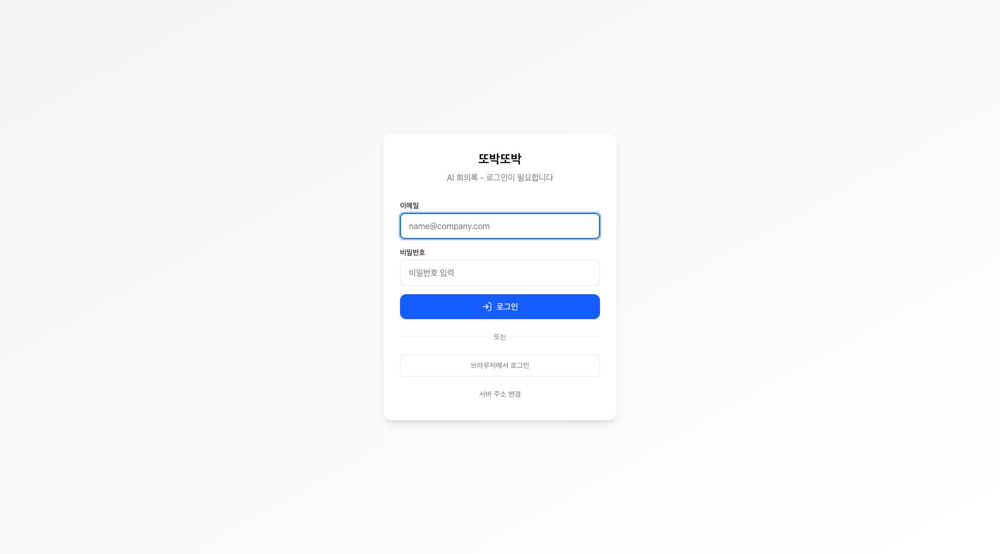
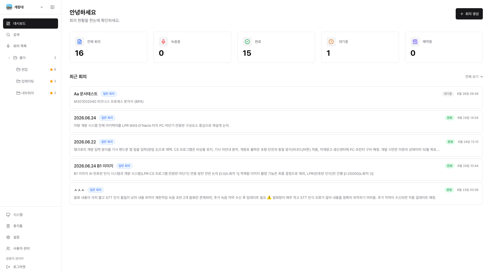
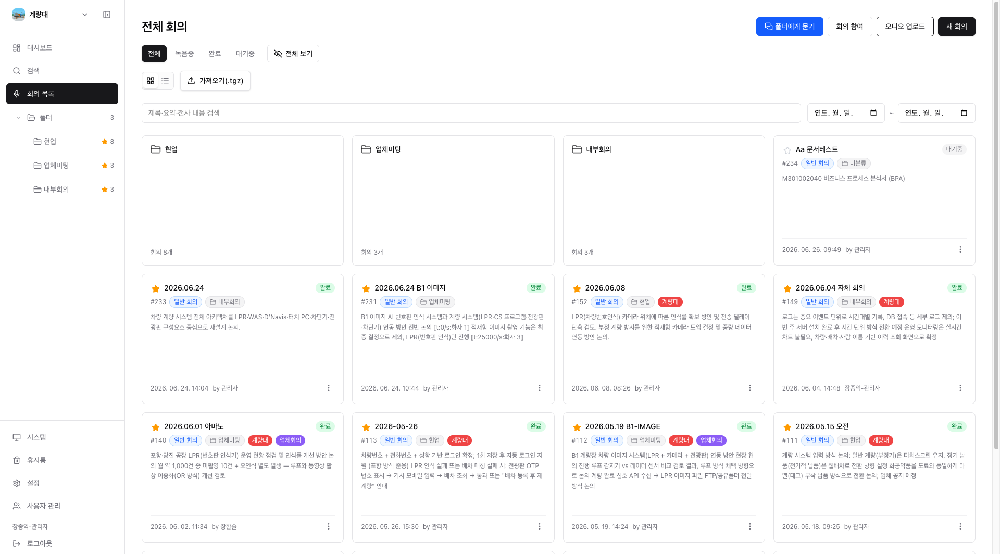
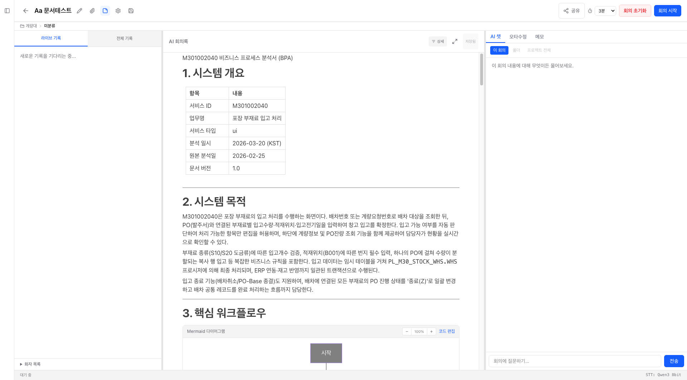
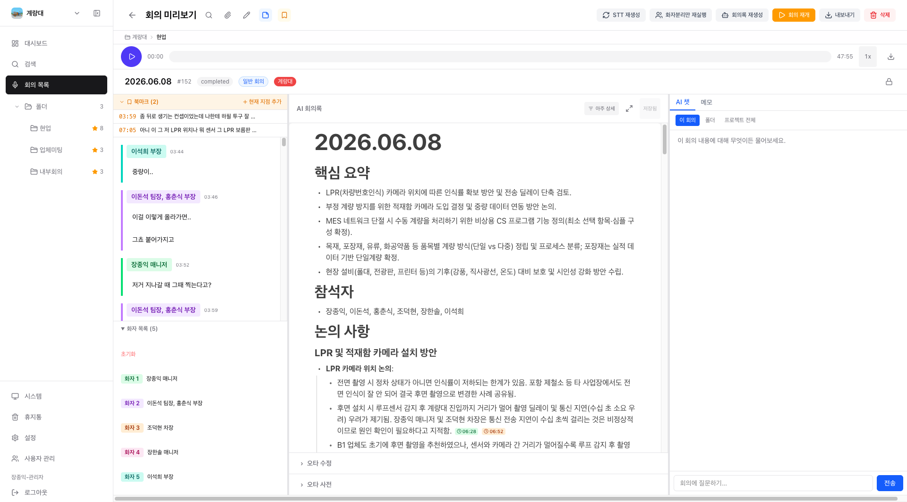
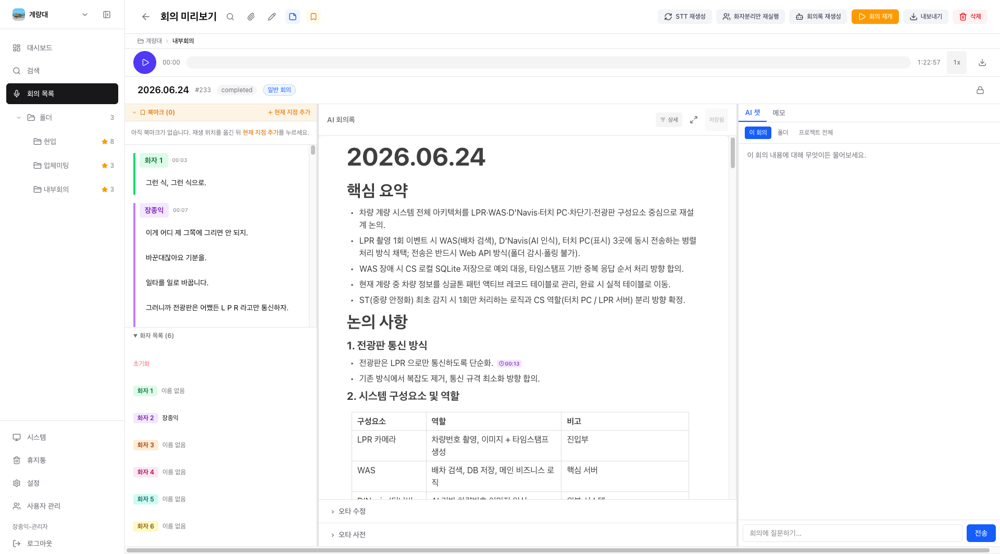
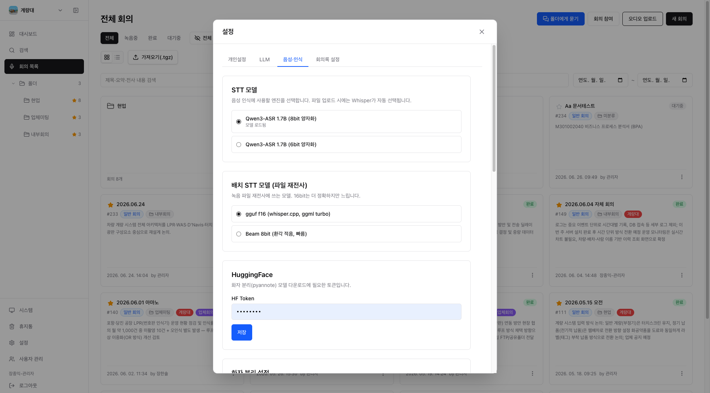

# 또박또박 사용자 매뉴얼

회의 음성을 실시간으로 받아쓰고, 화자를 자동으로 구분하며, AI가 회의록까지 정리해 주는 **셀프호스트(자체 호스팅) 회의록 어시스턴트**입니다.

이 매뉴얼은 또박또박을 처음 쓰는 분을 위한 사용 안내입니다. 앱 설치부터 회의 녹음, 회의록 확인·공유, 설정과 복구까지 화면에 보이는 그대로 차근차근 따라 할 수 있게 정리했습니다.

> **💡 빠른 시작**
> 1. 데스크톱 앱을 설치하고 실행 모드(로컬 실행 / 서버 연결)를 고릅니다.
> 2. 이메일·비밀번호로 **로그인**한 뒤 작업할 **프로젝트**를 선택합니다.
> 3. 회의 목록에서 **`새 회의`** 를 눌러 제목·유형을 정하고 회의를 만듭니다.
> 4. 라이브 화면에서 **`회의 시작`** 을 누르면 말하는 즉시 자막과 AI 회의록이 채워집니다.
> 5. 회의를 마치면 **`요약하고 종료`** 를 눌러 완성된 회의록을 확인하세요.

## 목차

1. [시작하기](#1-시작하기)
2. [프로젝트와 폴더 정리](#2-프로젝트와-폴더-정리)
3. [회의 녹음하기](#3-회의-녹음하기)
4. [실시간 전사와 파일 업로드(배치)](#4-실시간-전사와-파일-업로드배치)
5. [AI 회의록 확인·편집](#5-ai-회의록-확인편집)
6. [화자 정리](#6-화자-정리)
7. [검색과 AI 챗으로 활용](#7-검색과-ai-챗으로-활용)
8. [공유와 내보내기](#8-공유와-내보내기)
9. [예약과 자동화](#9-예약과-자동화)
10. [설정과 관리](#10-설정과-관리)
11. [휴지통과 복구](#11-휴지통과-복구)

---

## 1. 시작하기

또박또박은 회의 음성을 실시간으로 받아쓰고, 화자를 자동으로 구분하며, AI가 회의록까지 정리해 주는 **자체 호스팅(셀프호스트) 팀 회의 어시스턴트**입니다.

이 장에서는 데스크톱 앱을 설치하고 처음 실행해서 로그인한 뒤, 작업할 프로젝트를 고르는 데까지를 안내합니다.

### 1.1 데스크톱 앱 설치

또박또박 데스크톱 앱은 다음 운영체제에서 사용할 수 있습니다.

- **macOS** (Apple Silicon · Intel)
- **Windows**
- **Linux**

앱 하나만 설치하면 회의록에 필요한 구성요소가 모두 안에 들어 있어, 인터넷이 없어도 (기기에서 직접 처리하는 경우) 회의를 녹음하고 정리할 수 있습니다.

> 설치 파일을 받는 곳, 운영체제별 자세한 설치 방법, 보안 경고가 뜰 때의 대처는 **[배포 가이드](../../배포가이드.md)** 의 "데스크톱 앱" 부분을 참고하세요.

### 1.2 첫 실행: 로컬 모드와 서버 모드 고르기

앱을 처음 켜면 **실행 모드를 선택하는 화면**이 나옵니다. 두 가지 중 하나를 고르세요.

- **`로컬 실행`** — "이 컴퓨터에서 직접 실행합니다". 내 컴퓨터 안에서 또박또박이 통째로 돌아갑니다. 혼자 쓰거나, 회의 내용을 외부로 보내지 않고 인터넷 없이 쓰고 싶을 때 좋습니다.
- **`서버 연결`** — "원격 서버에 연결하여 사용합니다". 팀이 함께 쓰는 회의 서버에 접속해, 여러 사람이 같은 회의록을 공유합니다.

**서버 연결**을 골랐다면 접속할 서버를 지정합니다.

1. 같은 네트워크에 서버가 있다면 **`같은 Wi-Fi에서 서버 찾기`** 버튼을 눌러 자동으로 검색합니다. 찾은 서버나 **`저장된 서버`** 목록에서 하나를 누르면 주소가 자동으로 채워집니다.
2. 직접 입력하려면 **`서버 URL`** 칸에 주소(예: `192.168.0.10` 또는 `http://example.com:13323`)를 적고 **`연결 확인`** 을 누릅니다.
3. **"서버 연결 성공"** 이 보이면 준비된 것입니다.

마지막으로 아래 **`시작하기`** 버튼을 누르면 앱으로 들어갑니다. (로컬 실행은 서버 주소 없이 바로 시작할 수 있습니다.)

> **모바일에서는** 항상 서버 연결 방식만 사용합니다. 실행 모드 선택 없이 회의 서버 주소만 입력하면 됩니다. (안드로이드에서는 서버 없이 기기에 저장하며 쓰는 오프라인 시작도 지원합니다.)

### 1.3 초기 셋업: 환경 확인과 자동 설치

**로컬 실행**을 처음 고르면, 또박또박이 동작에 필요한 도구가 준비됐는지 스스로 점검합니다. 이 과정은 처음 한 번만 진행되며, 대부분 자동으로 끝납니다.

1. **`환경 확인`** 단계에서 필요한 도구(Ruby · uv(Python) · ffmpeg)가 설치돼 있는지 확인합니다. 준비된 항목에는 초록색 체크가 표시됩니다.
2. 빠진 도구가 있으면 **"필수 도구가 설치되지 않았습니다"** 안내와 함께 **`자동 설치`** 버튼이 나옵니다. 이 버튼을 누르면 또박또박이 알아서 설치합니다. (직접 설치한 뒤 **`다시 확인`** 을 눌러도 됩니다.)
3. 도구가 모두 준비되면 **`서비스 준비`** 단계로 넘어가 회의록 서비스가 켜질 때까지 잠시 기다립니다.
4. **"준비 완료!"** 가 보이면 자동으로 다음 화면으로 넘어갑니다.

> 문제가 생겨 오류 안내가 나오면 **`다시 시도`** 버튼으로 같은 과정을 다시 진행할 수 있습니다.

### 1.4 로그인

준비가 끝나면 로그인 화면이 나옵니다.

1. **`이메일`** 과 **`비밀번호`** 를 입력하고 **`로그인`** 버튼을 누릅니다.
2. 이메일이나 비밀번호가 틀리면 "이메일 또는 비밀번호가 올바르지 않습니다." 라는 안내가 나옵니다. 다시 확인해 주세요.

이 밖에 다음 방법도 있습니다.

- **`브라우저에서 로그인`** — 웹 브라우저 창에서 로그인한 뒤 앱으로 돌아옵니다.
- **`서버 주소 변경`** — 접속할 서버를 바꾸고 싶을 때 누르면 1.2의 실행 모드/서버 선택 화면으로 돌아갑니다.

> 화면 위쪽에 현재 접속 중인 **서버 주소**가 함께 표시되므로, 어느 서버에 연결되어 있는지 확인할 수 있습니다.

### 1.5 프로젝트 선택 화면

로그인하면 **`프로젝트 선택`** 화면이 나옵니다. 또박또박은 회의록을 **프로젝트** 단위로 모아 관리합니다.

1. 왼쪽 **`프로젝트`** 목록 또는 가운데 카드 그리드에서 작업할 프로젝트를 고릅니다. 각 카드에는 프로젝트 이름과 함께 **멤버 수 · 회의 수**, 설명이 표시됩니다.
2. 새 프로젝트를 만들려면 **`새 프로젝트`** 버튼을 누릅니다.
3. 프로젝트를 누르면 그 프로젝트의 **회의 목록**으로 들어갑니다.

> 또박또박을 처음 시작하면 **`내 회의`** 라는 개인 프로젝트가 자동으로 만들어져 있습니다. 팀 프로젝트가 따로 없어도 바로 회의를 시작할 수 있어요.

프로젝트에 들어오면 사이드바의 **`대시보드`** 에서 상태별 회의 수와 최근 회의를 한눈에 확인할 수 있습니다.

이제 또박또박을 쓸 준비가 끝났습니다. 다음 장부터 프로젝트와 폴더를 정리하고, 첫 회의를 녹음하는 방법을 살펴봅니다.

---

## 2. 프로젝트와 폴더 정리

회의가 쌓이기 시작하면 "어디에 그 회의가 있더라?"가 가장 흔한 고민입니다. 또박또박은 **프로젝트 → 폴더 → 회의** 3단계로 회의를 정리합니다. 프로젝트는 가장 큰 칸막이(개인용·팀용), 폴더는 그 안의 서랍, 회의는 서랍 속 문서라고 생각하시면 됩니다. 이 장에서는 프로젝트를 전환하고, 폴더를 만들고 옮기고, 위치를 한눈에 확인하는 방법을 안내합니다.

### 2.1 개인 프로젝트와 팀 프로젝트

또박또박의 프로젝트는 두 종류입니다.

- **개인 프로젝트** — 가입하면 **‘(내 이름)의 회의’** 라는 개인 프로젝트가 자동으로 만들어집니다. 예를 들어 이름이 "홍길동"이면 사이드바에 **`홍길동의 회의`** 로 보입니다. 나만 보는 공간이라 별도 설정 없이 바로 녹음을 시작할 수 있습니다.
- **팀 프로젝트** — 여러 사람이 함께 쓰는 공간입니다. 팀 단위로 회의록을 공유하고, 멤버를 초대하고, 프로젝트마다 아이콘·색·이름을 지정할 수 있습니다. 새 팀 프로젝트는 사이드바의 프로젝트 스위처에서 **`새 프로젝트`** 로 만듭니다(멤버 초대·공유 권한은 8장에서 자세히 다룹니다).

처음에는 개인 프로젝트 하나로 시작했다가, 팀과 함께 쓸 회의가 생기면 팀 프로젝트를 만들어 옮기면 됩니다.

### 2.2 사이드바와 프로젝트 스위처

왼쪽 **사이드바**는 또박또박을 돌아다니는 출발점입니다. 위에서 아래로 다음과 같이 구성됩니다.

- 맨 위: **프로젝트 스위처**(현재 프로젝트 아이콘 + 이름)
- 주요 메뉴: **대시보드**, **검색**, **회의 목록**
- 그 아래: **폴더** 트리(현재 프로젝트의 폴더들)
- 맨 아래: 테마 전환, **휴지통**, **설정** 등

**프로젝트 전환하기**

1. 사이드바 맨 위의 **프로젝트 스위처**(현재 프로젝트 이름이 적힌 부분)를 클릭합니다.
2. 펼쳐진 목록에서 이동할 프로젝트를 선택하면, 그 프로젝트의 회의 목록으로 바뀝니다. 폴더·회의 선택도 새 프로젝트 기준으로 다시 불러옵니다.
3. 목록 아래의 **`전체 프로젝트`** 를 누르면 모든 프로젝트를 카드로 보는 화면으로, **`새 프로젝트`** 를 누르면 프로젝트를 새로 만드는 화면으로 이동합니다.

> 데스크톱에서는 사이드바 오른쪽 경계를 좌우로 **드래그**해 폭을 조절하거나, 상단의 닫기 버튼으로 사이드바를 접을 수 있습니다. 모바일에서는 상단 메뉴 버튼으로 사이드바를 엽니다.

### 2.3 폴더 만들기·이름 변경

폴더는 사이드바의 **폴더** 영역에서 관리합니다. 맨 윗줄 **`폴더`** 항목을 클릭하면 펼쳐지거나 접히고, 옆의 숫자는 전체 폴더 개수입니다.

**새 폴더 만들기**

1. 사이드바에서 **`폴더`** 줄 위에 마우스를 올리면 오른쪽에 **+** 버튼이 나타납니다. 이 버튼을 클릭합니다.
2. **`새 폴더`** 창에서 폴더 이름을 입력하고 **`확인`** 을 누릅니다.

**하위 폴더 만들기 / 이름 변경**

1. 폴더 줄 위에 마우스를 올리면 오른쪽에 **⋮**(점 세 개) 메뉴 버튼이 보입니다. 클릭해서 메뉴를 엽니다.
2. **`하위 폴더`** 를 누르면 그 폴더 아래에 폴더를 더 만들 수 있고, **`이름 변경`** 을 누르면 폴더 이름을 바꿀 수 있습니다.

폴더를 더 이상 쓰지 않는다면 같은 **⋮** 메뉴의 **`휴지통`** 으로 보낼 수 있습니다. 이때 폴더 안의 회의와 하위 폴더도 함께 휴지통으로 이동하니, 확인 메시지를 잘 읽고 진행하세요. (휴지통에서 복구하는 방법은 11장을 참고하세요.)

폴더는 팀에 **공개**하거나 **비공개**로 전환할 수도 있습니다(⋮ 메뉴). 자세한 공유 동작은 8장에서 다룹니다.

### 2.4 폴더·회의 이동(드래그 & 메뉴)

또박또박에서 "이동"은 **두 가지 경우**가 있으니 구분하면 헷갈리지 않습니다.

**같은 프로젝트 안에서 위치 바꾸기 — 드래그 & 드롭**

- 폴더를 마우스로 잡고 다른 폴더 위에 놓으면 그 폴더의 **하위 폴더**로 들어갑니다. 맨 위 **`폴더`** 줄에 놓으면 최상위로 빠져나옵니다.
- 회의 카드도 똑같이 잡아서 원하는 폴더 위에 놓으면 그 폴더로 옮겨집니다.
- 회의 카드의 **⋮** 메뉴에서 **`폴더로 이동`** 을 골라 옮길 폴더(또는 분류 안 함)를 선택해도 됩니다.

**다른 프로젝트로 옮기기 — 메뉴 사용**

- 폴더를 다른 프로젝트로 옮기려면 폴더의 **⋮** 메뉴에서 **`프로젝트 이동`** 을 선택합니다.
- 회의를 다른 프로젝트로 옮기려면 회의 카드의 **⋮** 메뉴에서 **`프로젝트 이동`** 을 선택합니다(내가 멤버인 프로젝트로만 이동할 수 있습니다).

### 2.5 중요 표시

자주 보는 폴더는 **중요**로 표시해 두면 눈에 잘 띄고, 최근 회의 목록에서 빠르게 추려 볼 수 있습니다.

1. 폴더의 **⋮** 메뉴를 엽니다.
2. **`중요 표시`** 를 누르면 폴더 이름 옆에 별(★)이 붙습니다. 해제하려면 같은 메뉴에서 **`중요 해제`** 를 누릅니다.

중요 표시는 **폴더에서 회의로 이어받습니다.** 즉, 폴더를 중요로 표시하면 그 안의 회의도 기본적으로 중요로 취급됩니다. 다만 개별 회의에 직접 중요/일반을 지정하면 그 회의는 지정한 값을 우선합니다. (회의 단위 중요 표시는 회의 카드에서도 별 버튼으로 켜고 끌 수 있습니다.)

### 2.6 경로 브레드크럼으로 위치 확인하기

내가 지금 어느 폴더·프로젝트를 보고 있는지, 또 이 회의가 어디에 들어 있는지를 화면 위쪽의 **경로 표시(브레드크럼)** 로 확인할 수 있습니다. 두 가지가 있는데 동작이 다릅니다.

- **회의 목록의 경로(클릭 가능)** — 회의 목록 화면에서 폴더를 열면 위쪽에 **`전체 회의 › 폴더명`** 형태의 경로가 보입니다. 각 단계를 **클릭하면** 그 위치로 바로 이동합니다. 폴더에 넣지 않은 회의를 보고 있을 때는 **`전체 회의 › 미분류`** 로 표시됩니다.
- **회의 상세·라이브 화면의 경로(표시 전용)** — 회의를 열면 상단 컨트롤 줄 아래에 **`프로젝트 › 폴더 › 하위 폴더`** 형태로 이 회의가 속한 위치가 표시됩니다. 이건 **눈으로 확인하는 용도**라 클릭으로 이동하지는 않습니다. 폴더에 들어 있지 않은 회의는 **`미분류`** 로 나옵니다.

### 2.7 태그로 분류하기

폴더가 "어디에 보관하느냐"라면, **태그**는 "어떤 성격이냐"를 색깔 라벨로 붙여 두는 방법입니다. 한 회의에 여러 태그를 달 수 있어 폴더와 별개로 한눈에 구분할 수 있습니다. 태그는 프로젝트 단위로 관리됩니다.

**회의에 태그 달기**

1. 회의 카드의 **⋮** 메뉴에서 **`정보 수정`** 을 엽니다.
2. **`태그`** 항목에서 이미 만들어 둔 태그를 눌러 켜고 끕니다(선택하면 색이 채워집니다).
3. 새 태그가 필요하면 **`새 태그`** 를 눌러 이름을 입력하고 **`추가`** 합니다.

이렇게 단 태그는 회의 목록과 카드에 **색깔 배지**로 표시되어, 목록을 훑을 때 회의 성격을 빠르게 알아볼 수 있습니다.

---

## 3. 회의 녹음하기

또박또박의 핵심은 말하는 즉시 받아쓰고, 화자를 구분하고, AI가 회의록을 정리해 주는 **라이브 녹음**입니다. 이 장에서는 새 회의를 만들고, 녹음을 시작·일시정지·재개·종료하며, 녹음 중에 메모·북마크·안건을 남기는 방법을 안내합니다.

### 3.1 새 회의 만들기

1. `회의 목록` 화면 오른쪽 위의 **`새 회의`** 버튼을 누릅니다. (대시보드에서도 새 회의를 만들 수 있고, 모바일에서는 오른쪽 아래 **`+`** 버튼을 누릅니다.)
2. **`새 회의 만들기`** 창이 열리면 다음 항목을 채웁니다.
   - **회의 제목**: 처음에는 오늘 날짜가 자동으로 채워집니다. 그대로 두거나 원하는 제목으로 바꿉니다.
   - **회의 유형**: `일반`, `팀 회의`, `스탠드업`, `브레인스토밍`, `리뷰`, `인터뷰`, `워크숍`, `1:1`, `강연` 등에서 고릅니다. 유형에 맞춰 AI 회의록의 항목 구성이 달라집니다.
   - **이전 회의 참고 (선택)**: 같은 폴더의 지난 회의를 고르면, 그 회의록을 시작점으로 깔고 이번 회의 내용을 이어서 작성합니다. 필요 없으면 `없음`으로 둡니다.
   - **이 회의를 모든 사용자에게 공유**: 기본은 켜져 있습니다. 끄면 작성자와 관리자만 볼 수 있습니다. (공유에 관한 자세한 내용은 8장을 참고하세요.)
   - 정해진 시각에 자동으로 시작하는 **예약** 기능도 이 창에서 켤 수 있습니다. 예약은 9장에서 다룹니다.
3. **`생성`** 버튼을 누릅니다. 예약을 켜지 않았다면 곧바로 **라이브 녹음 화면**으로 이동합니다.

> 템플릿을 미리 만들어 두었다면 창 위쪽의 **`템플릿`** 목록에서 골라 회의 유형을 한 번에 맞출 수 있습니다.

**참석자 입력하기.** 참석자 명단은 라이브 녹음 화면 상단의 연필 아이콘(**`회의 정보 수정`**)에서 입력합니다.

1. 상단의 연필 아이콘을 눌러 **`회의 정보 수정`** 창을 엽니다.
2. **`참석자`** 칸에 이름을 쉼표 또는 줄바꿈으로 구분해 적습니다. (예: 홍길동, 김영희)
3. **`참여 인원`** 칸에 사람 수를 적으면 화자 구분의 힌트로 쓰입니다. 비워 두면 자동으로 감지합니다.

### 3.2 라이브 녹음: 시작·일시정지·재개·종료

1. **시작**: 화면 위쪽의 파란색 **`회의 시작`** 버튼을 누르면 녹음이 시작됩니다. 말하는 내용이 왼쪽 **`라이브 기록`** 영역에 실시간 자막으로 나타나고, 위쪽에 **`녹음 중`** 표시와 경과 시간이 보입니다.
2. **일시정지**: 잠시 멈추려면 **`일시정지`** 버튼을 누릅니다. 표시가 노란색으로 바뀌며 녹음이 멈춥니다.
3. **재개**: 다시 **`재개`** 버튼을 누르면 멈춘 지점부터 이어서 녹음합니다.
4. **종료**: 회의가 끝나면 빨간색 **`회의 종료`** 버튼을 누릅니다. *"이번 회의를 AI로 최종 요약할까요?"* 라고 물으면 다음 중 하나를 고릅니다.
   - **`요약하고 종료`**: 전체 내용으로 AI가 최종 회의록을 정리합니다. (권장)
   - **`요약 없이 종료`**: 요약 없이 녹음만 마칩니다.
   - **`취소`**: 종료를 취소하고 계속 녹음합니다.

녹음 중에는 약 1분 주기로 AI 회의록이 자동으로 갱신됩니다. 곧바로 갱신하고 싶으면 **`지금 요약`** 버튼을 누르세요. (AI 회의록을 읽고 다듬는 방법은 5장에서 다룹니다.)

> **이미 끝낸 회의를 이어서 녹음하려면**, 회의 상세 화면 위쪽의 **`회의 재개`** 버튼을 누르면 다시 녹음 화면으로 돌아가 이어서 기록할 수 있습니다.

> **주의 — `회의 초기화`**: 아직 녹음을 시작하지 않은 상태에서 보이는 **`회의 초기화`** 버튼은 전사·요약·첨부·오디오를 모두 비우고 회의를 처음 상태로 되돌립니다. 내용이 사라지므로 꼭 필요할 때만 사용하세요.

### 3.3 시스템 오디오 캡처 (데스크톱)

화상회의처럼 컴퓨터에서 소리가 나는 회의라면, 내 마이크뿐 아니라 **컴퓨터에서 재생되는 소리(상대방 목소리 등)까지 함께 녹음**할 수 있습니다.

- 데스크톱 앱의 녹음 화면 위쪽에 있는 모니터 모양 아이콘 옆 **시스템 오디오 캡처** 스위치를 켜면 됩니다.
- 이 기능은 **데스크톱 앱에서만** 제공됩니다. 웹 브라우저나 모바일에는 표시되지 않습니다.

### 3.4 녹음 중 메모·북마크·안건 첨부

녹음을 하면서 중요한 순간을 표시하거나 메모와 자료를 남길 수 있습니다.

**북마크 (Ctrl+B).** 중요한 발언이 나온 순간을 표시해 두면 나중에 그 지점으로 바로 이동할 수 있습니다.

1. 녹음 중 화면 위쪽의 북마크(책갈피) 아이콘을 누르거나 키보드 **`Ctrl+B`** 를 누릅니다.
2. **`북마크 추가`** 창에 현재 시각이 표시됩니다. **라벨**(예: "예산 결정")을 적거나 비워 둡니다.
3. **`추가`** 를 누르면 해당 시각에 북마크가 저장됩니다. 나중에 북마크 목록에서 누르면 그 지점으로 점프합니다.

**메모.** AI 요약과 별개로, 내가 직접 적는 메모를 남길 수 있습니다.

1. 화면 위쪽의 메모(쪽지) 아이콘을 눌러 메모 패널을 엽니다.
2. 적은 내용은 원문 그대로 보관되며 AI 요약과 섞이지 않습니다.

**안건 첨부.** 회의 안건이나 참고 문서를 올려 두면, AI가 회의록을 작성할 때 참고합니다.

1. 화면 위쪽의 첨부(클립) 아이콘을 눌러 첨부 영역을 엽니다.
2. **`안건`**·**`참고자료`**·**`명함`** 탭에서 원하는 분류를 고릅니다.
3. **`파일 추가`** 로 문서(PDF·워드·이미지 등)를 올리거나, **`링크 추가`** 로 URL을 첨부합니다.
4. **`안건`** 으로 올린 문서는 AI 회의록을 작성할 때 한 번 참고 자료로 반영됩니다.

> 모바일에서는 위쪽의 더보기(**⋯**) 메뉴와 화면 아래쪽의 **`기록`·`요약`·`메모`** 탭에서 같은 기능에 접근합니다.

### 3.5 모바일에서 백그라운드 녹음

모바일 앱은 녹음 도중 화면이 꺼지거나 다른 앱으로 전환해도 **끊김 없이 녹음**을 이어 갑니다. 회의 중에는 화면을 잠가 두어도 안심하고 진행할 수 있습니다.

---

## 4. 실시간 전사와 파일 업로드(배치)

또박또박은 두 가지 방식으로 회의록을 만듭니다. 회의를 진행하면서 말하는 즉시 자막과 회의록이 채워지는 **실시간(라이브) 전사**, 그리고 이미 녹음해 둔 오디오 파일을 올려 한 번에 변환하는 **파일 업로드(배치) 전사**입니다. 이 장에서는 화면에서 무엇을 보고 어떻게 확인하는지를 설명합니다. (녹음 시작·일시정지·종료 등 녹음 제어는 **3장 회의 녹음하기**를, 회의록 편집은 **5장**을 참고하세요.)

### 4.1 라이브 실시간 전사 화면 보기

회의 화면에서 **`회의 시작`**(오른쪽 위 파란 버튼)을 누르면 라이브 화면으로 들어가고, 말하는 내용이 곧바로 자막으로 흐릅니다. 녹음을 시작·일시정지·종료하는 방법은 3장을 참고하세요.

화면은 크게 세 영역으로 나뉩니다.

1. **왼쪽 — 실시간 자막과 화자**
   - **`라이브 기록`** 탭에는 방금 인식된 발화가 위에서 아래로 실시간으로 쌓입니다. 아직 말이 시작되지 않았다면 "새로운 기록을 기다리는 중..."이라고 표시됩니다.
   - **`전체 기록`** 탭으로 바꾸면 회의 전체 전사를 한눈에 볼 수 있습니다.
   - 아래쪽 **`화자 목록`**에서 발화자 목록을 확인할 수 있습니다. 단, 자막은 즉시 표시되지만 **화자 구분(누가 말했는지)은 회의를 종료한 뒤에 적용**됩니다. 녹음 중에는 화자 이름이 붙지 않을 수 있으며, 화자 정리·이름 지정은 **6장 화자 정리**를 참고하세요.

2. **가운데 — 실시간 AI 회의록**
   - 녹음이 진행되는 동안 **`AI 회의록`**이 일정 주기마다 자동으로 갱신되어 핵심·논의·결정 등으로 점점 구조화됩니다. 표나 다이어그램이 들어가기도 합니다.
   - 위쪽 **`적용 주기`**(예: `3분`) 선택으로 회의록을 얼마나 자주 갱신할지 조절할 수 있고, **`지금 요약`**을 누르면 다음 주기를 기다리지 않고 즉시 한 번 갱신합니다.
   - **`상세`** 선택으로 회의록 분량(압축율)을, 확장 아이콘으로 회의록을 넓은 팝업으로 펼쳐 볼 수 있습니다. 회의록 읽기·조정·편집의 자세한 방법은 5장을 참고하세요.

3. **오른쪽 — AI 챗·오타수정·메모**
   - **`AI 챗`** 탭에서 진행 중인 회의 내용에 바로 질문할 수 있습니다(자세히는 7장).
   - **`오타수정`** 탭은 잘못 인식된 용어를 바로잡을 때, **`메모`** 탭은 AI 회의록과 별개로 직접 메모를 남길 때 사용합니다.

> 화면 맨 아래에는 현재 사용 중인 음성 인식 모델(예: `STT: Qwen3 8bit`)과 상태(예: `대기 중`)가 표시됩니다.

### 4.2 오디오 파일 업로드로 회의록 만들기(배치)

회의를 실시간으로 녹음하지 못했더라도, 따로 녹음해 둔 음성 파일을 올리면 동일한 회의록을 만들 수 있습니다.

1. **`회의 목록`** 화면 오른쪽 위의 **`오디오 업로드`** 버튼을 누릅니다.
2. **`오디오 파일로 회의록 작성`** 창이 열리면 점선 영역에 파일을 끌어다 놓거나 클릭해서 선택합니다. **MP3, WAV, M4A, WebM, OGG, FLAC** 등 일반적인 음성 형식을 지원합니다.
3. **`회의 제목`**(파일 이름이 자동으로 채워집니다)과 **`회의 유형`**을 정하고, 필요하면 **`회의록 압축율`**(분량)과 **`회의록 구성 방식`**(`주제별 재구성` 또는 `시간 흐름`)을 선택합니다. 그대로 두면 직전 회의 설정을 따릅니다.
4. **`업로드 및 변환`**을 누르면 변환이 시작됩니다.

변환이 시작되면 진행 상황을 보여 주는 전체 화면이 나타납니다. **진행률 막대와 백분율(%)**, 그리고 현재 단계 안내가 함께 표시됩니다. 예를 들어 음성 인식 중에는 `음성 인식 중… 경과 0:42 · 잔여 ~1:10`처럼 **지금까지 걸린 시간과 예상 잔여 시간**을 보여 주고, 이후 화자 분리·후처리, AI 회의록 생성 단계를 차례로 안내합니다. 변환이 끝나면 자동으로 완성된 회의 화면으로 넘어갑니다.

긴 파일도 자동으로 나누어 처리하며, 화자 분리와 AI 회의록 작성이 실시간 녹음과 동일하게 적용됩니다. 다만 화자 분리를 켜 둔 경우에는 회의록이 자동 생성되지 않고, **화자 이름을 먼저 지정한 뒤 회의록을 생성**하도록 안내합니다(자세히는 6장 화자 정리).

> 오디오 업로드는 데스크톱·웹 화면에서 제공됩니다.

### 4.3 모바일 오프라인 온디바이스 녹음(Android)

인터넷이나 서버에 연결되지 않은 환경에서도, Android 모바일 앱에서는 음성 인식을 **기기 안에서 직접** 처리하는 오프라인 녹음을 사용할 수 있습니다.

1. 처음 한 번은 **`설정`** > **`전사 위치`**에서 온디바이스 음성 인식 모델(약 2.7GB)을 내려받습니다. 다운로드가 끝나면 `준비됨`으로 표시되어 오프라인 전사가 가능해집니다.
2. **`전사 위치`**를 `온디바이스`(항상 폰에서 전사) 또는 `자동`(서버에 연결되지 않으면 자동으로 폰에서 전사)으로 선택합니다.
3. 오프라인 회의 홈에서 **`오프라인 회의 시작`**을 누르면 서버 없이도 녹음과 전사가 진행됩니다.

온디바이스 전사는 한 가지 언어만 인식하고 화자 구분은 제공하지 않습니다. 오프라인으로 만든 회의는 나중에 서버에 업로드하면 공유·검색·요약 기능을 이어서 사용할 수 있습니다.

---

## 5. AI 회의록 확인·편집

회의가 끝나거나 오디오 전사가 완료되면, 또박또박이 전체 발화를 분석해 **AI 회의록**을 자동으로 작성합니다. 회의 상세 화면 가운데 패널에서 회의록을 읽고, 분량을 조절하고, 직접 다듬고, 필요하면 처음부터 다시 만들 수 있습니다.

### 5.1 회의록 구조 읽기

가운데 **AI 회의록** 패널에 회의록이 표시됩니다. 회의록은 회의 유형(일반·팀·스탠드업·인터뷰 등)에 맞춰 구성이 달라지며, 보통 다음과 같은 항목으로 정리됩니다.

- **핵심 요약** — 회의에서 합의·결정된 내용을 항목별로 압축
- **논의 사항** — 주제별로 오간 의견과 배경
- **참석자** — 회의록에서 인식된 발화자 이름
- **결정 사항·할 일** — 정해진 결정과 후속 작업(담당·기한이 추출되면 함께 표시)

내용에 따라 비교 항목은 **표** 형태로 정리되기도 하고, 흐름이 있는 내용은 **다이어그램**(5.6)으로 그려지기도 합니다. 각 항목 옆에 붙은 시각 배지는 원본 발화로 점프하는 인용 근거입니다(5.5).

> 표시되는 항목 이름과 순서는 회의 유형마다 다릅니다. 위 목록은 일반적인 예시입니다.

### 5.2 요약 분량·구성 방식 조절 (압축율 5단계)

회의록이 너무 길거나 짧다고 느껴지면 **압축율**을 바꿔 다음 생성부터 분량을 조절할 수 있습니다. AI 회의록 패널 머리글의 압축율 버튼(현재 단계가 `보통`·`상세` 등으로 표시됨)을 누르면 설정 창이 열립니다.

압축율은 5단계입니다.

1. **아주 간결** — 결정·할 일만, 항목당 한 문장 (가장 빠름)
2. **간결** — 항목당 한 문장, 표 최소화
3. **보통** — 기본 분량
4. **상세** — 맥락·근거를 충실히, 표 적극 활용
5. **아주 상세** — 발언 흐름·반론까지 전부 (가장 느림)

원하는 단계를 누르면 바로 저장됩니다. 같은 창 아래의 **`지속 재구조화`** 스위치로 회의록을 쌓는 방식도 고를 수 있습니다.

- **켜짐(기본값)** — 요약할 때마다 전체를 다시 정리합니다. 깔끔하지만, 논의가 바뀌면 마지막 내용만 남습니다.
- **꺼짐(증분)** — 앞 내용은 그대로 두고 새로 진행된 구간을 시간대별로 뒤에 덧붙입니다. 더 빠르며, 버튼에 `· 증분`이 함께 표시됩니다.

> 회의가 아주 길 때 `아주 상세`로 만들면 생성이 오래 걸릴 수 있습니다. 분량이 큰 회의는 `보통`이나 `상세`를 권장합니다.

### 5.3 블록 에디터로 직접 편집·자동 저장

AI 회의록은 문서 편집기처럼 직접 고칠 수 있습니다. 본문을 클릭해 글자를 바꾸거나, 항목을 추가·삭제하면 됩니다.

1. 고치고 싶은 문장을 클릭해 바로 입력합니다.
2. 빈 줄에서 **`/`**(슬래시)를 입력하면 제목·목록·표·다이어그램 등 블록을 끼워 넣는 메뉴가 열립니다.
3. 편집을 멈추면 약 2초 뒤 자동으로 저장되고, 머리글 버튼이 **`저장됨`**으로 바뀝니다. 즉시 저장하려면 **`저장`** 버튼을 누르세요.

라이브 녹음 중에는 머리글에 **`자동 저장`** 표시가 떠 있어, 편집한 내용이 그대로 보존됩니다.

> 실수로 모든 내용을 지운 채 저장되는 것을 막는 보호 장치가 있어, 편집 중 실수해도 회의록이 통째로 비워지지 않습니다.

### 5.4 잘못 인식된 용어 한 번에 고치기 (오타 수정)

고유명사나 전문용어가 잘못 받아쓰였다면, AI 회의록 패널 아래 **`오타 수정`** 항목을 펼쳐 회의록과 전사 전체에서 한 번에 바꿀 수 있습니다.

1. **`오타 수정`** 막대를 눌러 펼칩니다.
2. 왼쪽 칸에 잘못된 용어, 오른쪽 칸에 올바른 용어를 입력합니다. 여러 개를 고치려면 **`+ 용어 추가`**로 줄을 늘립니다.
3. **`오타 수정 적용`**을 누르면 회의록과 전사에서 해당 용어가 모두 교체됩니다.

자주 틀리는 용어를 폴더 단위 사전으로 등록해 두는 방법은 7장에서 다룹니다.

### 5.5 인용 근거 클릭으로 그 순간 듣기

AI 회의록과 AI 챗 답변의 문장 끝에는 발화 **시각·화자** 배지가 붙습니다. 이 배지를 누르면 해당 발언이 나온 지점으로 오디오가 이동해 바로 재생됩니다. "정말 그렇게 말했는지" 원문으로 확인할 수 있습니다.

화자 이름을 나중에 바꾸면, 배지의 이름과 색도 현재 화자 기준으로 다시 표시됩니다.

### 5.6 다이어그램(Mermaid) 보기·삽입

프로세스나 흐름이 있는 내용은 회의록에 다이어그램으로 그려질 수 있습니다.

- 다이어그램을 클릭하면 **확대 보기**가 열려 크게 보고 확대·축소할 수 있습니다.
- 직접 넣으려면 빈 줄에서 **`/`**를 입력한 뒤 **`Mermaid 다이어그램`**을 선택합니다.

### 5.7 회의록 크게 펼쳐 읽기 (전체보기)

회의록을 넓게 읽고 싶다면 AI 회의록 머리글의 **`전체보기`** 아이콘(↗)을 누릅니다.

- **데스크톱** — 회의록이 떠 있는 창으로 크게 열립니다. 창 머리글을 잡아 끌어 위치를 옮기고, 가장자리를 끌어 크기를 조절할 수 있으며, 위치·크기는 다음에 열 때까지 기억됩니다. 뒤쪽 전사 화면도 그대로 보여 함께 확인할 수 있습니다. 닫으려면 **`닫기`**(X)를 누르거나 `Esc` 키를 누릅니다.
- **모바일에서는** 전체 화면으로 열립니다.

전체보기는 **읽기 전용**입니다. 내용을 고칠 때는 5.3처럼 가운데 패널에서 직접 편집하세요.

### 5.8 회의록 다시 만들기 (재생성)

회의록을 처음부터 새로 만들고 싶다면, 화면 상단 도구막대의 **`회의록 재생성`** 버튼을 누릅니다(전사가 있는 완료된 회의에서 사용 가능).

1. 압축율·재구조화(5.2)나 화자 이름을 먼저 정리해 둡니다.
2. **`회의록 재생성`**을 누릅니다.
3. "기존 회의록을 삭제하고 전체 트랜스크립트를 바탕으로 처음부터 다시 생성합니다"라는 확인 창이 뜨면 진행을 선택합니다.

생성이 끝나면 새 회의록으로 교체됩니다. 직접 편집한 내용이 있다면 재생성 시 사라지므로, 필요하면 미리 따로 보관하세요.

> 화자분리를 켠 회의는 좌측 **화자 목록**에서 이름을 지정한 뒤 `회의록 재생성`으로 만들면, 회의록에 실제 이름이 반영됩니다(자세한 내용은 6장).

### 5.9 회의 잠금으로 확정본 보호하기

회의록을 확정한 뒤 더 이상 바뀌지 않도록 잠글 수 있습니다. 잠금은 **회의 소유자와 관리자**만 사용할 수 있습니다.

1. 회의 제목 옆의 **자물쇠 아이콘**을 누릅니다.
2. 잠기면 제목 옆에 **`읽기 전용`**(모바일에서는 `잠금`) 배지가 표시됩니다.

잠긴 회의는 편집·`회의록 재생성`·`회의 재개`·오타 수정·삭제 등 내용을 바꾸는 기능이 모두 잠깁니다. 다만 **내보내기**(8장)는 잠금 상태에서도 가능합니다. 다시 수정하려면 같은 **자물쇠 아이콘**을 눌러 잠금을 해제하세요.

---

## 6. 화자 정리

회의에 여러 사람이 참여하면, 누가 어떤 말을 했는지 구분돼 있어야 회의록을 읽기 편합니다. 또박또박은 음성을 분석해 발화자를 자동으로 나누는 **화자 분리** 기능을 제공합니다. 분리된 화자에 실제 이름을 붙이면 전사 본문, 검색 결과, AI 회의록 곳곳에 그 이름이 그대로 반영됩니다.

### 6.1 화자 분리 켜기 (요약)

화자 분리는 설정의 **`음성·인식`** 탭에서 한 번만 켜 두면 됩니다. 분리 모델을 내려받기 위해 **HuggingFace 토큰**이 필요하며, 토큰이 없으면 기능이 비활성화됩니다. 켜는 자세한 순서와 민감도 조정은 **10.6**을 참고하세요.

화자 분리는 **오디오 전체를 한 번에 분석하는 방식**이라 파일 업로드나 STT 재생성 시점에 적용됩니다. 실시간 녹음 중에는 화자 라벨이 바로 붙지 않으니, 녹음을 마친 뒤 STT 재생성(또는 6.4의 화자분리만 재실행)으로 화자를 나눠 주세요. 회의 정보에 **참여 인원**을 입력해 두면 그 인원수에 가깝게 화자를 맞춰 줍니다.

### 6.2 화자 이름 바꾸기

회의 상세 화면 왼쪽의 **화자 목록**에는 분리된 화자가 색상 배지와 함께 표시됩니다. 처음에는 `화자1`, `화자2`처럼 임시 이름으로 나오는데, 실제 참석자 이름으로 바꿔 줄 수 있습니다.

방법은 두 가지입니다.

- **화자 목록에서 바꾸기**: 목록에서 바꿀 화자의 이름을 클릭하면 입력 칸이 열립니다. 이름을 입력하고 **Enter** 를 누르면 적용됩니다.
- **전사 본문에서 바꾸기**: 전사 본문에 붙은 화자 칩을 **더블클릭**하면 그 자리에서 바로 이름을 고칠 수 있습니다.

어느 쪽으로 바꾸든 같은 화자가 등장하는 전사·검색·AI 회의록 전반에 새 이름이 함께 반영됩니다.

화자 구분을 처음부터 다시 시작하고 싶다면, 화자 목록 위쪽의 **`초기화`** 를 누릅니다. 지정해 둔 화자 이름이 모두 지워지니 주의하세요.

### 6.3 화자 배지로 발화 따라가기

특정 사람이 어떤 말을 했는지 빠르게 확인하고 싶을 때, 화자 목록의 **색상 배지**를 누르면 그 화자의 발화 위치로 오디오가 이동하면서 자동으로 재생됩니다. 같은 배지를 다시 누르면 같은 화자의 **다음 발화**로 이어서 넘어가므로, 한 사람의 발언만 연달아 들어 볼 수 있습니다.

### 6.4 화자분리만 다시 실행하기

민감도를 바꿨거나 화자가 잘못 나뉘었을 때는, 전사를 다시 하지 않고 화자만 다시 나눌 수 있습니다. 전사·녹음이 끝난 오디오 회의의 **회의 상세 화면 상단**에 **`화자분리만 재실행`** 버튼이 있습니다.

1. 회의 상세 상단에서 **`화자분리만 재실행`** 을 누릅니다.
2. 확인 창에서 **`재실행`** 을 누릅니다. 전사 텍스트는 그대로 유지하고, 현재 민감도 설정으로 화자만 다시 분리합니다. 다시 전사하지는 않으며 보통 1~2분 정도 걸립니다.
3. **재실행하면 지정해 둔 화자 이름은 초기화됩니다.** 끝난 뒤 6.2를 참고해 이름을 다시 지정해 주세요.

화자 분리가 끝나면 AI 회의록 영역에 "화자분리가 완료되었습니다. 좌측 화자 목록에서 이름을 지정한 뒤 회의록 재생성 버튼으로 회의록을 만들 수 있습니다."라는 안내가 표시됩니다. 화자 이름을 먼저 정한 다음 회의록을 만들면, 회의록에도 실제 이름이 담깁니다.

---

## 7. 검색과 AI 챗으로 활용

쌓인 회의가 많아질수록 "그때 무슨 얘기를 했더라"를 빠르게 찾는 일이 중요해집니다. 또박또박은 전사와 회의록을 한꺼번에 검색하고, 회의에 직접 질문해 AI가 근거와 함께 답하도록 도와줍니다. 잘못 받아쓴 용어를 한 번에 고치고, 명함 사진만으로 참석자를 등록하는 기능도 함께 소개합니다.

### 7.1 전역 검색 — 모든 회의에서 찾기

여러 회의에 걸쳐 단어나 문장을 찾을 때 사용합니다.

1. 왼쪽 사이드바에서 **검색**을 클릭합니다. (모바일에서는 화면 하단 탭의 **검색**)
2. 검색창에 찾을 내용을 입력하고 **검색** 버튼을 누르거나 Enter를 칩니다. 회의록(요약)과 받아쓴 기록을 함께 찾아 줍니다.
3. 결과는 회의별로 묶여서 나옵니다. 회의 제목과 날짜 옆에 `요약 N건`·`기록 N건` 배지로 어디에서 몇 건이 나왔는지 보여 주고, 검색어가 노란색으로 강조된 미리보기 문장이 함께 표시됩니다.
4. 회의 제목을 클릭하면 해당 회의로 이동합니다.

**필터로 좁히기**: 검색창 오른쪽의 깔때기 모양 **필터** 버튼을 누르면 조건을 추가할 수 있습니다.

- **화자**: 특정 화자가 말한 부분만 (예: `화자 1`)
- **날짜**: 시작일 ~ 종료일 범위
- **상태**: `상태 전체` / `대기중` / `녹음중` / `완료`

결과가 많으면 아래쪽 화살표 버튼으로 페이지를 넘길 수 있습니다.

### 7.2 회의 내 검색 — 지금 보는 회의에서 찾기

특정 회의 안에서 특정 대목을 찾을 때 사용합니다.

1. 회의 상세 화면에서 **Ctrl+F**(Mac은 **Cmd+F**)를 누릅니다. 키보드가 없다면 상단 도구막대의 검색 버튼(`페이지 내 검색`)을 눌러도 됩니다.
2. 나타난 검색 바에 단어를 입력하면 받아쓴 전사와 AI 회의록 본문에서 일치하는 곳을 찾아 줍니다. (검색 바에는 `전사·요약 검색`이라고 표시됩니다.)
3. 일치 항목 사이를 이동합니다.
   - **Enter**: 다음 항목으로
   - **Shift+Enter**: 이전 항목으로
   - 검색 바의 위·아래 화살표 버튼으로도 이동할 수 있습니다.
4. 검색 바 가운데의 `현재/전체` 숫자로 몇 번째 항목을 보고 있는지 확인할 수 있습니다.
5. **Esc**를 누르거나 X 버튼으로 검색 바를 닫습니다.

### 7.3 회의에 질문하기 (AI 챗)

회의록과 전사를 근거로 AI에게 직접 물어볼 수 있습니다. "오늘 결정된 사항만 정리해 줘", "예산 얘기 나온 부분 요약해 줘"처럼 자연스럽게 질문하면 됩니다.

1. 회의 상세 화면 오른쪽 패널에서 **AI 챗** 탭을 엽니다.
2. 아래 입력창(`회의에 질문하기…`)에 질문을 적고 **전송** 버튼을 누르거나 Enter를 칩니다.
3. 답변은 실시간으로 한 글자씩 작성되며, 답변 위에는 어떤 AI 모델이 답했는지 표시됩니다.
4. 답변 문장에 붙은 시각·화자 인용 표시를 클릭하면 그 발언이 나온 원본 오디오 지점으로 바로 이동합니다.

> AI 챗 대화 내용은 나에게만 보입니다. 같은 회의를 함께 보는 다른 참여자에게는 공유되지 않습니다.

**질문 범위(스코프) 바꾸기**: AI 챗 탭 위에는 질문 범위를 고르는 버튼이 있습니다.

- **이 회의**: 지금 보는 회의 안에서만 답합니다.
- **폴더**: 이 회의가 속한 폴더의 회의들을 함께 살펴 답합니다.
- **프로젝트 전체**: 프로젝트 안의 모든 회의를 가로질러 답합니다.

`폴더`·`프로젝트 전체`는 회의가 폴더나 프로젝트에 속해 있을 때만 선택할 수 있습니다. 범위를 넓히면 답변 안의 인용을 클릭했을 때 해당 회의로 이동합니다.

### 7.4 폴더에게 묻기 — 여러 회의를 가로질러 묻기

"지난 분기 회의들에서 자주 나온 이슈가 뭐였지?"처럼 한 회의를 넘어서는 질문은 **폴더에게 묻기**로 합니다. 여러 회의를 가로질러 관련 내용을 찾아 한 번에 답해 줍니다.

1. 회의 목록 화면에서 질문하고 싶은 폴더를 선택합니다.
2. 화면 위쪽의 **폴더에게 묻기** 버튼을 누릅니다. (폴더나 프로젝트가 선택돼 있을 때 나타납니다.)
3. 오른쪽에서 채팅창이 열립니다. 위쪽 버튼으로 질문 범위를 고를 수 있습니다.
   - **이 폴더: (폴더 이름)**: 선택한 폴더의 회의들에서 답합니다.
   - **프로젝트 전체**: 프로젝트의 모든 회의에서 답합니다.
4. 질문을 입력하고 보내면, 답변에는 어느 회의의 어느 대목을 근거로 했는지 인용이 함께 붙습니다. 인용을 클릭하면 그 회의로 이동합니다.

> 모바일에서는 전체 화면으로 열립니다. 데스크톱에서는 채팅창 왼쪽 가장자리를 끌어 너비를 조절할 수 있습니다.

### 7.5 잘못 받아쓴 용어 바로잡기

회의 중 고유명사나 전문용어가 잘못 인식될 수 있습니다. 또박또박은 두 가지 방법으로 이를 고칩니다.

**오타 일괄 치환 — 이 회의만 빠르게 고치기**

지금 회의에서만 한 번에 바꾸고 싶을 때 사용합니다.

1. 회의 상세 화면 오른쪽 패널에서 **오타수정** 탭을 엽니다.
2. **잘못된 용어**와 **올바른 용어**를 한 쌍씩 입력합니다. 여러 쌍이 필요하면 **+ 용어 추가**로 줄을 늘립니다.
3. **오타 수정 적용**을 누르면 회의록과 전사 전체에서 한꺼번에 바뀝니다.

**폴더별 오타사전 — 자주 쓰는 교정 규칙을 저장하기**

같은 용어가 여러 회의에서 반복해 잘못 인식된다면, 폴더 단위로 교정 규칙을 저장해 두면 편리합니다. 폴더에 등록한 사전은 그 폴더 아래의 모든 회의에 적용됩니다.

1. 회의 상세 화면 맨 아래 **오타 사전**을 펼칩니다. (또는 사이드바 폴더 메뉴에서 폴더의 오타 사전을 엽니다.)
2. 사전은 **상위폴더 → 현재 폴더 → 현재 회의** 순서로 단계별 표가 나옵니다. 어느 단계에 등록하느냐에 따라 적용 범위가 달라집니다.
3. 각 줄에 **잘못된 용어 → 올바른 용어**를 입력하고 **추가**를 누릅니다.
   - 단순 단어 교체는 **리터럴**, 패턴으로 바꿔야 하면 **정규식**을 선택합니다.
   - **사용** 체크박스로 규칙을 켜고 끌 수 있고, 각 줄의 **적용** 버튼으로 그 규칙만 바로 반영할 수 있습니다.
4. 전체 사전을 다시 적용하려면 **사전 재적용**을 누릅니다.

> 폴더 사전은 하위 모든 회의에 영향을 주므로, 팀이 함께 쓰는 폴더에서는 신중하게 등록하세요.

### 7.6 명함으로 참석자 등록하기

처음 만난 참석자의 명함을 사진으로 올리면, 또박또박이 이름·회사·연락처를 자동으로 읽어 참석자로 등록해 줍니다.

1. 회의 상세 화면의 첨부 영역에서 분류를 **명함**으로 선택한 뒤 **파일 추가**를 누릅니다.
2. 명함 이미지(PNG·JPG·WEBP)를 끌어다 놓거나 클릭해서 선택합니다.
3. 잠시 기다리면 인식이 끝나고, **참석자 (명함)** 패널에 카드 형태로 표시됩니다. 인식 중에는 이 창을 닫아도 됩니다.
4. 등록된 내용은 카드에서 직접 수정하거나 삭제할 수 있습니다.

> 인식에 실패하면 안내 메시지가 뜨며, 올린 원본 이미지는 첨부에 그대로 남아 있으니 다시 시도하거나 직접 입력할 수 있습니다.

---

## 8. 공유와 내보내기

또박또박은 회의록을 혼자만 보지 않고 팀과 함께 보도록 만들어졌습니다. 진행 중인 회의를 코드 하나로 실시간 공유하고, 프로젝트에 동료를 초대하며, 완성된 회의록을 문서나 아카이브 파일로 내보낼 수 있습니다.

### 8.1 회의 실시간 공유(공유 코드)

회의를 다른 사람과 실시간으로 함께 보려면 **공유 코드**를 발급합니다.

1. 회의 상세 화면 또는 라이브 녹음 화면 상단의 **`공유`** 버튼을 누릅니다.
2. 6자리 공유 코드가 발급되고, 버튼 자리에 코드가 표시됩니다. 한 회의에는 최대 20명까지 함께 참여할 수 있습니다.
3. 코드 옆 복사 아이콘(**`공유 코드 복사`**)을 누르면 코드가 복사됩니다. 이 코드를 동료에게 전달하세요.
4. 공유를 끝내려면 코드 옆 **`공유 중지`**(X) 버튼을 누릅니다. 그러면 참여자들의 실시간 보기가 종료됩니다.

회의 상세 화면에서는 **`링크 복사`** 버튼으로 회의 주소(URL)를 그대로 복사해 전달할 수도 있습니다.

공유 중에는 전사·요약·화자·참여자 정보가 참여자 화면에 실시간으로 함께 갱신됩니다.

### 8.2 공유 회의에 참여하기

다른 사람이 공유한 회의에 들어가려면 받은 공유 코드를 입력합니다.

1. 회의 목록 화면이나 대시보드 상단의 **`회의 참여`** 버튼을 누릅니다.
2. 받은 **공유 코드(6자리)**를 입력합니다.
3. **`참여`**를 누르면 해당 회의의 읽기전용 화면(뷰어 모드)으로 들어갑니다.

권한이 없는 회의에 바로 접근하면 "이 회의에 접근 권한이 없습니다. 공유 코드로 참여하세요."라는 안내가 표시됩니다. 이때도 위와 같이 공유 코드로 참여하면 됩니다.

### 8.3 뷰어 모드(읽기전용 실시간)

공유 코드로 참여하면 **뷰어 모드**로 들어갑니다. 뷰어 모드에서는 진행 중인 회의의 전사·AI 회의록·화자·참여자를 실시간으로 따라 볼 수 있지만, 내용을 직접 편집하거나 녹음을 제어할 수는 없습니다.

- 화면 상단에 **`회의 참여 중`**(녹음이 끝나면 **`종료됨`**)이 표시되어 회의 상태를 알 수 있습니다.
- **`화자 · 참여자`** 영역을 펼치면 누가 말하고 있는지, 누가 함께 보고 있는지 확인할 수 있습니다.
- 다 보았으면 상단의 **`나가기`**를 눌러 원래 화면으로 돌아갑니다.

### 8.4 호스트 위임과 승계

라이브 녹음에서 녹음을 제어하는 사람을 **호스트**라고 합니다. 참여자 목록에서 호스트에게는 **`호스트`** 표시가 붙습니다.

- **호스트 위임**: 호스트는 다른 참여자에게 녹음 권한을 넘길 수 있습니다. 위임을 진행하면 "정말 ○○에게 호스트를 넘기시겠습니까?" 확인 후 **`위임하기`**를 누릅니다. 호스트를 넘기면 녹음 컨트롤 권한이 그 사람에게 이동합니다.
- **자동 승계**: 호스트의 연결이 끊어지면 다른 참여자 화면에 "호스트가 나갔습니다" 배너와 함께 재접속을 기다리는 안내가 표시됩니다. 일정 시간 안에 호스트가 돌아오지 않으면, 배너의 **`호스트 되기`** 버튼으로 다른 참여자가 호스트 권한을 이어받아 회의를 계속할 수 있습니다.

### 8.5 프로젝트 멤버 초대

회의록을 팀과 함께 축적하려면 프로젝트에 동료를 멤버로 초대합니다.

1. **`프로젝트`** 화면에서 초대할 프로젝트 카드의 **⋮** 메뉴를 열고 **`멤버 관리`**를 선택합니다.
2. 멤버 관리 창에서 현재 멤버 목록과 각자의 역할(**관리자**/**멤버**)을 확인할 수 있습니다.
3. **이름 또는 이메일로 멤버 추가** 칸에 동료의 이름이나 이메일을 입력하고 **`추가`**를 누르면 곧바로 멤버로 들어옵니다. (동명이인이 있으면 목록에서 정확한 사람을 선택합니다.) 멤버 옆 휴지통 아이콘으로 제거할 수 있습니다.

계정을 아직 만들지 않은 동료에게는 **초대 링크**를 보낼 수 있습니다.

1. 같은 창의 **`초대 링크`** 영역에서 필요하면 **만료** 날짜와 **최대 사용** 횟수를 정합니다(둘 다 선택 사항이며, 비워 두면 무제한입니다).
2. **`링크 생성`**을 누르면 초대 링크가 만들어집니다.
3. 링크 옆 복사 아이콘(**`링크 복사`**)으로 링크를 복사해 동료에게 전달합니다. 더 이상 쓰지 않을 링크는 휴지통 아이콘(**`초대 취소`**)으로 무효화할 수 있습니다.

초대 링크를 받은 사람은 링크를 열면 어떤 프로젝트에 초대되었는지 미리 본 뒤,

- 이미 로그인되어 있으면 **`합류하기`**,
- 계정이 없으면 이름·이메일·비밀번호를 입력해 **`가입하고 합류하기`**,
- 계정이 있으면 **`로그인하고 합류하기`**

로 곧바로 프로젝트에 들어옵니다.

### 8.6 회의록 문서 내보내기(MD/PDF/DOCX/프롬프트)

완성된 회의록을 문서 파일로 저장하거나 외부 AI에 붙여넣을 수 있습니다.

1. 회의 상세 화면 상단의 **`내보내기`** 버튼을 누릅니다.
2. **회의록 내보내기** 패널에서 파일 형식을 고릅니다.
   - **`.md`** — 마크다운 텍스트
   - **`.pdf`** — 인쇄·배포용 문서
   - **`.docx`** — Word 문서
   - **`프롬프트`** — 외부 LLM용 텍스트
3. 문서 형식(`.md`/`.pdf`/`.docx`)에서는 포함할 내용을 선택합니다.
   - **`AI 요약 포함`** — AI가 작성한 회의록
   - **`메모 포함`** — 직접 작성한 메모
   - **`원본 텍스트 포함`** — 전사 전문
4. **`다운로드`** 버튼을 누르면 파일이 저장됩니다.

**`프롬프트`**를 선택하면 회의록 작성 지시문과 자막 데이터가 담긴 텍스트 파일이 만들어집니다. 이 내용을 ChatGPT나 Claude 같은 외부 AI에 붙여넣어 원하는 형태의 회의록을 다시 만들 수 있습니다.

> 모바일에서는 회의 화면이 기록/요약/메모 탭으로 나뉘며, 내보내기 패널은 전체 화면으로 열립니다.

### 8.7 회의·폴더 아카이브 내보내기/가져오기

회의나 폴더를 통째로 백업하거나 다른 환경으로 옮길 때는 **아카이브(.tgz)**로 내보냅니다. 아카이브에는 회의록·요약뿐 아니라 오디오와 첨부까지 함께 담을 수 있습니다.

**회의 한 건 내보내기**

1. 회의 목록에서 옮길 회의 카드의 **⋮** 메뉴를 열고 **`회의 내보내기`**를 선택합니다.
2. **`음성 포함`**을 켜면 오디오까지 함께, 끄면 회의록·요약 등 메타데이터만 내보냅니다(파일 크기가 작아집니다).
3. **`내보내기`**를 누르면 `.ddobak-meeting.tgz` 파일이 저장됩니다.

**폴더 단위 내보내기**

1. 사이드바 폴더 트리에서 내보낼 폴더의 메뉴를 열고 **`내보내기(.tgz)`**를 선택합니다.
2. 마찬가지로 **`음성 포함`** 여부를 고른 뒤 **`내보내기`**를 누르면, 하위 폴더 구조와 회의가 함께 담긴 `.ddobak-folder.tgz` 파일이 저장됩니다.

**가져오기**

1. 가져올 대상 프로젝트(또는 폴더)를 연 상태에서 회의 목록 상단의 **`가져오기(.tgz)`** 버튼을 누릅니다.
2. 내보내 두었던 `.tgz` 파일을 선택합니다. 파일 종류(회의/폴더)는 자동으로 구분되어 현재 위치로 들어옵니다.

> 회의 한 건을 옮길 때는 회의 아카이브를, 여러 회의를 폴더 구조 그대로 옮길 때는 폴더 아카이브를 사용하세요.

프로젝트 전체를 통째로 옮기는 **프로젝트 내보내기/가져오기**는 관리자에게만 제공됩니다. 관리자는 **`프로젝트`** 화면에서 프로젝트 카드의 **⋮** 메뉴 → **`내보내기`**로 프로젝트 전체를 `.tgz` 파일로 내보내고, 화면 상단의 **`가져오기`** 버튼으로 되돌릴 수 있습니다.

---

## 9. 예약과 자동화

정해진 시각에 회의가 알아서 시작되도록 예약해 두면, 매번 직접 녹음 버튼을 누르지 않아도 됩니다. 정기 회의는 반복으로 설정해 두고, 데스크톱 앱은 백그라운드에 둔 채 예약 회의를 자동으로 받아 적게 할 수 있습니다. 이 장에서는 회의를 예약하고 자동으로 시작하는 방법을 안내합니다.

### 9.1 회의 예약하기

회의 목록 화면에서 새 회의를 만들 때 시작 시각을 미리 정해 둘 수 있습니다.

1. 회의 목록에서 **`새 회의`**를 눌러 **`새 회의 만들기`** 창을 엽니다.
2. 회의 제목과 폴더 등 기본 정보를 입력합니다.
3. **`⏰ 예약 시작`** 항목의 체크박스를 켭니다. (꺼 두면 예약 없이 바로 시작하는 일반 회의가 됩니다.)
4. **`예약 시각 (24시간)`**에서 날짜를 고르고, 그 옆의 **시**(00~23)와 **분**(00~59)을 선택합니다. 시각은 24시간제로 표시됩니다.
5. 아래의 **`시작 방식`**(9.2)과 필요하면 **`반복`**(9.3)을 설정한 뒤, 회의를 만듭니다.

예약한 회의는 바로 녹음 화면으로 이동하지 않고, 목록에 **`⏰ 예약중`** 표시와 함께 추가됩니다. 정한 시각이 되면 그때 시작됩니다.

### 9.2 자동 시작과 수동 시작

예약을 켜면 **`시작 방식`**에서 두 가지 중 하나를 고를 수 있습니다. 기본값은 안전한 **수동**입니다.

- **자동**: 예약 시각이 되면 확인 없이 곧바로 녹음이 시작됩니다. 회의실에 미리 앱을 띄워 두고 정시에 자동으로 받아 적게 할 때 좋습니다.
- **수동**: 시작 1분 전에 "지금 시작할까요?"라고 물어봅니다. 확인을 누르면 시작하고, 누르지 않으면 시작하지 않습니다. 자리에 사람이 있을 때, 시작 여부를 직접 정하고 싶을 때 알맞습니다.

> 모바일이나 웹 브라우저에서는 소리 녹음을 위해 한 번의 확인 동작이 필요합니다. 그래서 **자동**으로 두었더라도 시작 시각에 "지금 시작할까요?" 확인이 한 번 뜨며, 확인을 눌러야 녹음이 시작됩니다. 데스크톱 앱에서는 **자동**일 때 확인 없이 바로 시작됩니다.

### 9.3 반복 회의

매주 같은 시각에 열리는 정기 회의는 반복으로 등록해 두면 회차마다 다시 만들 필요가 없습니다.

1. 예약 설정에서 **`반복`** 체크박스를 켭니다.
2. **`반복 요일`**에서 회의가 열리는 요일(일~토)을 눌러 선택합니다. 여러 요일을 함께 고를 수 있습니다.
3. 선택한 요일마다, 예약 시각의 같은 시·분에 반복 예약됩니다.

반복 회의는 한 회차가 끝나면 다음 회차 예약이 자동으로 만들어지며, 시작 방식 같은 설정도 그대로 이어받습니다. 예약 목록과 회의 카드에는 `자동 · 매주 월, 수`처럼 시작 방식과 반복 요일이 함께 표시됩니다.

### 9.4 예약 확인과 수정

예약한 회의는 회의 목록과 대시보드에서 **`⏰ 예약중`** 표시로 구분되고, 예약 시각과 시작 방식·반복 정보가 함께 보입니다.

예약 내용은 **아직 시작하지 않은 예약 회의**에 한해 수정할 수 있습니다. 회의를 열어 예약 시각·시작 방식·반복을 바꾸거나, 예약을 해제해 일반 회의로 되돌릴 수 있습니다. 이미 시작했거나 끝난 회의의 예약은 바꿀 수 없습니다.

### 9.5 다가오는 예약과 놓친 예약 안내

대시보드는 곧 시작될 예약과, 앱이 꺼져 있어 시작하지 못한 예약을 함께 안내합니다.

- **`예약된 회의`**: 앞으로 시작될 예약을 시각 순서대로 보여 줍니다. 항목을 누르면 해당 회의로 이동합니다.
- **`놓친 예약 회의`**: 예약 시각에 앱이 닫혀 있어 자동으로 시작하지 못한 회의를 안내합니다. 각 항목에서 **`지금 시작`**을 누르면 곧바로 녹음 화면으로 들어가 회의를 시작하고, **`닫기`**를 누르면 안내에서 지웁니다.

예약을 놓치지 않으려면, 예약 시각에 앱이 켜져 있도록 두는 것이 좋습니다(데스크톱은 9.6의 백그라운드 기능 권장).

### 9.6 데스크톱 백그라운드와 트레이

데스크톱 앱은 창을 닫아도 완전히 종료되지 않고 백그라운드에 남아, 예약 회의를 시각에 맞춰 자동으로 시작할 수 있습니다.

- 창의 닫기(빨간 X) 버튼을 누르면 **`또박또박을 어떻게 할까요?`** 창이 뜹니다. **`백그라운드 유지`**를 누르면 화면에서 사라진 채 계속 실행되고, **`완전 종료`**를 누르면 앱이 종료됩니다. **`다음부터 묻지 않기`**를 켜면 같은 선택이 기억되어 다음부터 묻지 않습니다.
- 백그라운드로 두면 화면 표시줄(메뉴 막대/시스템 트레이)에 또박또박 아이콘이 남습니다. 아이콘을 클릭하면 창을 다시 열거나 숨길 수 있고, 아이콘 메뉴에서 **`열기`** 또는 **`완전 종료`**를 고를 수 있습니다.
- 백그라운드로 둔 동안에는 컴퓨터가 잠자기(슬립) 상태여도 예약 시각이 되면 회의가 자동으로 시작됩니다. 자동으로 시작된 회의는 "녹음 중: 예약 회의" 알림으로도 알려 줍니다.

### 9.7 로그인 시 앱 자동 실행

예약 회의를 빠짐없이 받아 적으려면, 컴퓨터를 켤 때 또박또박이 자동으로 실행되도록 해 두면 편리합니다. 이 설정은 데스크톱 앱에서만 제공됩니다.

1. **`설정`**을 열고 **`회의록 설정`** 탭으로 이동합니다.
2. **`앱 자동시작`**의 **`로그인 시 자동 시작`** 스위치를 켭니다. (기본값은 꺼짐)

켜 두면 컴퓨터에 로그인할 때 또박또박이 자동으로 실행되어 백그라운드에서 대기하므로, 예약된 회의가 시각에 맞춰 자동으로 시작됩니다.

---

## 10. 설정과 관리

또박또박의 거의 모든 환경 설정은 한곳에 모여 있습니다. 왼쪽 **사이드바 맨 아래의 `설정`** 버튼을 누르면 설정 창이 열립니다. 모바일에서는 하단 탭의 **`설정`**에서 같은 화면으로 들어갑니다.

설정 창은 윗부분의 탭으로 나뉩니다.

- **`개인설정`** — 회의 언어, 내 LLM(AI 모델), 비밀번호 변경 등 나에게만 적용되는 설정
- **`LLM`** — 서버 기본(전역) AI 모델 설정
- **`음성·인식`** — 음성 인식(STT) 엔진, 화자 분리, 음성 감지 세부 조정
- **`회의록 설정`** — 회의 템플릿과 회의록 양식 관리

> `LLM`·`음성·인식`·`회의록 설정` 탭은 **관리자 계정이거나 내 컴퓨터에서 로컬로 실행**할 때만 보입니다. 팀 서버에 일반 멤버로 로그인한 경우에는 `개인설정`만 표시됩니다. 아래 설명은 데스크톱 앱을 로컬로 실행한 기준(모든 탭이 보이는 상태)으로 안내합니다.

테마 전환과 (관리자) 사용자 관리는 설정 창이 아니라 **사이드바**에서 합니다(각각 10.10, 10.12 참고).

### 10.1 내 LLM(AI 모델) 설정과 연결 테스트

회의록 요약과 AI 챗에 사용할 AI 모델을 직접 고를 수 있습니다. `개인설정` 탭의 **`내 LLM 설정`** 카드에서 설정하며, 여기서 정한 모델은 **내가 만든 회의**에만 적용됩니다. 따로 설정하지 않으면 서버 기본 모델이 쓰입니다.

1. `개인설정` 탭에서 **`내 LLM 설정`** 카드를 찾습니다.
2. **`요약 모델`** 영역에서 사용할 서비스를 고릅니다. 대표적으로 다음과 같습니다.
   - **`Anthropic`** / **`OpenAI`** — Claude·GPT 같은 클라우드 모델 (**`API Key`** 입력 필요)
   - **`Ollama`** / **`LM Studio`** — 내 컴퓨터에서 돌리는 로컬 모델 (키 불필요, 10.2 참고)
3. 서비스를 고르면 **`모델명`** 칸이 나타납니다. 목록에서 고르거나 **`직접 입력`**을 눌러 모델 이름을 적습니다.
4. 클라우드 모델이라면 **`API Key`** 칸에 발급받은 키를 넣습니다. 키는 암호화되어 저장됩니다.
5. **`연결 테스트`**를 눌러 정상 동작을 확인합니다. 성공하면 `연결 성공 (응답시간 ms)`, 실패하면 `연결 실패`와 원인이 표시됩니다.
6. **`저장`**을 누릅니다.

카드 오른쪽 위의 스위치로 개인 LLM 사용을 잠시 **켜고 끌 수** 있고, 껐을 때는 서버 기본 모델이 쓰입니다. 처음 상태로 되돌리려면 **`설정 초기화`**를 누릅니다.

> 관리자(또는 로컬 실행)라면 **`LLM`** 탭의 **`LLM 모델 설정`**에서 서버 전체가 공통으로 쓰는 기본 모델을 같은 방식으로 지정할 수 있습니다. 개인 설정이 있으면 개인 설정이 우선합니다.

### 10.2 로컬 LLM(Ollama) 연결 — 인터넷 없이 요약

내 컴퓨터나 같은 네트워크의 PC에서 모델을 직접 구동하면, 외부로 데이터를 보내지 않고 요약·챗을 쓸 수 있습니다.

1. 먼저 Ollama(또는 LM Studio)를 **실행**해 둡니다.
2. `내 LLM 설정`의 `요약 모델`에서 **`Ollama`**(또는 **`LM Studio`**)를 고릅니다. **`API Base URL`**에는 기본 주소(예: Ollama `http://localhost:11434/v1`)가 자동으로 채워집니다.
3. **`모델 새로고침`**을 누르면 실행 중인 로컬 모델 목록이 불러와집니다. 목록에서 사용할 모델을 고릅니다.
   - 목록이 비어 있으면 프로그램이 실행 중인지, 주소가 맞는지 확인하세요. (`로컬 서버에 연결할 수 없습니다`라고 표시됩니다.)
4. **`연결 테스트`**로 확인한 뒤 **`저장`**합니다.

### 10.3 요약 모델과 챗 모델 분리

요약에 쓰는 모델과 AI 챗에 쓰는 모델을 다르게 둘 수 있습니다. 예를 들어 요약은 정확한 클라우드 모델로, 챗은 빠른 로컬 모델로 나눠 쓰는 식입니다.

- `내 LLM 설정` 카드에는 **`요약 모델`**과 **`AI 챗 모델`** 두 칸이 있습니다.
- `AI 챗 모델`에서 **`요약과 동일`**을 고르면 챗도 요약과 같은 모델을 씁니다. 다른 모델을 쓰려면 원하는 서비스를 골라 모델명·키를 따로 지정합니다.
- 설정 후 **`저장`**을 누르면 둘이 각각 적용됩니다.

### 10.4 회의 언어 (단일 / 다국어)

내가 만드는 회의의 음성 인식 언어를 정합니다. `개인설정` 탭의 **`회의 언어`** 카드에서 설정하며, 내 계정에 저장됩니다.

- **`단일 언어 (정확) — 권장`**: 한 가지 언어로 고정해 인식합니다. 아래 목록에서 언어를 고르세요. 인식 정확도가 가장 높습니다.
- **`다국어 자동감지`**: 체크한 여러 언어를 자동으로 감지합니다. 목록 밖 언어는 걸러냅니다.

지원 언어는 한국어, English, 日本語, 中文, Español, Français, Deutsch, ไทย, Tiếng Việt 9종입니다. 설정 후 **`저장`**을 누릅니다.

> 한국어로만 진행하는 회의는 **단일 언어(한국어)**가 가장 정확합니다. 다국어 모드는 편리하지만 다른 언어가 섞여 인식될 수 있습니다.

### 10.5 음성 인식(STT) 엔진

`음성·인식` 탭에서 받아쓰기에 사용할 엔진을 고릅니다. 사용 가능한 엔진은 실행 환경(컴퓨터 사양)에 따라 자동으로 달라집니다.

- **`STT 모델`**: 실시간 녹음에 사용할 엔진을 고릅니다. 항목을 선택하면 바로 적용되며, 모델에 따라 로딩에 잠시 시간이 걸릴 수 있습니다.
- **`배치 STT 모델 (파일 재전사)`**: 녹음 파일 업로드·재전사에 쓰는 모델입니다. 더 정확하지만 느린 모델과 빠른 모델 중에서 고를 수 있습니다.

### 10.6 화자 분리와 HuggingFace 토큰

화자 분리는 누가 언제 말했는지 자동으로 구분해 발화마다 화자 라벨을 붙여 줍니다. `음성·인식` 탭에서 다음 순서로 켭니다.

1. **`HuggingFace`** 카드의 **`HF Token`**에 토큰을 입력하고 **`저장`**합니다. 화자 분리 모델을 내려받는 데 필요하며, **토큰이 없으면 화자 분리가 비활성화**됩니다.
2. **`화자 분리 설정`** 카드에서 **`화자 분리 사용`** 스위치를 켭니다.
3. 필요하면 **`화자 구분 민감도`** 슬라이더를 조정합니다. 값을 낮출수록 화자를 더 잘게 나눕니다. 여러 사람이 한 화자로 뭉쳐 나오면 값을 낮춰 보세요.

> 화자 분리는 **전체 오디오를 한 번에 분석**하는 방식입니다. 따라서 실시간 녹음 중에는 화자 라벨이 붙지 않고, 녹음을 끝낸 뒤 회의 상세 화면에서 **`STT 재생성`** 또는 **`화자분리만 재실행`**을 하면 화자가 구분됩니다(자세한 사용은 6장 참고). 회의 정보의 참여 인원을 입력해 두면 그 인원수에 맞춰 더 정확히 나눕니다.

### 10.7 음성 감지 세부 조정 (VAD)

`음성·인식` 탭 맨 아래 **`음성 청킹 설정`**에서 음성 감지와 구간 분할을 세밀하게 조정할 수 있습니다. **대부분의 경우 기본값 그대로 두는 것을 권장**합니다. 바꾼 값이 마음에 들지 않으면 카드 오른쪽 위 **`기본값으로 초기화`**로 되돌립니다. 자주 쓰는 두 가지만 소개합니다.

- **`음성 감지 민감도`**: 주변 소음이 많아 잡음까지 받아쓰면 값을 높이세요.
- **`파일 STT 청크 분할`**: 다국어가 섞인 파일을 업로드할 때 10~15초로 짧게 두면 언어 감지가 더 정확해집니다.

변경한 값은 다음 녹음부터 적용됩니다.

### 10.8 회의 템플릿 관리

자주 여는 반복 회의(스탠드업, 주간회의 등)의 설정을 템플릿으로 저장해 재사용할 수 있습니다.

- 템플릿 **만들기**는 새 회의를 만들 때 회의 설정에서 **`템플릿으로 저장`** 버튼으로 합니다.
- `회의록 설정` 탭의 **`회의 템플릿`**에서는 저장된 템플릿의 **이름을 바꾸거나 삭제**할 수 있습니다. 연필 아이콘으로 이름을 수정하고, 휴지통 아이콘으로 삭제합니다.

### 10.9 회의록 양식(프롬프트) 관리

AI가 회의록을 어떤 구조로 작성할지를 회의 유형별로 직접 다듬을 수 있습니다. `회의록 설정` 탭의 **`회의록 양식 관리`**에서 합니다.

1. 왼쪽 목록에서 편집할 회의 유형을 고릅니다.
2. 오른쪽 **`구조화 프롬프트`**에 원하는 섹션 구조를 적고 **`저장`**합니다. 이 내용이 AI 회의록의 섹션 구조를 결정합니다.
3. 새 유형을 만들려면 **`+ 새 유형 추가`**를 눌러 유형 코드·표시 이름·구조화 프롬프트를 입력합니다.
4. 기본 제공 유형은 **`기본값 복원`**으로 처음 상태로 되돌릴 수 있고, 직접 추가한 유형은 **`삭제`**할 수 있습니다.

### 10.10 테마: 라이트 / 다크 / 시스템

화면 테마는 사이드바 아래쪽의 **테마 버튼**으로 바꿉니다. 누를 때마다 **라이트 → 다크 → 시스템** 순으로 전환되며, 현재 테마가 아이콘과 이름으로 표시됩니다. `시스템`은 운영체제의 밝게/어둡게 설정을 따릅니다.

### 10.11 비밀번호 변경

`개인설정` 탭의 **`비밀번호 변경`**에서 바꿉니다.

1. **`현재 비밀번호`**를 입력합니다.
2. **`새 비밀번호`**(6자 이상)와 **`새 비밀번호 확인`**을 입력합니다.
3. **`비밀번호 변경`**을 누릅니다.

보안을 위해 비밀번호를 바꾸면 **지금 사용 중인 기기를 제외한 모든 로그인 세션이 만료**되어, 다른 기기에서는 다시 로그인해야 합니다.

> 이 항목은 **팀 서버에 계정으로 로그인한 경우**에 나타납니다. 내 컴퓨터에서 로컬로 실행할 때는 자동 로그인이라 표시되지 않습니다.

### 10.12 (관리자) 사용자 관리

관리자 계정(또는 로컬 실행)에서는 사이드바 아래쪽의 **`사용자 관리`** 버튼으로 사용자 관리 창을 엽니다. (모바일에서는 보이지 않습니다.)

- **`사용자 추가`**: 새 사용자를 만듭니다.
- **역할 배지 클릭**: 사용자의 권한을 `admin` ↔ `member`로 전환합니다. (본인 계정과 로컬 관리자 계정은 변경할 수 없습니다.)
- **연필 아이콘**: 이름·이메일을 수정합니다.
- **열쇠 아이콘**: 비밀번호를 초기화합니다.
- **휴지통 아이콘**: 사용자를 삭제합니다.

---

## 11. 휴지통과 복구

회의나 폴더, 프로젝트를 삭제해도 곧바로 사라지지 않습니다. 또박또박은 삭제한 항목을 먼저 **휴지통**으로 옮겨 두기 때문에, 실수로 지웠더라도 언제든 원래대로 되돌릴 수 있습니다. 정말로 완전히 지우고 싶을 때만 휴지통에서 영구 삭제하면 됩니다.

### 11.1 삭제하면 어디로 가나요

회의·폴더·프로젝트를 삭제하면 화면 목록에서는 사라지지만, 실제 데이터는 휴지통에 보관됩니다. 다시 꺼내(복구) 쓸 수도 있고, 휴지통에서 영구 삭제하기 전까지는 안전하게 남아 있습니다.

특히 **폴더나 프로젝트는 그 안에 든 것까지 한 묶음으로 처리**됩니다.

- 폴더를 삭제하면 폴더 안의 회의와 하위 폴더가 폴더와 **함께** 휴지통으로 이동합니다.
- 프로젝트를 삭제하면 그 프로젝트의 폴더와 회의가 모두 함께 이동합니다.

이렇게 함께 삭제된 항목은 휴지통에서 따로따로 보이지 않고, 맨 위 항목(예: 삭제한 폴더) **하나로만** 표시됩니다. 그 항목을 복구하거나 영구 삭제하면 안에 들어 있던 회의·하위 폴더도 **한꺼번에** 같이 처리됩니다.

### 11.2 회의·폴더·프로젝트 삭제하기

**회의 삭제**

방법 1 — 회의 목록에서

1. `회의` 목록에서 삭제할 회의 카드의 **⋮**(더보기) 메뉴를 엽니다.
2. **`휴지통`** 을 선택합니다.
3. "회의를 휴지통으로 이동합니다. 계속할까요?" 라고 물으면 확인합니다.

방법 2 — 회의 상세 화면에서

회의를 연 상태라면 화면 상단의 **`삭제`** 버튼을 눌러 바로 휴지통으로 보낼 수 있습니다. 단, 회의가 **잠겨(읽기전용)** 있으면 삭제 버튼이 비활성화됩니다. 먼저 잠금을 해제한 뒤 삭제하세요.

**폴더 삭제**

1. 왼쪽 사이드바의 폴더 목록에서 삭제할 폴더의 **⋮**(더보기) 메뉴를 엽니다.
2. **`휴지통`** 을 선택합니다.
3. "폴더를 휴지통으로 이동합니다. 폴더 안의 회의·하위폴더도 함께 이동합니다. 계속할까요?" 라고 물으면 확인합니다.

**프로젝트 삭제**

1. `프로젝트` 화면에서 삭제할 프로젝트 카드의 더보기 메뉴를 엽니다.
2. **`휴지통`** 을 선택합니다.
3. "프로젝트를 휴지통으로 이동합니다. 계속할까요?" 라고 물으면 확인합니다.

프로젝트 삭제는 해당 프로젝트의 **관리자**만 할 수 있으며, 개인 프로젝트('내 회의')는 삭제할 수 없습니다.

> 모바일에서는 사이드바가 화면 위에 덮여 열립니다. 왼쪽 위 메뉴 버튼으로 사이드바를 연 뒤 폴더의 더보기 메뉴를 사용하세요.

### 11.3 휴지통 열기

왼쪽 사이드바 아래쪽의 **`휴지통`** 메뉴를 누르면 휴지통 화면이 열립니다. 삭제한 항목이 **최근 삭제 순**으로 나열되며, 각 줄에는 다음이 표시됩니다.

- 종류 배지: **회의 / 폴더 / 프로젝트**
- 제목
- 삭제된 시각

휴지통에는 **내가 삭제한 항목만** 보입니다(관리자는 전체 항목을 봅니다). 비어 있을 때는 "휴지통이 비어 있습니다." 라고 표시됩니다.

### 11.4 복구하기

1. 휴지통 화면에서 되살릴 항목을 찾습니다.
2. 그 항목의 **`복구`** 버튼을 누릅니다.

복구하면 항목이 **원래 있던 위치**(폴더·프로젝트)로 되돌아갑니다. 폴더나 프로젝트처럼 묶음으로 삭제된 항목은 안에 들어 있던 회의·하위 폴더까지 한꺼번에 함께 복구됩니다.

### 11.5 영구 삭제하기

휴지통에 둘 필요 없이 완전히 지우려면 영구 삭제합니다. **영구 삭제한 항목은 되돌릴 수 없으며**, 그 회의의 녹음 오디오와 첨부 파일까지 함께 사라집니다.

1. 휴지통 화면에서 완전히 지울 항목의 **`영구삭제`** 버튼을 누릅니다.
2. "영구 삭제하시겠습니까? 되돌릴 수 없습니다." 라고 물으면 확인합니다.

폴더·프로젝트를 영구 삭제하면 그 안의 회의·하위 폴더도 모두 함께 영구 삭제됩니다. 영구 삭제는 항목을 삭제한 본인(또는 관리자)만 할 수 있습니다.

### 11.6 휴지통 비우기

휴지통에 쌓인 항목을 한 번에 모두 영구 삭제하려면 휴지통을 비웁니다.

1. 휴지통 화면 오른쪽 위의 **`휴지통 비우기`** 버튼을 누릅니다.
2. "휴지통을 비우시겠습니까? 모든 항목이 영구 삭제됩니다." 라고 물으면 확인합니다.

휴지통 비우기 역시 **되돌릴 수 없습니다.** 복구할 항목이 남아 있지 않은지 확인한 뒤 진행하세요.

---

## 더 알아보기

- **설치·배포 상세** — 운영체제별 설치, 서버 구축, 보안 경고 대처 등은 [배포 가이드](../../배포가이드.md)를 참고하세요.
- **기능 전체 목록** — 또박또박의 모든 기능을 한눈에 보려면 [기능 인벤토리](기능-인벤토리.md)를 참고하세요.
- **제품 소개** — 또박또박을 처음 소개할 때는 [소개 페이지](landing/index.html)를 활용하세요.
