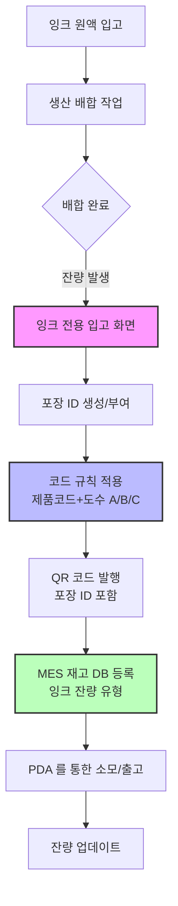
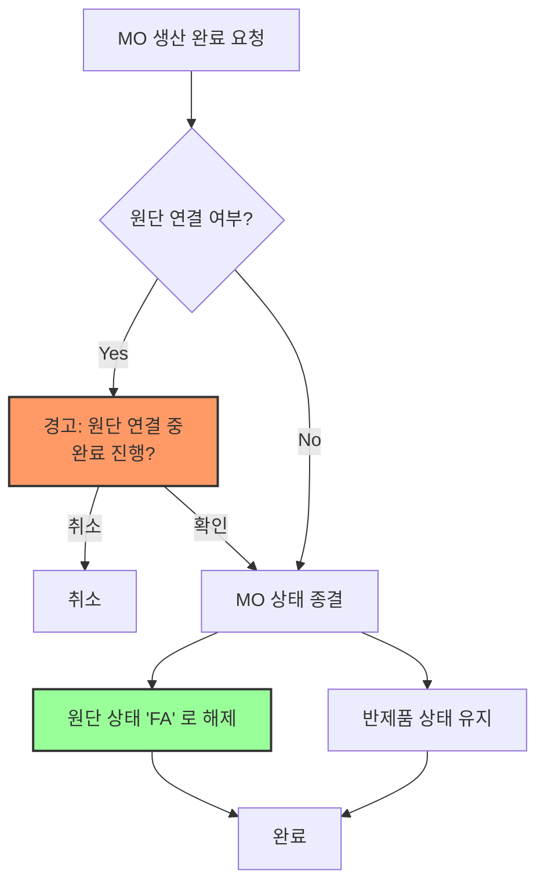

## 핵심 요약

FMES 시스템 내 잉크 잔량 및 혼합 잉크 관리 프로세스를 논의함. 기존 실사 중심의 중고입고 로직이 일상적인 잉크 배합 관리에는 부적합하므로, 별도의 전용 입고 화면 및 재고 유형 신설 필요성 확인됨. 잉크 색상/도수 관리 코드를 ERP 코드와 충돌 없이 운영하기 위해 '제품코드 + 도수 (A/B/C)' 형식의 규칙 기반 코드화 방식으로 결정함. MO(Manufacturing Order) 생산 완료 시 원단 연결 상태 검증 로직 추가 및 다중 선택 기능 도입 논의. 영업사원별 주문 합산의 불편함을 해소하기 위해 '소재 주문' 개념 도입 및 프로세스 재설계 필요성 제기됨.

## 논의 사항

### 1. 잉크 잔량 및 혼합 잉크 관리 프로세스

* **현황**: 잉크 원액 소모 후 배합된 잉크의 잔량을 전산 관리하려는 요구 발생. 기존 '중고입고' 프로세스는 실사 (재고 확인) 시에만 사용되며, 일상적인 배합/잔량 관리에는 적합하지 않음.

* **문제점**:

  * 잉크 배합 시 색상, 도수 (1 도~6 도) 등 변수가 많고, 배합 비율이 작업자마다 다를 수 있어 고정된 부재료 코드나 컬러 코드로만 관리하기 어려움.

  * 기존 중고입고 로직은 '실물 존재 + 전산 잔여' 상황을 전제로 하나, 잉크 배합은 '새로운 재고 생성' 성격이 강함.

  * ERP 연동 없이 FMS/MES 내부에서만 재고 관리가 필요하나, 기존 로직을 그대로 쓰면 ERP 연동 로직이 복잡해짐.

* **해결 방안**:

  * **전용 입고 화면 신설**: FMS/MES에 '잉크 잔량 입고' 전용 화면을 별도 구축.

  * **재고 유형 분리**: ERP 연동 없이 내부 관리용인 '잉크 잔량' 전용 재고 유형 (예: FCL 잉크 잔량) 을 신설하여 기존 원자재/부재료와 분리 관리.

  * **포장 ID 활용**: 드럼통 단위로 포장 ID 를 부여하고, 이를 기반으로 입고/소모 관리. 기존 포장 ID 를 재사용하거나 신규 생성하여 관리.

### 2. 잉크 색상/도수 코드화 전략

* **요구사항**: 'GUTI 24' 제품의 1 도, 2 도, 3 도 등 도수별 잉크를 구분할 수 있는 코드 필요. ERP 기존 컬러 코드와 충돌 방지 필요.

* **논의 과정**:

  * **안 A (ERP 코드 연동)**: ERP 컬러 코드 규칙 (5 자리 등) 을 따르려 했으나, 도수 정보 (1 도, 2 도) 를 포함하기엔 규칙이 복잡하고 중복 발생 우려.

  * **안 B (별도 테이블 관리)**: 도수별 코드를 별도의 마스터 테이블로 관리. 하지만 데이터 유지보수 부담 발생.

  * **안 C (규칙 기반 코드화)**: 별도의 테이블 없이 규칙만 정해 자동 생성. (예: 제품코드 + 도수 알파벳)

* **결정사항**:

  * **규칙 기반 코드화 채택**: `제품컬러코드 + 도수 (A, B, C...)` 형식 적용.

  * **예시**: `GUTI24` 제품의 1 도는 `GUTI24A`, 2 도는 `GUTI24B` 로 표기.

  * **장점**: ERP 코드와 충돌 없음, 별도 마스터 테이블 불필요, 직관적 구분 가능.

  * **포장 ID**: 포장 ID 는 시퀀셜하게 유니크하게 부여하며, QR 코드에는 해당 정보 (제품명, 도수, 수량 등) 를 포함하여 발행.

### 3. MO(Manufacturing Order) 생산 완료 로직 개선

* **현황**: MO 생산 완료 시 다중 선택 (Checkbox) 으로 변경 요청됨 (기존은 단일 선택).

* **요구사항**:

  * 원단 (Raw Material) 이 연결된 MO 는 생산 완료 처리를 막거나 경고 메시지 표시.

  * 원단이 연결되어 있더라도 MO 완료 시 원단 상태는 'FA(가용)' 로 해제되어 다른 MO 에 재사용 가능해야 함.

  * MO 완료 시 반제품 상태는 유지되나 MO 상태는 종결됨.

* **논의**:

  * 실수로 원단 연결 중인 MO 를 완료하는 경우를 방지하기 위해 검증 로직 추가 필요.

  * MO 종결 시 주문 (Order) 은 종결되지 않으며, MO 는 다시 생성 가능함.

  * 검단기 (QC) 완료 후 MO 생산 완료 자동화 요청에 대해, 현재 시스템 구조상 MO 는 생산 지시 단위이므로 검단기 완료 시 자동으로 종결되지 않음. 다만, 잔여 반제품이 없을 경우 자동 종결 로직 추가 검토.

### 4. 영업 주문 및 생산 프로세스 재설계 논의

* **문제점**:

  * 영업사원별로 개별 주문을 입력했으나, 생산 시에는 이를 합쳐야 하는 번거로움이 발생.

  * 기존 '주문 합치기' 기능은 영업사원 권한, 시간 차이 등으로 인해 현장 활용도가 낮음.

  * 영업사원이 소요량을 계산하여 일괄 투입하는 방식 (과거 방식) 으로 회귀하려는 요구 발생.

* **대안 논의**:

  * **소재 주문 (Material Order) 도입**: 최종 완제품 주문이 아닌, 앞단계 (예: CGL 공정) 까지의 대량 생산을 위한 '소재 주문' 개념 도입.

  * **효과**: 영업사원이 개별 주문을 합산하여 '소재 주문'으로 내보내면, FMS 는 이를 대량 생산하고 필요 시 개별 주문으로 분할 생산 가능.

  * **적용 범위**: CGL(코일) 은 적용 가능하나, FCL(필름) 은 초기 공정부터 변수가 많아 적용 시 주의 필요.

## 결정사항

| 항목                | 내용                              | 비고                  |
| ----------------- | ------------------------------- | ------------------- |
| **잉크 관리 유형**      | '잉크 잔량' 전용 재고 유형 신설 (ERP 비연동)   | 기존 부재료/원재료와 분리      |
| **잉크 입고 프로세스**    | 전용 입고 화면 개발 및 포장 ID 기반 관리       | 실사용 중고입고와 분리        |
| **잉크 코드 규칙**      | `제품코드 + 도수 (A/B/C...)` 형식 적용    | 예: GUTI24A, GUTI24B |
| **코드 관리 방식**      | 별도 마스터 테이블 없이 규칙 기반 자동 생성       | 유지보수 최소화            |
| **MO 완료 검증**      | 원단 연결 시 완료 차단 또는 경고 메시지 표시      | 실수 방지               |
| **MO 완료 시 원단 상태** | MO 종결 시 원단 상태는 'FA(가용)' 로 자동 해제 | 재사용 가능              |
| **주문 프로세스**       | '소재 주문' 개념 도입 검토 (대량 생산용)       | 영업사원별 주문 합산 번거로움 해소 |

## Action Items

| 항목                           | 담당자     | 기한    | 상태  |
| ---------------------------- | ------- | ----- | --- |
| 잉크 잔량 전용 재고 유형 정의 및 DB 설계    | 개발팀     | 차주 중  | 미시작 |
| 잉크 전용 입고 화면 프로토타입 제작         | 개발팀     | 차주 중  | 미시작 |
| 잉크 코드 생성 로직 (규칙 기반) 구현       | 개발팀     | 차주 말  | 미시작 |
| MO 생산 완료 시 원단 연결 검증 로직 추가    | 개발팀     | 차주 말  | 미시작 |
| '소재 주문' 프로세스 상세 요구사항 정의      | 기획팀/영업팀 | 다음 회의 | 진행중 |
| FMS/MES 간 잉크 재고 데이터 인터페이스 정의 | 개발팀     | 차주 중  | 미시작 |

## 프로세스 다이어그램 (잉크 관리)

## 프로세스 다이어그램 (MO 완료 및 원단 관리)

