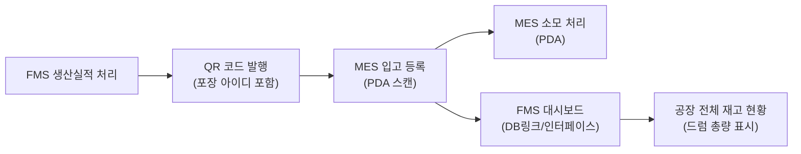

# FMES 회의록

## 핵심 요약

- **잉크 잔량 양성화**: 잉크 배합 후 남은 잔량을 FMS/MES에서 전산 관리하는 방안 논의. 기존 실사 화면은 일회성이므로 별도 입고 프로그램 개발 필요. ERP 연동 없이 내부 재고관리만 수행
- **색상 코드 체계 결정**: 제품 컬러코드 + 도수 알파벳 방식(예: 9T24A, 9T24B)으로 확정. 별도 관리 테이블 불필요, 룰 기반 운영으로 ERP 코드와 충돌 없음
- **MO 다중형 생산 완료**: 단일 선택(라디오)에서 다중 선택(체크박스)으로 변경 시, 원단 연결된 MO는 완료 차단 조건 추가 필요
- **주문 합치기 이슈**: 영업사원별 개별 주문을 공장에서 합쳐 생산하는 구조의 비효율 논의. 소재 주문 개념 참고하여 개선 방향 검토 중

---

## 논의 사항

### 1. 재고 실사 시 전산-실물 불일치 처리

- 전산상 소모 처리됐지만 실물이 남아있는 경우 발생
- 반대로 전산 재고는 있으나 실물이 없는 경우도 존재
- **처리 방식**: 중고 입고로 전부 잡되, 무상(0원) 처리
- **포장 아이디가 메인 키**: 포장 아이디 안에 품목, 색상, 수량 등 모든 정보 포함
- 라벨 훼손 시 신규 포장 아이디 부착하여 중고 입고 처리

### 2. 잉크 잔량 관리 (드럼 양성화)

#### 현황 및 문제점
- 잉크 원액 입고 → 배합(혼합) → 소모 처리 → **잔량 발생**
- 현재 배합 후 잔량은 **전산 미관리** 상태
- 공장장/팀장이 공장 전체 드럼 수량을 파악해야 하는 니즈 존재 (현재 약 4,100개)
- 기존 실사 화면은 **일회성**(실사 시)만 사용 가능 → 상시 입고 불가

#### 요구사항
- 잉크 잔량을 전산에 등록하여 관리 (양성화)
- **ERP에는 전송하지 않음** — 순전히 내부 재고관리 목적
- 드럼 단위로 관리, 포장 아이디 단위로 입고
- 소모는 전량 소모 방식 (다 쓰면 아이디 소멸)
- 드럼에 계속 추가 배합하여 넣는 경우 있음 → 양이 늘었다 줄었다 반복
- 한 드럼에 계속 배합해서 넣을 경우, 입고/소모를 반복 관리 (기존 프로세스 활용)

#### 시스템 구현 방향

- **새로운 유형 추가**: "혼합용 잉크" 또는 "FCL 잉크" 등 중분류 신설 (기존 S로 시작하는 미사용 코드 활용)
- **별도 입고 프로그램 개발 필수**: 기존 실사 화면과 목적이 다름
  - 실사 화면: 일회성, 자동 중고입고 (재고 변동 감지 후)
  - 신규 입고 프로그램: 상시 입고, 작업자가 수동 입고 (QR 스캔 후 수량 입력)
- **재고 조회**: MES 부재료 재고 화면에 잉크 잔량 유형 추가하여 표시
- **대시보드**: FMS 대시보드에서 총량만 표시 (MES 데이터를 DB링크로 가져옴, 일 1회 또는 버튼 갱신)
- **진도 코드**: 가용 재고만 관리 (반품 없음, 소모 시 아이디 소멸)
- 기존 시스템 로직(PDA 등) 최대한 활용, ERP 연동만 차단

#### QR 코드 생성 프로세스
1. FMS에서 생산실적 처리 시 컬러코드 정보 기입
2. QR 코드 발행 (포장 아이디 자동 선발행)
3. QR 코드에는 **포장 아이디만 포함**
4. 나머지 정보(제품, 색상, 도수, 제조사, 로트 번호 등)는 테이블에 저장 후 DB 조회
5. MES PDA 스캔 → 포장 아이디로 입고 등록 → 수량 입력

### 3. 잉크 배합 색상 코드 체계

#### 배경
- 제품(예: 9T24) 생산 시 그라비아 1도~6도까지 잉크 배합 발생
- 각 도수별 드럼이 여러 개 존재 가능 → 포장 아이디로 구분
- 같은 제품·같은 도수라도 매번 새로운 포장 아이디 발행

#### 검토된 안

| 안 | 형식 예시 | 장점 | 단점 |
|-----|-----------|------|------|
| ① FM 시퀀셜 | FM001, FM002 | 유니크 보장 | 직관성 부족, 별도 테이블 관리 필요 |
| ② 5자리 코드 | T24A0 | 기존 체계 유사 | ERP 코드와 충돌 위험 |
| ③ **제품코드+도수 알파벳** | **9T24A, 9T24B** | **직관적, 테이블 관리 불필요, ERP 미충돌** | - |
| ④ 하이픈 구분 | 9T24-1, 9T24-2 | 가독성 양호 | 숫자 구분 직관성 부족 |

#### 최종 결정: ③ 제품코드 + 도수 알파벳 방식

- **규칙**: 제품 컬러코드 + 도수 알파벳 (1도=A, 2도=B, 3도=C, ...)
- **예시**: 9T24A (9T24의 1도), 9T24B (9T24의 2도), 9T24C (9T24의 3도)
- 동판 도수 규칙(1도=A, 2도=B)과 통일
- **포장 아이디는 별도 유니크 생성** — 색상 코드는 분류(코드) 역할, 포장 아이디가 개별 식별(ID) 역할
- 조회 시 "9T24A 몇 드럼, 9T24B 몇 드럼" 형태로 직관적 표시

**코드 체계 장점**:
- 별도 관리 테이블 불필요 → 룰만 관리
- 데이터 관리(주기적 정리/삭제) 불필요
- ERP 코드와 절대 충돌 없음 (별도 카테고리)
- 재활용 가능 (시퀀셜 소진 없음)
- 같은 도수라도 포장 아이디가 다르면 별개 관리 가능

#### 포장 아이디 생성 전략
- **생성 시점**: FMS 생산실적 처리 후, QR 코드 발행 시 자동 선발행
- **생성 방식**: 시퀀셜하게 유니크하게 생성 (16진수, 32진수 등 검토 필요)
- **발행량**: 컬러코드별로 여러 개 발행 가능 (예: 9T24A에 여러 포장 아이디)
- **QR에 포함**: 포장 아이디만 포함, 색상/규격 정보는 DB에서 조회

### 4. QR 코드 생성 및 포장 아이디

- QR 코드에는 **포장 아이디만 포함**하면 됨 → 나머지 정보는 DB에서 조회
- 포장 아이디는 QR 발행 시 자동 선번(선발행)
- QR 스캔 → 포장 아이디로 조회 → 입고/소모 처리
- 포장 아이디 발행량이 많아질 수 있음 (6도 × 제품 수) → 시퀀셜 체계 충분히 확보 필요
- 생산실적 처리 후 QR 발행 → 작업자가 수량(kg) 입력

### 5. MO 다중형 생산 완료

#### 배경
- 기존: 단일 선택(라디오 버튼) → 하나씩 확인하며 MO 종결
- 변경 요청: 다중 선택(체크박스)으로 여러 건 동시 완료 처리
- 현장에서 "너무 힘들다"는 피드백으로 다중형 전환 요청

#### MO 완료 시 동작
- MO 완료 → 반제품은 현재 상태 그대로 남음 (FA 상태)
- MO 연결만 해제 → 반제품은 다른 MO에 재연결 가능
- MO는 순수하게 **매뉴팩처링 오더(묶음 단위)**일 뿐, 제품 생산 완료와 별개
- MO 종결해도 주문은 살아있음 → 새로운 MO 생성 가능 (기존 MES와 다른 장점)
- **MO 다중 선택 시 원단 연결 체크**: 원단 있으면 알림 후 차단

#### 추가 조건 요청
- **원단 연결된 MO는 생산 완료 차단**: 실수로 생산 중인 MO를 완료 처리하는 것 방지
- 원단이 없는(비어있는) MO만 완료 가능하도록 유효성 검사 추가
- 알림창: "연결된 원단을 확인하세요" 표시

#### MO와 반제품의 관계
- MO 완료 시 반제품은 FA 상태로 유지
- 해당 MO 연결만 해제 → 반제품은 독립적으로 존재
- 다른 MO에 반제품 재할당 가능
- 검단기 이후 남은 반제품 없으면 자동 MO 종결 시도 (예외 케이스 검토 필요)

### 6. MO 자동 종결 논의

- **요청**: 검단기 완료 후 남은 반제품이 없으면 자동 MO 종결
- **현실적 제약**: 현장에서 하나의 MO에 여러 주문을 계속 붙여 사용 → 자동 종결 시 후속 생산 불가
- 배폭 등 다른 케이스 존재로 단순 자동 종결 어려움
- **보류** — 추가 검토 필요

### 7. 주문 합치기 문제

#### 현황
- 영업사원이 개별 주문 투입 (A사원: 5톤, B사원: 10톤, C사원: 9톤)
- 공장에서는 한꺼번에 생산해야 하나, 주문 합치기 기능이 실사용 불가
- 결과적으로 하나의 MO에 여러 주문을 계속 붙여 사용 중
- 합쳐주문 기능은 구현되어 있으나, 영업사원 간 조율·시간 차이 등으로 활용 안 됨
- 정확도 저하, 포장 문제 발생

#### 개선 방향
- 기존 방식 복귀 검토: 영업사원이 소요량 계산하여 합산 주문 투입
- **소재 주문 개념 참고** (PLTCM/EGL/CGL 방식):
  - 앞단계(컬러 전)까지만 대량 생산 → 이후 소량 개별 생산
  - 컬러 앞 공정은 같으므로 합쳐서 생산 가능
- FCL은 처음부터 도수별로 다를 수 있어 코일 공정과 완전 동일 적용 어려움
- **영업회의에서 추가 논의 예정**

---

## 결정사항

| # | 결정 내용 | 비고 |
|---|-----------|------|
| 1 | 잉크 잔량 색상 코드 체계: **제품코드 + 도수 알파벳** (예: 9T24A) | 별도 테이블 관리 불필요, ERP 미충돌, 동판 규칙과 통일 |
| 2 | 잉크 잔량은 **ERP 미연동**, 내부 재고관리만 수행 | MES 내부 + FMS 대시보드 |
| 3 | 기존 실사 화면 재활용 불가 → **별도 입고 프로그램 개발** | 상시 입고 필요, 실사와 목적 상이 |
| 4 | 재고 조회는 **MES 부재료 재고 화면에 유형 추가** | FMS는 대시보드 총량만 표시 |
| 5 | 포장 아이디가 드럼 단위 키, 색상 코드는 분류 코드(재활용) | 포장 아이디만 유니크 생성 |
| 6 | MO 다중 선택 시 **원단 연결된 MO는 완료 차단** 조건 추가 | 알림창 표시 |
| 7 | QR 코드에는 **포장 아이디만 포함**, 나머지는 DB 조회 | - |
| 8 | 포장 아이디 시퀀셜 체계: 시간 기반 또는 16진수/32진수 등 | 충분한 발행량 확보 필요 |
| 9 | 드럼 관리: **가용 재고만** 관리 (반품 없음) | 소모 시 아이디 소멸 |
| 10 | MO 자동 종결: **보류**, 배폭 등 예외 케이스 추가 검토 | - |

---

## Action Items

| # | 항목 | 담당 | 비고 |
|---|------|------|------|
| 1 | 잉크 잔량 전용 입고 프로그램 개발 (FMS 또는 MES) | 개발팀 | 드럼 단위, PDA 스캔 입고, 상시 입고 가능 |
| 2 | MES 부재료 재고 화면에 잉크 잔량 유형 추가 | 개발팀 | 기존 미사용 코드(S로 시작하지 않는) 활용 |
| 3 | FMS 대시보드에 잉크 재고 총량 표시 | 개발팀 | DB링크/인터페이스로 MES 데이터 조회 (일 1회 또는 버튼 갱신) |
| 4 | 색상 코드 체계(제품코드+도수 알파벳) 룰 정의 및 적용 | 현장/개발팀 | 동판 도수 규칙과 통일 (A=1도, B=2도...) |
| 5 | MO 다중 선택 생산 완료 시 원단 연결 체크 로직 추가 | 개발팀 | 원단 있으면 알림 후 차단 |
| 6 | 포장 아이디 시퀀셜 체계 설계 (대량 발행 대비) | 개발팀 | 16진수/32진수 등 검토 |
| 7 | FMS 생산실적 처리 시 QR 코드 생성 로직 구현 | 개발팀 | 포장 아이디 자동 선발행, 색상 정보 포함 |
| 8 | 주문 합치기 개선 방안 영업회의에서 논의 | 팀장 | 소재 주문 개념 참고, 영업사원 계산 방식 검토 |
| 9 | MO 자동 종결 가능 여부 추가 검토 | 개발팀 | 배폭 등 예외 케이스 확인 필요 |
