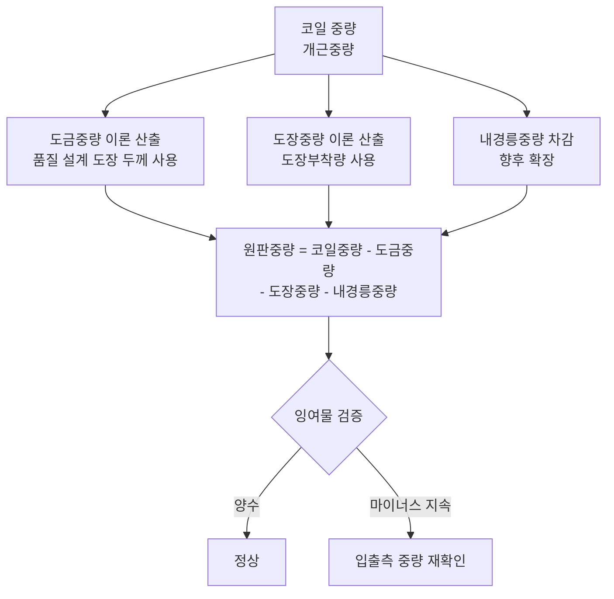

# 회의록: 원판중량 계산 개선

## 핵심 요약

원판중량 계산 로직 개선 논의. 현재 도금 두께 계산 시 TCM 세트치 사용으로 마이너스 값 발생 및 PATCM 공정 후 중량 증가 문제로 잉여물이 음수로 산출되어 세금 신고 누락 우려 존재. 해결책으로 품질 설계의 도장 두께를 기준으로 도금중량·도장중량을 이론 산출 후 코일중량에서 차감하는 방식으로 변경. 2개월치 데이터로 기존/신규 계산식 비교 검증 예정.

***

## 논의 사항

### 1. 문제 현황

#### 1.1 이론 길이 계산 오류

* **증상**: 특정 Coil에서 길이가 698m로 산출되나, 원인 불확실

* **원인 분석**:

  * 도금 두께 계산 시 `D15-D12` (출측 두께 - TCM 세트치) 사용

  * TCM 세트치(1.63mm) 대신 실제 측정 두께 사용 필요

  * **문제**: `1.554 - 1.6 = -0.046`으로 마이너스 발생 → 도금을 했는데 더 얇아져버리는 모순

#### 1.2 잉여물 마이너스 문제

* **사례**: 원재료 중량 21.1톤 vs 계산된 원판중량 21.6톤 → +500kg 발생

* **세무적 영향**:

  * ST(Slitting) 후 스크랩 발생 시 수입신고 필수

  * 잉여물이 마이너스면 스크랩이 없는 것으로 간주되어 세금 누락

  * 물류팀에서는 현재 마이너스 값을 강제로 0으로 변경하여 신고 중

#### 1.3 PATCM 공정 후 중량 변동

* **정상**: 공정 진행 시 원판중량 감소(로스 300~320kg 예상)

* **비정상**: PATCM 후 중량이 증가하는 케이스 발생

* **사례 분석**:

| 항목       | 값      | 비고           |
| -------- | ------ | ------------ |
| 원재료 중량   | 21.1톤  |              |
| PATCM 중량 | 증가함    | 입출측 중량 오차 가능 |
| 잉여물      | +500kg | 원판이 불어난 현상   |

***

### 2. 근본 원인

#### 2.1 계산식 구조적 문제

```text
현재: 도금 두께 = 출측 두께 - TCM 세트치
      → TCM 세트치가 실제 두께보다 크면 마이너스 발생
```

#### 2.2 파라미터 오류 가능성

* 입출측 중량 측정 오차

* 개근 기계 오차

* 사람 입력 오류

***

### 3. 개선 방안 논의

### 3.1 방안 A: 중량 비율 기반 계산 (검토 후 보류)

* **원리**: 코일 단면 기준 두께·비중 비율로 중량 배분

* **장점**: 길이·폭 입력 오류 영향 없음

* **단점**: 도금 규격두께 값 미확보로 현실적 어려움

### 3.2 방안 B: 이론 중량 차감 방식 (채택)

**새로운 계산 로직:**



**도금중량 계산식:**

```text
도금중량 = 도금 부착량(g/m²) × 이론길이(m) × 폭(mm) / 1,000,000
```

**도장중량 계산식 (CCL):**

```text
도장중량 = 도장부착량(g/m²) × 시트 길이 / 1,000
```

**특징:**

* 품질 설계에 저장된 도장 두께(설계값) 사용

* 마이너스 값 발생 근원적 차단

* 길이·폭 입력 오류 영향 최소화

***

## 결정사항

| 구분          | 내용                         | 비고          |
| ----------- | -------------------------- | ----------- |
| 계산 로직 변경    | 코일중량 - 도금중량 - 도장중량 - 내경릉중량 | 이론 산출값 사용   |
| 도금두께 기준     | 품질 설계 도장 두께 사용             | TCM 세트치 미사용 |
| 잉여물 마이너스 조치 | 입출측 중량 재확인 (PATCM 이슈)      |             |
| 도장 두께       | 양면 합산 17μm 확인 필요           | 설계팀 문의      |

***

## Action Items

| 작업 내용          | 담당자 | 기한   | 비고                          |
| -------------- | --- | ---- | --------------------------- |
| 신규 계산식 개발      | 개발팀 | 3/31 | 도금중량·도장중량 이론 산출 로직          |
| 2개월치 데이터 비교 검증 | 개발팀 | 4/초  | 9/1~12/31 데이터, 기존 vs 신규 계산식 |
| 엑셀 리포트 작성      | 개발팀 | 4/초  | 원자재 사용실적 관리 양식 참고, 편차 분석    |
| 잉여물 비교 확인      | 기획팀 | 4/초  | 편차 유무 확인                    |
| 도장 두께 양면 확인    | 설계팀 | ASAP | 17μm 단면/양면 문의               |
| 내경릉중량 반영 확장    | 개발팀 | 4월   | 향후 로직에 추가                   |

***

## 참고 사항

* **도금 비중**: 7.14 (GL 계열), GI 계열은 상이

* **페인트 비중**: 고정값 사용 (Top/Bottom 각 1.7 × 두께 합산)

* **이론길이 영향**: 도금중량 계산 시 사용되나, 전체 중량 대비 미미하여 영향 적음

* **CCL(색코팅) 라인**: 별도 계산식 적용 필요 (매수 반영)
