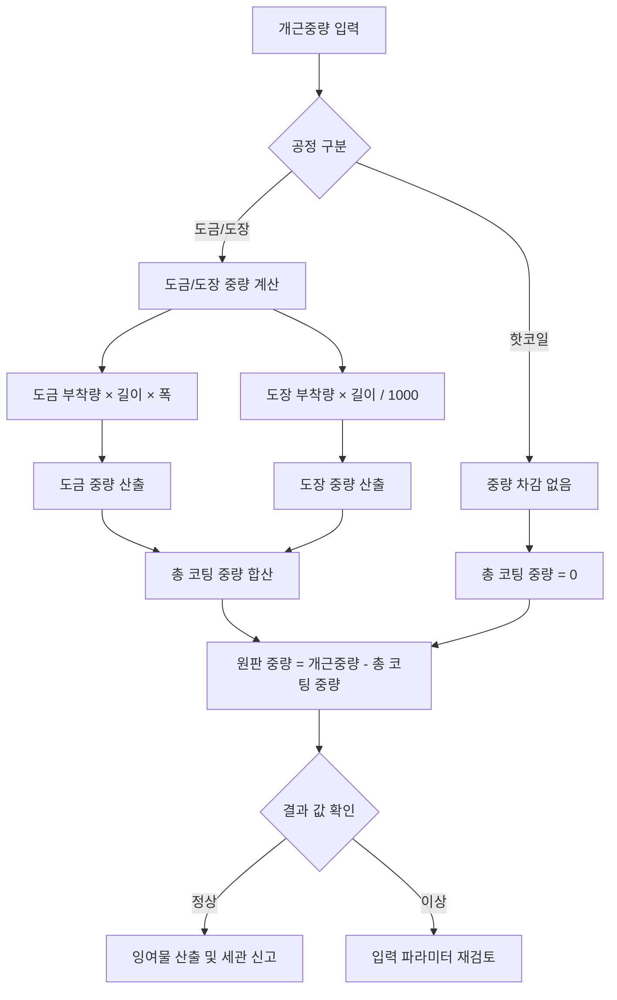

## 핵심 요약

원판 중량 계산 로직 오류로 인해 잉여물 (스크랩) 이 마이너스 (-) 로 산출되거나 원재료가 불어난 것처럼 계산되는 문제 해결 논의 진행. 기존 두께 차이 기반 계산식 대신 '개근중량에서 도금/도장 중량을 차감'하는 방식으로 로직 변경 결정. 도금 중량 산출 시 이론 길이 대신 설계된 도금 부착량 (g/m²) 을 활용하여 인위적 입력 오류 최소화 방안 도출. 향후 2~3 개월 데이터로 기존/신규 로직 비교 분석 후 적용 예정.

## 논의 사항

### 1. 원판 중량 계산 오류 현황 및 원인 분석

* **현황**: 기존 로직 적용 시 원판 중량이 실제 원재료 중량보다 크게 산출되거나, 잉여물 (Loss) 이 마이너스 (-) 값으로 나타남.

  * 예시: 원재료 21.1 톤 → 계산된 원판 중량 21.6 톤 (불합리한 증가)

  * 물류팀 대응: 세관 신고를 위해 마이너스 값을 강제로 0 으로 처리하여 신고 중.

* **원인**:

  * 기존 로직이 `TCM 세트치`와 `측정 두께`의 차이로 도금 두께를 구하는 방식 사용.

  * 입력값 (두께, 길이 등) 의 오차나 기계적 오차 시 도금 두께가 마이너스가 되거나, 이론 길이 계산 시 불확실성 증대.

  * `입축 중량` 파라미터 오류로 인해 중량이 실제보다 과다하게 입력된 경우 로직이 이를 보정하지 못함.

### 2. 개선된 계산 로직 제안 및 검토

* **기존 방식 (변경 필요)**: 길이 × 폭 × 두께 × 비중 (인위적 입력 변수 의존도 높음)

* **제안 방식 (적용 예정)**:

  * **공식**: `원판 중량 = 개근중량 - (도금 중량 + 도장 중량 + 내경용 중량 등)`

  * **도금 중량 산출**: `도금 부착량 (g/m²) × 이롱 길이 × 코일 폭`

    * 도금 두께 대신 설계된 `도금 부착량` 값을 사용하여 두께 입력 오류 영향 최소화.

    * 비중 계산 불필요 (부착량 단위 면적당 중량 포함).

  * **이론 길이 영향**: 도금 두께가 전체 두께 대비 미미하므로, 이론 길이 산출 방식 변경이 최종 결과에 미치는 영향은 작음.

* **검토 결과**:

  * 마이너스 값 발생 가능성 차단.

  * 입력 파라미터 (두께 등) 의 오차에 대한 민감도 감소.

  * 단, `개근중량` 자체 입력 오류 (예: 입축 중량 과다 입력) 에 대해서는 보정 불가 (기본 입력값 신뢰 필요).

### 3. 공정별 적용 범위 및 변수 정의

* **도금 공정**: 도금 부착량 (양면 합산 기준, 17μm 등) 활용.

* **도장 공정**: 도장 부착량 활용 (색상/라인별 편차 존재하나 고정값 또는 평균값 적용 검토).

  * 샤라인 (Color Line) 등 특수 라인 시 `도장 부착량 × 시트 길이 / 1000` 방식 적용.

* **핫코일 (Hot Coil)**: 도금/도장 중량 0 으로 처리하여 개근중량 = 원판 중량으로 산출.

### 4. 데이터 검증 및 적용 계획

* **검증 기간**: 9 월 ~ 12 월 (약 3 개월) 데이터 및 올해 1~2 월 데이터 비교.

* **검증 방법**:

  * 기존 로직과 신규 로직 산출치 비교.

  * 잉여물 편차 분석 및 정상화 여부 확인.

  * 엑셀 시트 (`원자재 사용실적 관리` 화면 양식) 로 추출하여 검토.

* **시행 시점**: 로직 변경 시 기존 데이터는 수정하지 않고, 변경 시점 이후 신규 데이터에 적용 (역행 적용 없음).

## 결정사항

| 항목           | 내용                                | 비고                   |
| ------------ | --------------------------------- | -------------------- |
| **계산 로직 변경** | `개근중량 - 도금중량 - 도장중량` 방식으로 변경      | 기존 두께 기반 계산식 폐지      |
| **도금 중량 산출** | `도금 부착량 (g/m²) × 이롱 길이 × 코일 폭` 사용 | 두께 입력 의존성 제거         |
| **마이너스 처리**  | 로직상 마이너스 발생 불가하도록 구조 변경           | 물류팀의 0 처리 수동 작업 불필요  |
| **적용 범위**    | 도금, 도장 공정 포함 (핫코일은 중량 차감 없음)      | 샤라인 등 특수 라인 별도 로직 검토 |
| **데이터 검증**   | 9 월~12 월 데이터로 기존/신규 로직 비교 분석      | 엑셀로 추출하여 검토 후 확정     |
| **역행 적용**    | 기존 데이터는 수정하지 않음 (전향적 적용)          | 물류팀 우려 해소            |

## Action Items

| 항목                          | 담당자    | 기한 | 상태  |
| --------------------------- | ------ | -- | --- |
| **신규 로직 구현 (도금/도장 중량 차감식)** | 개발팀    | 미정 | 진행중 |
| **도금/도장 부착량 데이터 매핑**        | 품질/개발팀 | 미정 | 진행중 |
| **9 월~12 월 데이터 추출 및 비교 분석** | 분석팀    | 미정 | 진행중 |
| **엑셀 검증 시트 제작 및 공유**        | 분석팀    | 미정 | 진행중 |
| **샤라인 등 특수 라인 로직 상세 검토**    | 개발/공정팀 | 미정 | 미진행 |

